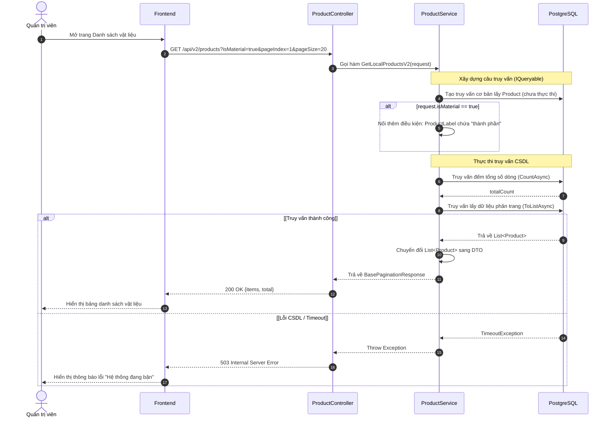
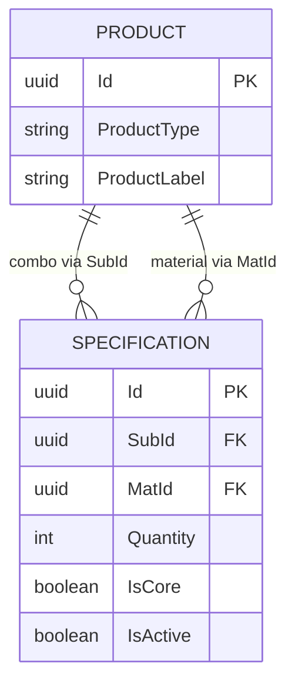
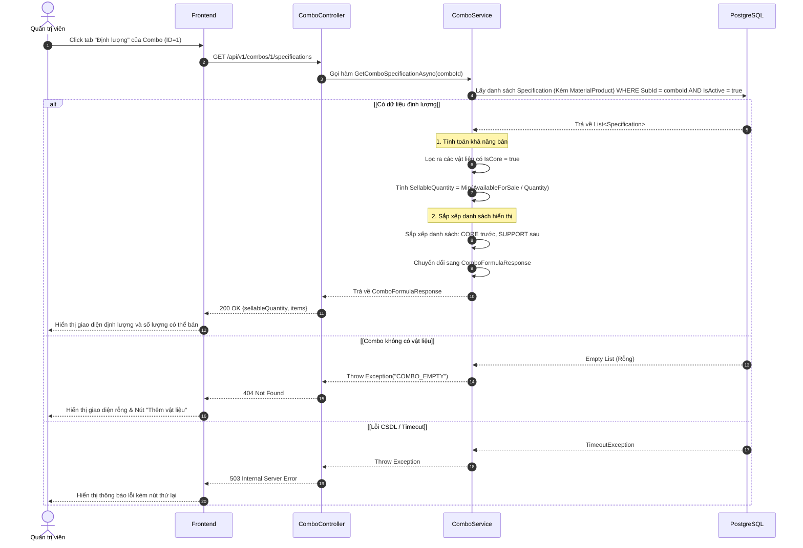

# Tài liệu Kỹ thuật (Sequence Diagram & TDD) - US002 & US006

Tài liệu này bao gồm các Sequence Diagram và mã nguồn dự kiến (TDD) sẽ được lập trình trong project backend (`hoatheomua-be`) để đáp ứng chức năng trong US002 và US006.

---

## 1. US002: Lọc sản phẩm là Vật Liệu (Label chứa "thành phần")

### 1.1. Sequence Diagram



### 1.2. TDD - Bổ sung Parameter vào Request
Sửa đổi file `HoaTheoMua.Service/Product/Request.cs` để nhận biến `isMaterial` từ query URL.

```csharp
public class LocalProductQueryRequest
{
    // ... các field cũ
    public bool? isPin { get; set; }
    
    // [THÊM MỚI] Dùng để lọc vật liệu
    public bool? isMaterial { get; set; }
}
```

### 1.3. TDD - Kịch bản Unit Test (Test-Driven)
Thêm vào file `HoaTheoMua.Service.Test/ProductTest/LocalProductSearchV2Test.cs`:

```csharp
[Fact]
public async Task GetLocalProductsV2_FilterByIsMaterialTrue_ReturnsOnlyMaterials()
{
    // 1. Arrange: Chuẩn bị DB giả lập
    using var dbContext = CreateInMemoryDbContext();
    var service = CreateService(dbContext);

    var p1 = new ProductEntity { Id = Guid.NewGuid(), ProductName = "Hoa hồng", ProductLabel = "thành phần, hoa tươi", IsDeleted = false };
    var p2 = new ProductEntity { Id = Guid.NewGuid(), ProductName = "Giấy gói", ProductLabel = "phụ kiện, thành phần", IsDeleted = false };
    var p3 = new ProductEntity { Id = Guid.NewGuid(), ProductName = "Combo 1", ProductLabel = "combo", IsDeleted = false };
    var p4 = new ProductEntity { Id = Guid.NewGuid(), ProductName = "Không label", ProductLabel = null, IsDeleted = false };

    await dbContext.Products.AddRangeAsync(p1, p2, p3, p4);
    await dbContext.SaveChangesAsync();

    // 2. Act: Gọi hàm lấy danh sách với cờ isMaterial = true
    var result = await service.GetLocalProductsV2(new Request.LocalProductQueryRequest
    {
        isMaterial = true
    });

    var items = result.Value.Items.Cast<Response.ProductDetailResponse>().ToList();

    // 3. Assert: Kiểm tra chỉ 2 vật liệu được trả về
    Assert.Equal(2, items.Count);
    Assert.Contains("Hoa hồng", items.Select(x => x.ProductName));
    Assert.Contains("Giấy gói", items.Select(x => x.ProductName));
    Assert.DoesNotContain("Combo 1", items.Select(x => x.ProductName));
}
```

### 1.4. TDD - Triển khai Logic thực tế
Cập nhật hàm `GetLocalProductsV2` trong `HoaTheoMua.Service/Product/Service.cs` để test pass:

```csharp
// Logic lọc vật liệu
if (request.isMaterial.HasValue && request.isMaterial.Value)
{
    query = query.Where(x => x.ProductLabel != null && x.ProductLabel.ToLower().Contains("thành phần"));
}
```

---

## 2. US006: Xem công thức định lượng (Combo Specification)

### 2.1. Cấu trúc Database (ERD)
Dựa theo cấu trúc bạn thiết kế, bảng `SPECIFICATION` sẽ liên kết với bảng `PRODUCT`:



### 2.2. Sequence Diagram



### 2.2. TDD - Kịch bản Unit Test (Test-Driven)
```csharp
[Fact]
public async Task GetComboSpecification_ValidSubId_ReturnsCalculatedFormulaAndSortsByCore()
{
    // 1. Arrange: Chuẩn bị 1 Combo và 2 Vật liệu (1 Core, 1 Support)
    using var dbContext = CreateInMemoryDbContext();
    var service = CreateComboService(dbContext);
    // (mock dữ liệu Combo và Specification vào dbContext, đảm bảo IsActive = true)

    // 2. Act
    var result = await service.GetComboSpecificationAsync(comboId);

    // 3. Assert: Kiểm tra logic
    // - CORE item phải nằm đầu tiên trong danh sách trả về
    Assert.True(result.Items[0].IsCore);
    
    // - Tính toán SellableQuantity = Min(AvailableForSale / Quantity) của các món CORE
    Assert.Equal(expectedSellableQuantity, result.SellableQuantity);
}
```

### 2.3. TDD - Triển khai Logic thực tế (Dự kiến)
```csharp
public async Task<ComboFormulaResponse> GetComboSpecificationAsync(Guid comboId)
{
    var specs = await _dbContext.Specifications
        .Include(cs => cs.MaterialProduct)
        .Where(cs => cs.SubId == comboId && cs.IsActive)
        .ToListAsync();

    if (!specs.Any()) throw new Exception("COMBO_EMPTY");

    // Sắp xếp: CORE trước, SUPPORT sau
    var sortedItems = specs.OrderByDescending(cs => cs.IsCore).ToList();

    // Tính số lượng khả dụng (chỉ xét CORE)
    var coreItems = sortedItems.Where(cs => cs.IsCore);
    int sellableQuantity = coreItems.Any() 
        ? (int)coreItems.Min(cs => cs.MaterialProduct.AvailableForSale / cs.Quantity)
        : 0;

    return new ComboFormulaResponse 
    {
        SellableQuantity = sellableQuantity,
        Items = sortedItems.Select(mapToDto).ToList()
    };
}
```
