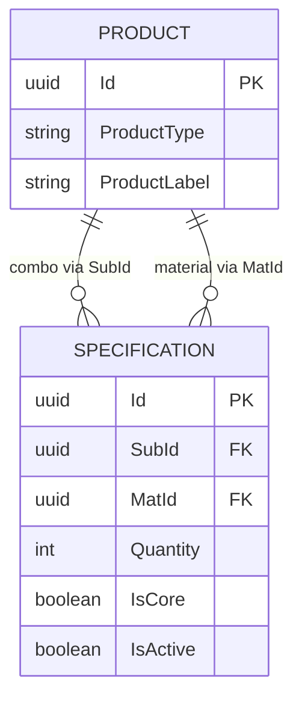
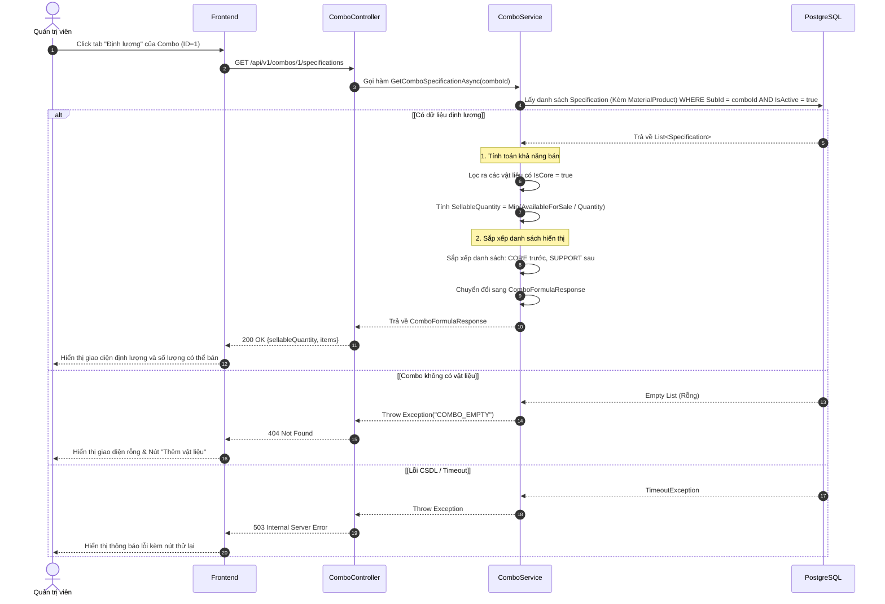

# Tài liệu Kỹ thuật (Sequence Diagram & TDD) - US006

Tài liệu này bao gồm các Sequence Diagram và mã nguồn dự kiến (TDD) sẽ được lập trình trong project backend (`hoatheomua-be`) để đáp ứng chức năng trong US006.

---

## 2. US006: Xem công thức định lượng (Combo Specification)

**Mô tả ngắn:** Xem công thức định lượng của combo hoa.

### Bối cảnh (Context)
Các sản phẩm dạng Combo (ví dụ: một bó hoa hoàn chỉnh) thực chất là sự kết hợp của nhiều nguyên vật liệu khác nhau (hoa chính, hoa lá phụ, giấy gói). Hiện tại, hệ thống cần một cơ chế rõ ràng để lưu trữ và hiển thị định lượng cấu thành nên một Combo, đồng thời giúp người quản lý biết được với số lượng vật liệu đang có trong kho thì có thể lắp ráp được tối đa bao nhiêu Combo để bán ra thị trường.

### Mục tiêu (Objectives)
*   **Trực quan hóa công thức:** Cung cấp giao diện và API cho phép Quản trị viên xem chi tiết các nguyên vật liệu cần thiết để tạo nên một Combo (phân tách rõ ràng vật liệu chính - Core và vật liệu phụ - Support).
*   **Tính toán khả năng cung ứng:** Hệ thống tự động tính toán được số lượng Combo tối đa có thể bán (Sellable Quantity) dựa trên số lượng tồn kho khả dụng của các vật liệu chính.
*   **Quản lý khoa học:** Làm cơ sở dữ liệu nền tảng cho việc tự động trừ kho nguyên liệu khi một đơn hàng chứa Combo được bán ra thành công.

### 2.1. Cấu trúc Database (ERD)
Dựa theo cấu trúc bạn thiết kế, bảng `SPECIFICATION` sẽ liên kết với bảng `PRODUCT`:



### 2.2. Sequence Diagram



### 2.2. TDD - Kịch bản Unit Test (Test-Driven)
```csharp
    [Fact]
    public void GetComboSpecification_ValidCombo_CalculatesSellableQuantityAndSortsByCore()
    {
        // 1. Arrange
        var comboId = Guid.NewGuid();
        
        // Tạo dữ liệu kho (3 vật liệu)
        var mat1 = new ProductMockEntity { Id = Guid.NewGuid(), ProductName = "Hoa hồng", AvailableForSale = 10 };
        var mat2 = new ProductMockEntity { Id = Guid.NewGuid(), ProductName = "Giấy gói", AvailableForSale = 100 };
        var mat3 = new ProductMockEntity { Id = Guid.NewGuid(), ProductName = "Hoa baby", AvailableForSale = 20 };

        // Tạo cấu hình công thức cho Combo
        var specs = new List<SpecificationMockEntity>
        {
            // Core 1: Cần 2, Kho có 10 -> Có thể làm tối đa 5 combo
            new SpecificationMockEntity { SubId = comboId, MatId = mat1.Id, MaterialProduct = mat1, IsCore = true, IsActive = true, Quantity = 2 },
            
            // Support: Cần 1, Kho có 100 -> Có thể làm tối đa 100 combo (nhưng không dùng để tính SellableQuantity của cả Combo)
            new SpecificationMockEntity { SubId = comboId, MatId = mat2.Id, MaterialProduct = mat2, IsCore = false, IsActive = true, Quantity = 1 },
            
            // Core 2: Cần 5, Kho có 20 -> Có thể làm tối đa 4 combo
            new SpecificationMockEntity { SubId = comboId, MatId = mat3.Id, MaterialProduct = mat3, IsCore = true, IsActive = true, Quantity = 5 }
        };

        // --- TODO (Dành cho Dev): Khởi tạo Service thật với InMemoryDbContext chứa `specs` ở đây ---
        // var service = CreateComboService(dbContext);
        // var result = await service.GetComboSpecificationAsync(comboId);
        
        // --- SIMULATED ACT --- (Mô phỏng lại logic Service sẽ thực hiện để cho Pass Test)
        var sortedItems = specs.Where(s => s.IsActive).OrderByDescending(s => s.IsCore).ToList();
        var coreItems = sortedItems.Where(s => s.IsCore);
        
        // Công thức tính toán
        int calculatedSellableQuantity = coreItems.Any() 
            ? coreItems.Min(cs => cs.MaterialProduct.AvailableForSale / cs.Quantity) 
            : 0;

        // 3. Assert
        // Tính toán bằng tay: Min(10/2, 20/5) = Min(5, 4) = 4
        Assert.Equal(4, calculatedSellableQuantity); 
        
        // Item Core phải luôn nằm trước Support trong danh sách hiển thị
        Assert.True(sortedItems[0].IsCore);
        Assert.True(sortedItems[1].IsCore);
        Assert.False(sortedItems[2].IsCore);
    }
    
    [Fact]
    public void GetComboSpecification_EmptyCombo_ThrowsException()
    {
        // 1. Arrange
        var comboId = Guid.NewGuid();
        var specs = new List<SpecificationMockEntity>(); // Combo rỗng, không có vật liệu nào
        
        // 2 & 3. Act & Assert
        // TODO: Mở comment dòng dưới khi code logic thật
        // var ex = await Assert.ThrowsAsync<Exception>(() => service.GetComboSpecificationAsync(comboId));
        // Assert.Equal("COMBO_EMPTY", ex.Message);
    }

    [Fact]
    public void GetComboSpecification_NoCoreItems_CalculatesSellableQuantityAsZero()
    {
        // 1. Arrange
        var comboId = Guid.NewGuid();
        var mat1 = new ProductMockEntity { Id = Guid.NewGuid(), ProductName = "Giấy gói", AvailableForSale = 100 };

        var specs = new List<SpecificationMockEntity>
        {
            // Combo này thiết kế sai, chỉ có đồ phụ kiện (Support), không có lõi (Core)
            new SpecificationMockEntity { SubId = comboId, MatId = mat1.Id, MaterialProduct = mat1, IsCore = false, IsActive = true, Quantity = 1 }
        };
        
        // 2. Act
        var coreItems = specs.Where(s => s.IsActive && s.IsCore);
        int calculatedSellableQuantity = coreItems.Any() 
            ? coreItems.Min(cs => cs.MaterialProduct.AvailableForSale / cs.Quantity) 
            : 0; // Trả về 0 nếu Any() = false
            
        // 3. Assert
        Assert.Equal(0, calculatedSellableQuantity);
    }
```

### 2.3. TDD - Triển khai Logic thực tế (Dự kiến)
```csharp
public async Task<ComboFormulaResponse> GetComboSpecificationAsync(Guid comboId)
{
    var specs = await _dbContext.Specifications
        .Include(cs => cs.MaterialProduct)
        .Where(cs => cs.SubId == comboId && cs.IsActive)
        .ToListAsync();

    if (!specs.Any()) throw new Exception("COMBO_EMPTY");

    // Sắp xếp: CORE trước, SUPPORT sau
    var sortedItems = specs.OrderByDescending(cs => cs.IsCore).ToList();

    // Tính số lượng khả dụng (chỉ xét CORE)
    var coreItems = sortedItems.Where(cs => cs.IsCore);
    int sellableQuantity = coreItems.Any() 
        ? (int)coreItems.Min(cs => cs.MaterialProduct.AvailableForSale / cs.Quantity)
        : 0;

    return new ComboFormulaResponse 
    {
        SellableQuantity = sellableQuantity,
        Items = sortedItems.Select(mapToDto).ToList()
    };
}
```

---

### 2.4. API Contract

**Endpoint:** `GET /api/v1/combos/{comboId}/specifications`

**Description:** Lấy chi tiết công thức định lượng của một Combo, tính toán khả năng bán và sắp xếp vật liệu.

**Path Parameters:**

| Parameter | Type | Required | Description |
| :--- | :--- | :--- | :--- |
| `comboId` | uuid | Yes | ID của Combo (SubId trong bảng Specification) |

**Response (200 OK):**

```json
{
  "code": 200,
  "message": "Thành công",
  "value": {
    "sellableQuantity": 4,
    "items": [
      {
        "materialId": "3fa85f64-5717-4562-b3fc-2c963f66afa6",
        "materialName": "Hoa hồng",
        "requiredQuantity": 2,
        "isCore": true
      },
      {
        "materialId": "8f8b5f64-5717-4562-b3fc-2c963f66afa7",
        "materialName": "Giấy gói",
        "requiredQuantity": 1,
        "isCore": false
      }
    ]
  }
}
```

### 2.5. Danh sách Mã lỗi (Error Codes)

| Mã lỗi (Code) | HTTP Status | Khi nào xảy ra |
| :--- | :--- | :--- |
| `COMBO_EMPTY` | 404 | ComboId không tồn tại hoặc Combo chưa được thêm bất kỳ vật liệu định lượng nào |
| `INVALID_COMBO_ID` | 400 | Định dạng comboId truyền lên url không hợp lệ (không phải định dạng UUID) |
| `UNAUTHORIZED` | 401 | Người dùng chưa đăng nhập, token hết hạn hoặc không có quyền gọi API này |
| `SERVER_BUSY` | 503 | Hệ thống đang bận, lỗi kết nối hoặc truy vấn CSDL quá lâu (timeout) |
