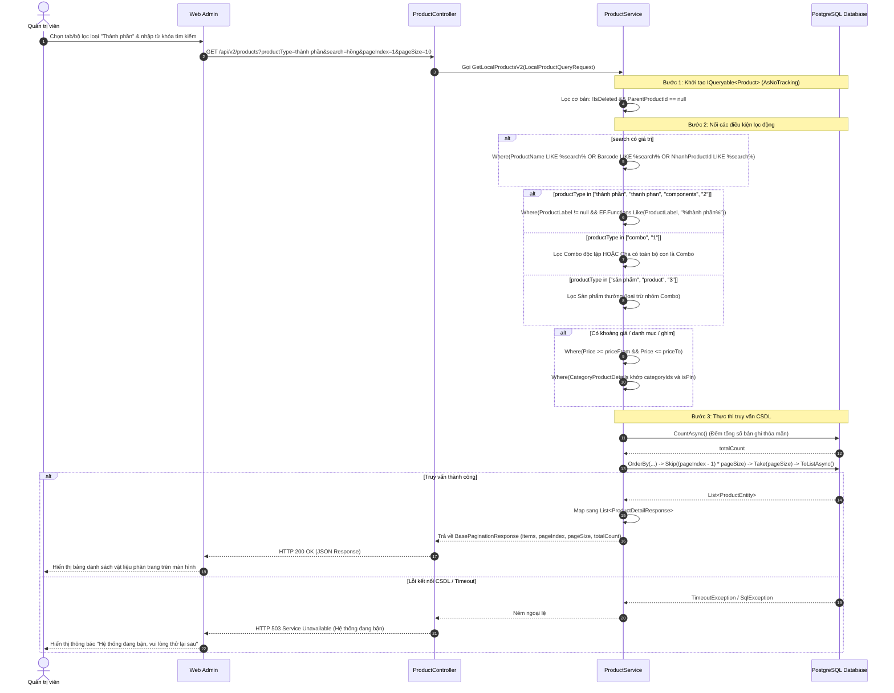

# Technical Design Document — Xem, tìm kiếm và filter theo sản phẩm có nhãn là vật liệu

---

## 1. Thông tin tài liệu

| Thuộc tính | Giá trị |
| :--- | :--- |
| **Doc ID** | **TDD-010** |
| **Tính năng** | Xem, tìm kiếm và filter theo sản phẩm có nhãn là vật liệu (Material / Thành phần) |
| **Tác giả** | Quoc Bao |
| **Người review** | Tech Lead |
| **Trạng thái** | In Review |
| **Phiên bản** | v0 |
| **Cập nhật (YYYY-MM-DD)** | 08/20/2026 |
| **Story liên quan** | STORY-002 (Chính), STORY-006 |

---

## 2. Bối cảnh & Mục tiêu

### 2.1. Vấn đề
Trong hệ thống của **HoaTheoMua**, danh mục sản phẩm đang lưu trữ chung giữa thành phẩm bán ra (Combo, bó hoa hoàn thiện) và các nguyên vật liệu thô (hoa tươi lẻ, giấy gói, phụ liệu). Việc không có công cụ phân tách rõ ràng khiến Quản trị viên (Admin) gặp khó khăn, mất nhiều thời gian khi chỉ muốn tra cứu tồn kho nguyên liệu, hoặc khi cần chọn vật liệu để tạo cấu hình định lượng (công thức) cho các sản phẩm Combo.

### 2.2. Mục tiêu (Goals)
1. **Phân loại thông minh:** Cung cấp API hỗ trợ lọc và tách biệt danh sách nguyên vật liệu khỏi các sản phẩm thông thường thông qua tham số `productType` / `typeProduct`.
2. **Hỗ trợ đa dạng tham số:** Cho phép người dùng truyền tham số lọc linh hoạt với các giá trị: `"thành phần"`, `"thanh phan"`, `"components"`, `"2"`.
3. **Kết hợp đa tiêu chí:** Tích hợp đồng thời với tìm kiếm từ khóa (`search` theo Tên, Barcode, Mã Nhanh), lọc khoảng giá (`priceFrom`, `priceTo`), danh mục (`categoryIds`), trạng thái ghim (`isPin`), sắp xếp (`sortBy`) và phân trang (`pageIndex`, `pageSize`).
4. **Tối ưu hóa truy vấn:** Sử dụng `IQueryable` động, `AsNoTracking()` và đếm `CountAsync()` độc lập để đảm bảo tốc độ phản hồi nhanh.

### 2.3. Ngoài phạm vi (Out of Scope)
1. Không thực hiện gọi API đồng bộ tồn kho thời gian thực từ Nhanh.vn trong API này (sử dụng dữ liệu Local Database).
2. Không bao gồm các chức năng tạo mới hoặc chỉnh sửa công thức định lượng (thuộc phạm vi TDD-006).

---

## 3. Kiến trúc & Sơ đồ

### 3.1. Kiến trúc tổng quan (Architecture)
* **Mô tả:** Mô hình 3 lớp từ Web Admin qua Controller, Service phân nhánh IQueryable đến PostgreSQL.


### 3.2. Sequence Diagram (Luồng tương tác)



---

## 4. API Contract

### 4.1. API Contract Nội bộ
* **Method:** `GET`
* **Endpoint:** `/api/v2/products`
* **Tên Endpoint:** `Xem và tìm kiếm danh sách sản phẩm theo loại`
* **Mô tả:** `Lấy danh sách sản phẩm (có hỗ trợ lọc các sản phẩm là vật liệu thông qua tham số productType / typeProduct).`

#### Query Parameters:

| Tham số | Kiểu dữ liệu | Bắt buộc | Mặc định | Mô tả |
| :--- | :--- | :---: | :---: | :--- |
| `pageIndex` | `integer` | Không | `1` | Chỉ số trang hiện tại ($\ge 1$) |
| `pageSize` | `integer` | Không | `10` | Số lượng phần tử mỗi trang ($1 \le pageSize \le 100$) |
| `search` | `string` | Không | `null` | Từ khóa tìm kiếm theo Tên, Barcode hoặc NhanhProductId |
| `productType` | `string` | Không | `null` | Bộ lọc loại sản phẩm: <br>• `"thành phần"` / `"components"` / `"2"`: Lọc nguyên vật liệu<br>• `"combo"` / `"1"`: Lọc sản phẩm Combo<br>• `"sản phẩm"` / `"product"` / `"3"`: Lọc sản phẩm thường |
| `priceFrom` | `number` | Không | `null` | Lọc sản phẩm có giá $\ge$ `priceFrom` |
| `priceTo` | `number` | Không | `null` | Lọc sản phẩm có giá $\le$ `priceTo` |
| `categoryIds` | `array[string]` | Không | `[]` | Danh sách ID danh mục sản phẩm (`Guid`) |
| `isPin` | `boolean` | Không | `null` | Lọc theo trạng thái ghim (`true`/`false`) |
| `sortBy` | `array[string]` | Không | `["-createdAt"]` | Tiêu chí sắp xếp: `price`, `-price`, `name`, `-name`, `createdAt`, `-createdAt` |

#### Payload Response Mẫu (200 OK):

```json
{
  "value": {
    "items": [
      {
        "id": "2066d62d-c314-4ee0-bbbd-90865e3779a6",
        "isPinned": false,
        "sourceRowNumber": 530,
        "nhanhProductId": "4933625",
        "parentProductId": null,
        "parentProductCode": null,
        "parentProductName": null,
        "barcode": "2000214269499",
        "productType": "Sản phẩm",
        "productCode": "VL_HH_DO",
        "productName": "Hoa Hồng Đỏ Cành Đà Lạt",
        "otherName": null,
        "unit": "cành",
        "coverImage": "https://pos.nvncdn.com/281991-126981/ps/20251229_0yynbkmHKI.jpeg",
        "otherImages": null,
        "warrantyMonths": null,
        "weight": 100,
        "importPrice": 5000,
        "importVat": null,
        "importPriceWithVat": 5000,
        "importVatMode": "Giá chưa bao gồm VAT",
        "price": 12000,
        "priceWithVat": 12000,
        "branchPrice": null,
        "branchPriceWithVat": null,
        "saleVatMode": "Giá chưa bao gồm VAT",
        "oldPrice": null,
        "vat": null,
        "profitPercentage": 58.33,
        "costPrice": 5000,
        "wholesalePrice": null,
        "wholesalePriceWithVat": null,
        "wholesaleBranchPrice": null,
        "wholesaleBranchPriceWithVat": null,
        "totalStock": 150,
        "stockTransferring": 0,
        "stock": 150,
        "deliveringStock": 0,
        "warehouseStock": null,
        "stockError": 0,
        "held": 0,
        "availableForSale": 150,
        "warrantyStock": 0,
        "heldComponents": 0,
        "pendingImportStock": null,
        "preOrder": null,
        "status": "Mới",
        "categoryCode": "VL",
        "categoryName": "NGUYÊN VẬT LIỆU",
        "internalCategoryCode": null,
        "brand": null,
        "nhanhCategoryId": null,
        "nhanhBrandId": null,
        "nhanhTypeId": null,
        "supplier": null,
        "warrantyAddress": null,
        "slug": "/hoa-hong-do-canh-da-lat-p4933625.html",
        "length": null,
        "width": null,
        "height": null,
        "webOrder": null,
        "nhanhCreatedAt": "2025-12-26T04:14:17+00:00",
        "nhanhUpdatedAt": null,
        "productLabel": "thành phần, hoa tươi",
        "branchPriceDuplicate": null,
        "wholesaleBranchPriceDuplicate": null,
        "priceLabel": null,
        "size": null,
        "color": "Đỏ",
        "origin": "Đà Lạt",
        "createdAt": "2026-07-24T13:30:35.204578+00:00",
        "updatedAt": "2026-08-07T09:43:43.490135+00:00",
        "categories": [
          {
            "categoryId": "ec6a8946-2bba-46fe-96e2-f932ae5e1135",
            "isPinned": false,
            "name": "Vật liệu hoa tươi",
            "name_En": "Fresh Flower Materials",
            "description": "Vật liệu hoa tươi",
            "description_En": "Fresh Flower Materials",
            "position": null,
            "metaData": "{\"isFilterable\": false}",
            "page": [],
            "startTime": null,
            "endTime": null,
            "type": "Fix",
            "isActive": true,
            "userId": "9ea83b22-cd9f-45c0-b8dd-e1c4e25ada11",
            "parentId": null,
            "parent": null,
            "children": [],
            "productCount": null,
            "productIds": null
          }
        ]
      }
    ],
    "pageIndex": 1,
    "pageSize": 10,
    "totalItems": 6,
    "totalPages": 1
  },
  "isSuccess": true,
  "isFaild": false,
  "error": "Lấy danh sách sản phẩm thành công",
  "traceId": null,
  "timestampUtc": "0001-01-01T00:00:00"
}
```

#### Quy ước Mã lỗi (Error Codes):

| Mã lỗi (Code) | HTTP Status | Khi nào xảy ra | Giải pháp xử lý |
| :--- | :---: | :--- | :--- |
| `INVALID_PARAMETER` | **400** | Truyền tham số không hợp lệ (VD: `pageIndex <= 0`, `categoryIds` không phải mảng GUID). | Trả về thông báo lỗi định dạng để client chỉnh sửa. |
| `UNAUTHORIZED` | **401** | Người dùng chưa đăng nhập, token hết hạn hoặc thiếu quyền gọi API. | Chuyển hướng người dùng về màn hình đăng nhập. |
| `SERVER_BUSY` | **503** | Hệ thống quá tải, timeout kết nối CSDL hoặc lỗi truy vấn nội bộ. | Bắt try-catch an toàn và trả thông báo: "Hệ thống đang bận". |

---

### 4.2. API Contract Bên ngoài
* **Field quan trọng:**
  * `ProductLabel`: Nhãn sản phẩm từ POS/Nhanh.vn dùng để nhận diện vật liệu chứa từ khóa `"thành phần"`.
  * `ParentProductId`: Xác định và loại trừ sản phẩm con biến thể.
  * `AvailableForSale`: Tồn kho khả dụng thực tế của nguyên vật liệu trong kho.
* **Xử lý lỗi từ đối tác:**
```text
API này truy vấn trực tiếp từ Local Database (PostgreSQL) đã đồng bộ từ trước, không gọi trực tiếp API Nhanh.vn theo thời gian thực nên không bị ảnh hưởng bởi downtime của đối tác.
```
* **Quirks / Cạm bẫy:**
  1. `ProductLabel có thể mang giá trị null hoặc chữ hoa/chữ thường khác nhau -> Bắt buộc dùng EF.Functions.Like(x.ProductLabel, "%thành phần%") để không phân biệt hoa thường.`
  2. `Sản phẩm cha có con: Nếu toàn bộ sản phẩm con thuộc loại Combo thì sản phẩm cha đó được xếp vào nhóm Combo, không được đưa vào nhóm Sản phẩm thường.`

---

## 5. Tham chiếu & Liên kết

### 5.1. User Stories & Use Cases
* **User Stories liên quan:**
  * `STORY-006`: Xem công thức định lượng của combo hoa
* **Use Cases:**
  * `UC-01: Admin lọc và tìm kiếm danh sách vật liệu để kiểm tra tồn kho.`
  * `UC-02: Admin tra cứu vật liệu để chọn nguyên liệu khi tạo công thức combo.`

### 5.2. Business Rules
* **BR-01:** `Sản phẩm có trường ProductLabel chứa từ khóa "thành phần" (không phân biệt hoa thường) được phân loại là Nguyên vật liệu.`
* **BR-02:** `Chỉ hiển thị các sản phẩm độc lập hoặc sản phẩm cha (ParentProductId là null hoặc rỗng) và chưa bị xóa mềm (!IsDeleted).`

### 5.3. Bộ kiểm chứng Unit Test (UT)
Tài liệu TDD-010 được kiểm chứng bởi 5 kịch bản Unit Test cốt lõi trong file [All_TestCase_Templates.md](file:///d:/VNZ/document-first-brief/hoatheomua/UnitTest/All_TestCase_Templates.md):

* **`UT-002-01`**: `xem và search list material` (`GetLocalProductsV2`)
* **`UT-002-02`**: `Lọc Product - sản phẩm thường` (`GetLocalProductsV2`)
* **`UT-002-02-01`**: `Lọc Material - vật liệu` (`GetLocalProductsV2`)
* **`UT-002-03`**: `kh truyền typeProduct` (`GetLocalProductsV2`)
* **`UT-002-04`**: `kh có dữ liệu thỏa mãn` (`GetLocalProductsV2`)

---

### 5.4. Giả định & Câu hỏi mở
* **Giả định:**
  * `Dữ liệu sản phẩm và nhãn ProductLabel đã được đồng bộ đầy đủ từ POS/Nhanh.vn vào Local DB.`
  * `Thuộc tính ParentProductId được điền chính xác cho các sản phẩm biến thể.`
* **Câu hỏi mở:**
  * `Trong tương lai có cần mở rộng thêm các từ khóa nhãn vật liệu khác ngoài "thành phần" không?`
