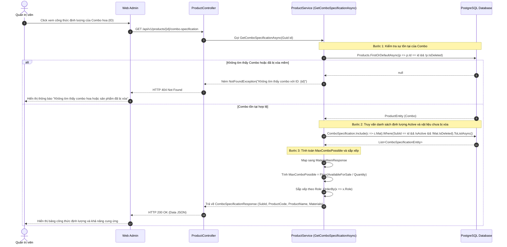
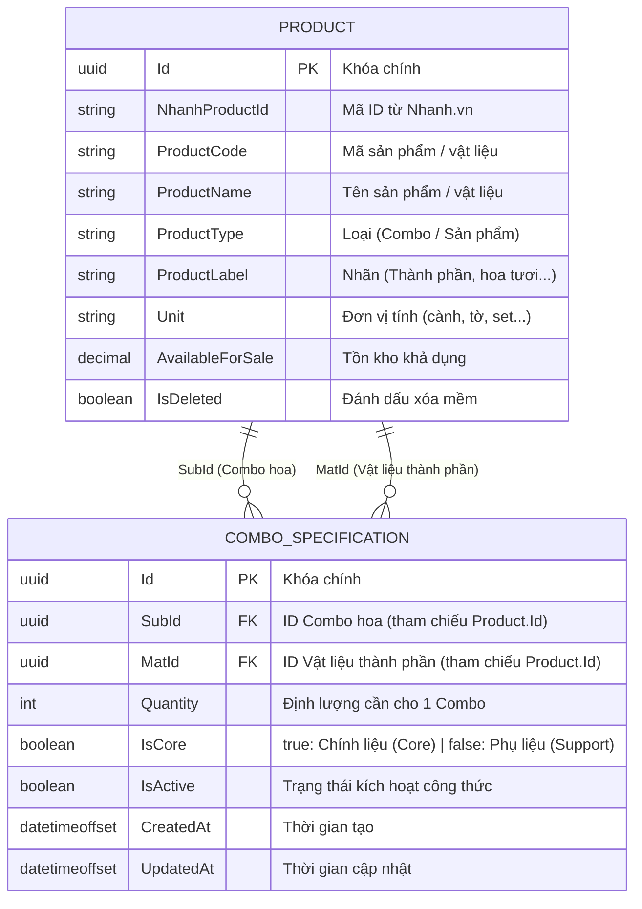

# Technical Design Document — Xem công thức định lượng của combo hoa

---

## 1. Thông tin tài liệu

| Thuộc tính | Giá trị |
| :--- | :--- |
| **Doc ID** | **TDD-011** |
| **Tính năng** | Xem công thức định lượng của combo hoa |
| **Tác giả** | Quoc Bao |
| **Người review** | Tân Trần / Tech Lead |
| **Người phê duyệt** | Tân Trần |
| **Chủ sở hữu (Owner)** | Quoc Bao |
| **Trạng thái** | In Review (Đang duyệt) |
| **Phiên bản** | v0.1 |
| **Cập nhật (YYYY-MM-DD)** | 2026-08-19 |
| **Story liên quan** | STORY-006, STORY-002 |

---

## 2. Bối cảnh & Mục tiêu

### 2.1. Vấn đề
Các sản phẩm dạng Combo (ví dụ: một bó hoa hoàn chỉnh) thực chất là sự kết hợp của nhiều nguyên vật liệu khác nhau (hoa chính, hoa lá phụ, giấy gói, ruy băng). Hiện tại, hệ thống cần một cơ chế rõ ràng để lưu trữ và hiển thị định lượng cấu thành nên một Combo, đồng thời giúp người quản lý biết được với số lượng vật liệu đang có trong kho thì có thể lắp ráp được tối đa bao nhiêu Combo để bán ra thị trường.

### 2.2. Mục tiêu (Goals)
* Cung cấp API tính toán số lượng Combo tối đa có thể bán (`MaxComboPossible`) dựa trên tồn kho nguyên liệu hiện tại (`AvailableForSale`) và định lượng của từng thành phần.
* Hiển thị chi tiết danh sách vật liệu cấu thành Combo, phân biệt rõ vai trò: **Vật liệu chính (Core - `Role = true / 1`)** và **Phụ liệu (Support - `Role = false / 2`)**.
* Xử lý an toàn các trường hợp biên: Combo chưa cấu hình định lượng, vật liệu bị hết hàng, hoặc vật liệu bị vô hiệu hóa / xóa mềm.

---

### 2.3. Ma trận Xử lý Nghiệp vụ (Business Rules Matrix)

| Trường hợp | Điều kiện | Kết quả xử lý |
| :--- | :--- | :--- |
| **Xem công thức hợp lệ** | `comboId` hợp lệ, Combo tồn tại, có công thức hoạt động (`IsActive = true`, `!IsDeleted`) | Trả về thông tin Combo, danh sách vật liệu đã sắp xếp và `MaxComboPossible` chính xác (`200 OK`). |
| **ComboId không hợp lệ** | `comboId` truyền lên URL không phải định dạng GUID hoặc rỗng | Trả về `400 INVALID_COMBO_ID` hoặc `400 BadRequest`. |
| **Combo không tồn tại** | Không tìm thấy Product theo `comboId` trong CSDL | Trả về `404 NOT_FOUND` ("Không tìm thấy combo với ID: ..."). |
| **Combo đã bị xóa** | Product có `IsDeleted == true` | Trả về `404 NOT_FOUND` (Xem như không tồn tại). |
| **Combo chưa có công thức** | Combo tồn tại nhưng chưa có bản ghi `ComboSpecification` nào | Trả về thông tin Combo với `materials = []` (`200 OK`). |
| **Tất cả công thức bị inactive/xóa** | Toàn bộ `ComboSpecification` đều có `IsActive == false` hoặc vật liệu `Mat.IsDeleted == true` | Bỏ qua các dòng này, trả về `materials = []` (`200 OK`). |
| **Vật liệu CORE hết hàng** | Tồn tại ít nhất 1 dòng CORE có `AvailableForSale == 0` | Dòng đó có `maxComboPossible = 0`. |
| **Vật liệu SUPPORT hết hàng** | Dòng SUPPORT có `AvailableForSale == 0` | Dòng đó có `maxComboPossible = 0`. |
| **Tính khả năng cung ứng từng dòng** | Từng dòng vật liệu có `Quantity > 0` | `maxComboPossible = Floor(AvailableForSale / Quantity)`. |
| **Sắp xếp vai trò vật liệu** | Danh sách gồm nhiều vật liệu cả CORE và SUPPORT | Sắp xếp theo `Role` boolean (`OrderBy(x => x.Role)`: Phụ liệu `false` đứng trước, Chính liệu `true` đứng sau). |
| **Chưa xác thực người dùng** | Request không có Token, Token hết hạn hoặc thiếu quyền | Trả về `401 UNAUTHORIZED`. |

---

## 3. Sequence Diagram (Luồng tương tác)



---

## 4. Mô hình dữ liệu (Data Model / ERD)



---

## 5. API Contract (Nội bộ)

### 5.1. Endpoint
* **Method:** `GET`
* **URL:** `/api/v1/products/{id}/combo-specification`
* **Tên Endpoint:** `Xem công thức định lượng của combo hoa`
* **Mô tả:** Lấy chi tiết công thức định lượng của một Combo, tính toán khả năng cung ứng tối đa cho từng nguyên vật liệu và sắp xếp theo vai trò.

### 5.2. Path Parameters

| Tham số | Kiểu dữ liệu | Bắt buộc | Mô tả |
| :--- | :--- | :---: | :--- |
| `id` | `Guid` | Có | ID của Combo hoa cần xem định lượng |

---

### 5.3. Response Payload Mẫu

#### 🟢 Trường hợp 1: Thành công — Combo có công thức định lượng (200 OK)
```json
{
  "value": {
    "subId": "2066d62d-c314-4ee0-bbbd-90865e3779a6",
    "productCode": "HB_JBK_2026",
    "productName": "Hồng Julibee Bó Kiểu Mặt Xinh_2026",
    "materials": [
      {
        "materialId": "4933640",
        "materialName": "Giấy gói hoa Hàn Quốc",
        "role": false,
        "quantityPerCombo": 2,
        "unit": "Tờ",
        "availableForSale": 30,
        "maxComboPossible": 15
      },
      {
        "materialId": "4933641",
        "materialName": "Ruy băng trang trí",
        "role": false,
        "quantityPerCombo": 1,
        "unit": "Sợi",
        "availableForSale": 100,
        "maxComboPossible": 100
      },
      {
        "materialId": "4933642",
        "materialName": "Hoa hồng Julibee",
        "role": true,
        "quantityPerCombo": 10,
        "unit": "Cành",
        "availableForSale": 50,
        "maxComboPossible": 5
      },
      {
        "materialId": "4933643",
        "materialName": "Hoa lá phụ Cẩm Chướng",
        "role": true,
        "quantityPerCombo": 5,
        "unit": "Cành",
        "availableForSale": 40,
        "maxComboPossible": 8
      }
    ]
  },
  "isSuccess": true,
  "isFaild": false,
  "error": "Tải công thức combo hoa thành công",
  "traceId": null,
  "timestampUtc": "0001-01-01T00:00:00"
}
```

#### 🟡 Trường hợp 2: Thành công — Combo chưa thiết lập định lượng (200 OK)
```json
{
  "value": {
    "subId": "2066d62d-c314-4ee0-bbbd-90865e3779a6",
    "productCode": "HB_NEW_2026",
    "productName": "Combo Mới Chưa Có Định Lượng",
    "materials": []
  },
  "isSuccess": true,
  "isFaild": false,
  "error": "Combo hoa chưa có công thức định lượng",
  "traceId": null,
  "timestampUtc": "0001-01-01T00:00:00"
}
```

#### 🔴 Trường hợp 3: Lỗi — Không tìm thấy Combo (404 Not Found)
```json
{
  "value": null,
  "isSuccess": false,
  "isFaild": true,
  "error": {
    "code": "NOT_FOUND",
    "message": "Không tìm thấy combo với ID: 2066d62d-c314-4ee0-bbbd-90865e3779a6"
  },
  "traceId": "00-4bf92f3577b34da6a3ce929d0e0e4736-00f067aa0ba902b7-01",
  "timestampUtc": "2026-08-19T07:47:00Z"
}
```

---

### 5.4. Quy ước Mã lỗi (Error Codes)

| Mã lỗi (Code) | HTTP Status | Khi nào xảy ra | Giải pháp xử lý |
| :--- | :---: | :--- | :--- |
| `NOT_FOUND` | **404** | `comboId` không tồn tại trong hệ thống hoặc `IsDeleted == true`. | Hiển thị thông báo "Không tìm thấy combo hoa hoặc sản phẩm đã bị xóa". |
| `INVALID_COMBO_ID` | **400** | Giá trị `id` truyền trên URL không đúng định dạng GUID hoặc rỗng. | Báo lỗi định dạng ID không hợp lệ cho client. |
| `UNAUTHORIZED` | **401** | Người dùng chưa đăng nhập, token hết hạn hoặc thiếu quyền truy cập. | Chuyển hướng người dùng về màn hình đăng nhập. |
| `SERVER_BUSY` | **503** | Lỗi kết nối CSDL hoặc timeout xử lý nội bộ. | Bắt try-catch an toàn và trả thông báo: "Hệ thống đang bận". |

---

## 6. Bộ kiểm chứng Unit Test (UT)

Tài liệu TDD-011 được kiểm chứng trực tiếp bởi các test case trong file [All_TestCase_Templates.md](file:///d:/VNZ/document-first-brief/hoatheomua/UnitTest/All_TestCase_Templates.md) và [GetComboSpecificationTest.cs](file:///d:/VNZ/document-first-brief/hoatheomua/Code/ServiceTest/GetComboSpecificationTest.cs):

1. **`UT-006-01`**: `kh tìm thấy combo` (`GetComboSpecificationAsync`) — Kiểm tra ném `NotFoundException` khi combo không tồn tại hoặc đã xóa mềm.
2. **`UT-006-02`**: `Combo rỗng, trả về danh sách rỗng` (`GetComboSpecificationAsync`) — Kiểm tra combo chưa cấu hình vật liệu trả về `Materials = []`.
3. **`UT-006-03`**: `Tính toán số lượng MaxCombo và Sắp xếp đúng Role` (`GetComboSpecificationAsync`) — Kiểm tra tính toán `MaxComboPossible = Floor(AvailableForSale / Quantity)` và sắp xếp vai trò Role.
4. **`UT-006-04`**: `Combo rỗng hoặc vật liệu bị vô hiệu hóa` (`GetComboSpecificationAsync`) — Kiểm tra tự động loại bỏ các bản ghi `IsActive = false` và vật liệu bị xóa mềm.

---

## 7. Tham chiếu & Liên kết

* **User Stories:**
  * `STORY-006`: Xem công thức định lượng của combo hoa (User Story chính)
  * `STORY-002`: Xem và filter theo sản phẩm có nhãn là vật liệu
* **Tài liệu liên quan:**
  * [TDD-010.md](file:///d:/VNZ/document-first-brief/hoatheomua/TDD/TDD-010.md) (Xem, tìm kiếm và filter theo sản phẩm có nhãn là vật liệu)
  * [GetComboSpecificationTest.cs](file:///d:/VNZ/document-first-brief/hoatheomua/Code/ServiceTest/GetComboSpecificationTest.cs)
