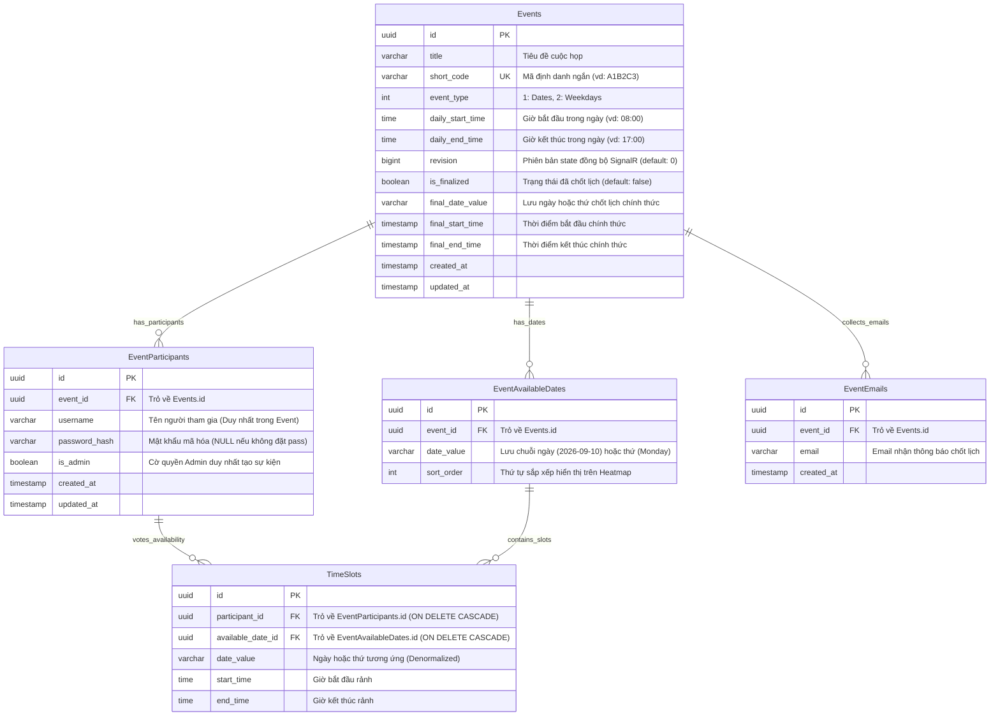

# Kiến Trúc Cơ Sở Dữ Liệu & ERD — Nền Tảng Meetly

> **Dự án**: `Meetly` (Meeting Scheduling & Visual Heatmap Polling Platform)  
> **Tài liệu**: Database Schema, Entity Relationship Diagram (ERD) & Data Dictionary  
> **Căn cứ**: [API_Contract.md](file:///d:/VNZ/document-first-brief/meetly/ConfirmedDoc/API_Contract.md), [SignalR_Contract.md](file:///d:/VNZ/document-first-brief/meetly/ConfirmedDoc/SignalR_Contract.md) & [MEETLY_API_CONTRACT.md](file:///d:/VNZ/document-first-brief/meetly/Context/MEETLY_API_CONTRACT.md)  
> **Ngày cập nhật**: 14/09/2026  

---

## 🏗️ 1. Sơ Đồ Thực Thể Quan Hệ (Mermaid ERD)



---

## 📋 2. Từ Điển Dữ Liệu Chi Tiết (Data Dictionary)

### 2.1. Bảng `Events`
Lưu trữ thông tin cấu hình cốt lõi của sự kiện khảo sát.

| Tên Cột | Kiểu Dữ Liệu | Ràng Buộc | Ý Nghĩa / Nghiệp Vụ |
| :--- | :--- | :---: | :--- |
| `id` | `UUID` | **PK** | Khóa chính duy nhất. |
| `title` | `VARCHAR(255)` | **NOT NULL** | Tên sự kiện (vd: *"Họp nhóm SWD"*). |
| `short_code` | `VARCHAR(10)` | **UNIQUE, NOT NULL** | Mã sự kiện ngẫu nhiên 6 ký tự (vd: `A1B2C3`). Dùng trên URL. |
| `event_type` | `INT` | **NOT NULL** | `1`: Khảo sát theo Ngày cụ thể (`Dates`), `2`: Khảo sát theo Thứ (`Weekdays`). |
| `daily_start_time` | `TIME` | **NOT NULL** | Khung giờ sớm nhất cho phép họp trong ngày (mặc định `08:00`). |
| `daily_end_time` | `TIME` | **NOT NULL** | Khung giờ muộn nhất cho phép họp trong ngày (mặc định `17:00` hoặc `23:00`). |
| `revision` | `BIGINT` | **DEFAULT 0, NOT NULL** | Phiên bản trạng thái sự kiện, tự động tăng khi có thay đổi (bình chọn, sửa cấu hình, chốt lịch) để broadcast SignalR realtime và chống race condition. |
| `is_finalized` | `BOOLEAN` | **DEFAULT FALSE** | Cờ trạng thái: `TRUE` khi Admin đã bấm chốt lịch họp. Khi `TRUE`, khóa toàn bộ quyền sửa lịch. |
| `final_date_value` | `VARCHAR(50)` | **NULLABLE** | Lưu ngày (`YYYY-MM-DD`) hoặc thứ (`Monday`...`Sunday`) được chọn làm lịch chính thức. |
| `final_start_time` | `TIMESTAMP` | **NULLABLE** | Thời gian bắt đầu buổi họp chính thức sau khi chốt. |
| `final_end_time` | `TIMESTAMP` | **NULLABLE** | Thời gian kết thúc buổi họp chính thức sau khi chốt. |
| `created_at` | `TIMESTAMP` | **DEFAULT NOW()** | Thời điểm tạo sự kiện. |
| `updated_at` | `TIMESTAMP` | **DEFAULT NOW()** | Thời điểm cập nhật cấu hình hoặc trạng thái sự kiện gần nhất. |

---

### 2.2. Bảng `EventAvailableDates`
Lưu danh sách các ngày hoặc thứ được chọn để khảo sát trong sự kiện.

| Tên Cột | Kiểu Dữ Liệu | Ràng Buộc | Ý Nghĩa / Nghiệp Vụ |
| :--- | :--- | :---: | :--- |
| `id` | `UUID` | **PK** | Khóa chính. |
| `event_id` | `UUID` | **FK (Events.id)** | Thuộc sự kiện nào. Bật `ON DELETE CASCADE`. |
| `date_value` | `VARCHAR(50)` | **NOT NULL** | Giá trị ngày dạng `YYYY-MM-DD` (nếu `eventType = 1`) hoặc tên thứ `Monday`, `Tuesday`... (nếu `eventType = 2`). |
| `sort_order` | `INT` | **DEFAULT 0** | Thứ tự hiển thị cột trên lưới Heatmap từ trái qua phải. |

> **Ràng buộc toàn vẹn**: `UNIQUE(event_id, date_value)` — Một sự kiện không được chứa hai ngày/thứ trùng lặp.

---

### 2.3. Bảng `EventParticipants`
Lưu danh tính của người tham gia trong phạm vi từng sự kiện (**Event-Scoped Identity**).

| Tên Cột | Kiểu Dữ Liệu | Ràng Buộc | Ý Nghĩa / Nghiệp Vụ |
| :--- | :--- | :---: | :--- |
| `id` | `UUID` | **PK** | Khóa chính. |
| `event_id` | `UUID` | **FK (Events.id)** | Thuộc sự kiện nào. Bật `ON DELETE CASCADE`. |
| `username` | `VARCHAR(100)` | **NOT NULL** | Tên hiển thị người tham gia (Duy nhất trong 1 Event: `UNIQUE(event_id, username)`). |
| `password_hash` | `VARCHAR(255)` | **NULLABLE** | Mật khẩu băm (BCrypt/Argon2). `NULL` nếu người dùng không cài mật khẩu bảo vệ. |
| `is_admin` | `BOOLEAN` | **DEFAULT FALSE** | `TRUE` cho người tạo sự kiện (Host duy nhất theo BR-05), `FALSE` cho người tham gia thông thường. |
| `created_at` | `TIMESTAMP` | **DEFAULT NOW()** | Thời điểm đăng ký. |
| `updated_at` | `TIMESTAMP` | **DEFAULT NOW()** | Thời điểm cập nhật thông tin/lịch gần nhất. |

---

### 2.4. Bảng `TimeSlots`
Lưu trữ toàn bộ các khoảng thời gian rảnh (**Free Time**) của từng người tham gia theo [BR-13](file:///d:/VNZ/document-first-brief/meetly/BusinessRules/BR-13.md).

| Tên Cột | Kiểu Dữ Liệu | Ràng Buộc | Ý Nghĩa / Nghiệp Vụ |
| :--- | :--- | :---: | :--- |
| `id` | `UUID` | **PK** | Khóa chính. |
| `participant_id` | `UUID` | **FK (EventParticipants.id)** | Của người tham gia nào. Bật `ON DELETE CASCADE`. |
| `available_date_id` | `UUID` | **FK (EventAvailableDates.id)** | Trỏ về ngày khảo sát tương ứng. Bật `ON DELETE CASCADE` đảm bảo tự động xóa liên tầng khi Admin xóa ngày khảo sát ([BR-07](file:///d:/VNZ/document-first-brief/meetly/BusinessRules/BR-07.md)). |
| `date_value` | `VARCHAR(50)` | **NOT NULL** | Giá trị ngày/thứ (Denormalized) giúp tối ưu hóa truy vấn ma trận Heatmap không cần JOIN nhiều bảng. |
| `start_time` | `TIME` | **NOT NULL** | Giờ bắt đầu khoảng rảnh (vd: `08:00`). |
| `end_time` | `TIME` | **NOT NULL** | Giờ kết thúc khoảng rảnh (vd: `10:00`). Điều kiện: `start_time < end_time` (xuyên ngày được tách làm 2 slot theo [BR-16](file:///d:/VNZ/document-first-brief/meetly/BusinessRules/BR-16.md)). |

---

### 2.5. Bảng `EventEmails`
Lưu trữ danh sách email đã đăng ký để hệ thống gửi thông báo tự động khi Admin chốt lịch.

| Tên Cột | Kiểu Dữ Liệu | Ràng Buộc | Ý Nghĩa / Nghiệp Vụ |
| :--- | :--- | :---: | :--- |
| `id` | `UUID` | **PK** | Khóa chính. |
| `event_id` | `UUID` | **FK (Events.id)** | Thuộc sự kiện nào. Bật `ON DELETE CASCADE`. |
| `email` | `VARCHAR(255)` | **NOT NULL** | Địa chỉ email người nhận. Ràng buộc: `UNIQUE(event_id, email)`. |
| `created_at` | `TIMESTAMP` | **DEFAULT NOW()** | Thời điểm đăng ký nhận thông báo. |

---

## 🔗 3. Ánh Xạ Giữa 7 API Endpoints & Thao Tác CSDL

```text
1. POST /events
   ├── INSERT INTO Events (title, event_type, daily_start_time, daily_end_time, short_code, revision = 0)
   ├── INSERT INTO EventAvailableDates (event_id, date_value, sort_order)
   └── INSERT INTO EventParticipants (event_id, username, password_hash, is_admin = true) (Tạo Admin sự kiện theo BR-05 & US-01)

2. GET /events/{shortCode}
   ├── SELECT FROM Events WHERE short_code = ? (Lấy metadata, revision, is_finalized, final_*)
   ├── SELECT FROM EventAvailableDates WHERE event_id = ? ORDER BY sort_order
   ├── SELECT FROM EventParticipants WHERE event_id = ?
   └── SELECT FROM TimeSlots JOIN EventParticipants -> Group dữ liệu thành ma trận heatmapGrid

3. POST /events/{shortCode}/participants/access
   ├── SELECT FROM EventParticipants WHERE event_id = ? AND username = ? (Verify mật khẩu nếu có, trả về isAdmin)
   └── Nếu tìm thấy: SELECT FROM TimeSlots WHERE participant_id = ?

4. POST /events/{shortCode}/participants
   ├── INSERT/UPDATE EventParticipants (username, password_hash, updated_at = NOW())
   ├── DELETE FROM TimeSlots WHERE participant_id = ? (Xóa lịch cũ)
   ├── BULK INSERT INTO TimeSlots (participant_id, available_date_id, date_value, start_time, end_time) (Lưu lịch rảnh mới)
   ├── INSERT INTO EventEmails (event_id, email) ON CONFLICT DO NOTHING (nếu email != null)
   ├── UPDATE Events SET revision = revision + 1, updated_at = NOW() WHERE id = ?
   └── Broadcast SignalR "HeatmapUpdated" kèm revision mới

5. POST /events/{shortCode}/finalize
   ├── UPDATE Events SET is_finalized = true, final_date_value = ?, final_start_time = ?, final_end_time = ?, revision = revision + 1, updated_at = NOW()
   ├── SELECT email FROM EventEmails WHERE event_id = ? -> Kích hoạt Background Job gửi Email BCC
   └── Broadcast SignalR "EventFinalized" kèm revision mới

6. GET /events/{shortCode}/suggestions
   └── Query TimeSlots: Lọc khoảng giao thời gian rảnh có chứa keyParticipant và duration >= minDuration

7. PUT /events/{shortCode}
   ├── Xác thực adminUsername & adminPassword từ EventParticipants (is_admin = true)
   ├── UPDATE Events (title, event_type, daily_start_time, daily_end_time, revision = revision + 1, updated_at = NOW())
   ├── Cập nhật EventAvailableDates (thêm ngày mới; xóa ngày bị bỏ -> DB engine tự CASCADE DELETE TimeSlots thông qua available_date_id theo BR-07)
   ├── Cắt tỉa (DELETE/TRUNCATE) các TimeSlots có giờ rảnh nằm ngoài khung daily_start_time - daily_end_time mới
   └── Broadcast SignalR "EventConfigUpdated" kèm revision mới
```

---

## ⚡ 4. Tối Ưu Chỉ Mục (Indexes) & Hiệu Năng Heatmap

```sql
-- 1. Tìm kiếm sự kiện theo ShortCode siêu tốc:
CREATE UNIQUE INDEX idx_events_short_code ON Events(short_code);

-- 2. Tìm kiếm người tham gia trong sự kiện:
CREATE UNIQUE INDEX idx_participants_event_user ON EventParticipants(event_id, username);

-- 3. Chặn trùng ngày/thứ và tối ưu sắp xếp cột Heatmap:
CREATE UNIQUE INDEX idx_event_dates_unique ON EventAvailableDates(event_id, date_value);
CREATE INDEX idx_event_dates_order ON EventAvailableDates(event_id, sort_order);

-- 4. Tối ưu tổng hợp ma trận Heatmap & CASCADE DELETE theo ngày:
CREATE INDEX idx_timeslots_participant ON TimeSlots(participant_id);
CREATE INDEX idx_timeslots_available_date ON TimeSlots(available_date_id);
CREATE INDEX idx_timeslots_date_time ON TimeSlots(date_value, start_time, end_time);

-- 5. Chặn trùng lặp email thông báo trong 1 sự kiện:
CREATE UNIQUE INDEX idx_event_emails_unique ON EventEmails(event_id, email);
```
