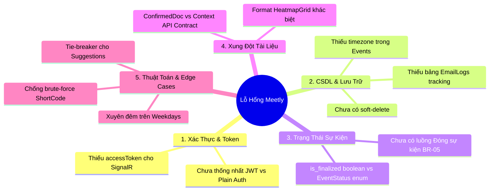

# Báo Cáo Đánh Giá Lỗ Hổng & Điểm Thiếu Sót Hệ Thống — Nền Tảng Meetly

> **Dự án**: `Meetly` (Meeting Scheduling & Visual Heatmap Polling Platform)  
> **Tài liệu**: System Gap Analysis & Technical Improvement Roadmap  
> **Người lập**: Antigravity Pair-Programming Assistant  
> **Ngày lập**: 14/09/2026  
> **Căn cứ đối soát**:  
> - CSDL & Kiến trúc: [Database_Architecture.md](file:///d:/VNZ/document-first-brief/meetly/Context/Database_Architecture.md)  
> - Hợp đồng API: [API_Contract.md](file:///d:/VNZ/document-first-brief/meetly/ConfirmedDoc/API_Contract.md) & [MEETLY_API_CONTRACT.md](file:///d:/VNZ/document-first-brief/meetly/Context/MEETLY_API_CONTRACT.md)  
> - Hợp đồng Realtime: [SignalR_Contract.md](file:///d:/VNZ/document-first-brief/meetly/ConfirmedDoc/SignalR_Contract.md)  
> - Quy tắc nghiệp vụ: [BusinessRules/](file:///d:/VNZ/document-first-brief/meetly/BusinessRules) ([BR-01](file:///d:/VNZ/document-first-brief/meetly/BusinessRules/BR-01.md) -> [BR-16](file:///d:/VNZ/document-first-brief/meetly/BusinessRules/BR-16.md))  
> - User Stories: [UserStory/](file:///d:/VNZ/document-first-brief/meetly/UserStory) ([US-01](file:///d:/VNZ/document-first-brief/meetly/UserStory/01-CreateSurveyEvent.md) -> [US-06](file:///d:/VNZ/document-first-brief/meetly/UserStory/06-VoteMeetingTime.md))  

---

## 📌 1. Tổng Quan

Qua quá trình rà soát chéo giữa các tầng **Cơ sở dữ liệu (DB)**, **Hợp đồng API (RESTful)**, **Đồng bộ thời gian thực (SignalR)** và **Quy tắc nghiệp vụ (Business Rules)**, hệ thống Meetly đã có cấu trúc cốt lõi vững chắc (Event-Scoped Identity, chuẩn hóa Free Time, Heatmap 15-phút).

Tuy nhiên, hệ thống vẫn tồn tại **5 nhóm vấn đề còn thiếu hoặc chưa đồng nhất**, cần được hoàn thiện trước khi bước vào giai đoạn code Backend/Frontend:



---

## 🚨 2. Các Lỗ Hổng Kỹ Thuật Trọng Yếu (Critical Gaps)

### 2.1. Thiếu cơ chế cấp phát `accessToken` cho SignalR Hub
- **Hiện trạng**: 
  - [SignalR_Contract.md](file:///d:/VNZ/document-first-brief/meetly/ConfirmedDoc/SignalR_Contract.md#L9-L22) ghi rõ: Kết nối `/hubs/events` yêu cầu `Bearer accessToken`.
  - Tuy nhiên, trong [API_Contract.md](file:///d:/VNZ/document-first-brief/meetly/ConfirmedDoc/API_Contract.md):
    - `POST /api/v1/events` (Tạo sự kiện) chỉ trả về `{ shortCode, url, revision }`.
    - `POST /api/v1/events/{shortCode}/participants/access` chỉ trả về `{ isAdmin, timeSlots }`.
- **Hậu quả**: Frontend hoàn toàn **không nhận được token** để kết nối vào SignalR Hub, dẫn đến tính năng realtime cập nhật Heatmap không thể hoạt động.
- **Giải pháp**: Cả 2 API trên phải trả về `accessToken` (chứa claims: `participantId`, `eventId`, `shortCode`, `isAdmin`).

---

### 2.2. Xung đột giữa 2 tài liệu API Contract
Trong thư mục dự án đang tồn tại 2 file hợp đồng API với format dữ liệu khác nhau:
1. [ConfirmedDoc/API_Contract.md](file:///d:/VNZ/document-first-brief/meetly/ConfirmedDoc/API_Contract.md) (Rút gọn 7 endpoints, xác thực bằng gửi username/password trực tiếp trong payload).
2. [Context/MEETLY_API_CONTRACT.md](file:///d:/VNZ/document-first-brief/meetly/Context/MEETLY_API_CONTRACT.md) (Chi tiết, xác thực bằng Bearer token, phân tách `availableWeekdays` dạng `int[]`).

| Tiêu chí | `ConfirmedDoc/API_Contract.md` | `Context/MEETLY_API_CONTRACT.md` |
| :--- | :--- | :--- |
| **Xác thực Admin khi sửa** | Gửi `adminUsername` + `adminPassword` trong body | Gửi `Bearer accessToken` trên header |
| **Cấu trúc `heatmapGrid`** | Key-Value: `"{datetime}": ["User1", "User2"]` | Mảng Object: `[ { specificDate, startTime, participants: [...] } ]` |
| **Weekdays format** | Mảng chuỗi: `["Monday", "Tuesday"]` | Mảng số theo enum .NET: `[1, 2]` |
| **Trạng thái sự kiện** | `isFinalized: boolean` | `status: 1 (Open), 2 (Finalized), 3 (Closed)` |

> **Khuyến nghị**: Cần thống nhất chọn 1 chuẩn duy nhất (ưu tiên chuẩn RESTful Bearer Token của `MEETLY_API_CONTRACT.md` kết hợp format `heatmapGrid` của `ConfirmedDoc` để tối ưu băng thông JSON).

---

### 2.3. Quản lý trạng thái sự kiện: Boolean `is_finalized` không đủ cho nghiệp vụ
- **Hiện trạng**: Bảng `Events` hiện chỉ có `is_finalized BOOLEAN`.
- **Vấn đề nghiệp vụ**:
  - Theo [BR-05](file:///d:/VNZ/document-first-brief/meetly/BusinessRules/BR-05.md) và [US-02](file:///d:/VNZ/document-first-brief/meetly/UserStory/02-EditSurveyEvent.md): Admin có quyền **"Đóng sự kiện / khóa bình chọn"** mà không nhất thiết phải chốt ngày họp (ví dụ: hủy khảo sát, hoặc tạm dừng nhận vote để hội ý nội bộ).
  - Nếu chỉ dùng `is_finalized = true`, hệ thống sẽ hiểu nhầm là sự kiện đã chốt ngày thành công và kích hoạt gửi mail/lịch.
- **Giải pháp**: Thay cờ `is_finalized` bằng trường `status INT` (hoặc enum `EventStatus`):
  - `1 = Open`: Đang mở bình chọn.
  - `2 = Finalized`: Đã chốt lịch chính thức và gửi thông báo.
  - `3 = Closed`: Đã đóng/khóa bình chọn (không cho vote thêm).

---

### 2.4. Thiếu trường Múi giờ (`timezone`) trong bảng `Events`
- **Hiện trạng**: [Database_Architecture.md](file:///d:/VNZ/document-first-brief/meetly/Context/Database_Architecture.md) lưu `daily_start_time` và `daily_end_time` dạng `TIME`, và `final_start_time` dạng `TIMESTAMP` không kèm timezone cột.
- **Vấn đề**:
  - Nếu người tạo ở Việt Nam (`Asia/Ho_Chi_Minh`, UTC+7) nhưng người tham gia ở Nhật Bản (UTC+9) hoặc Châu Âu (UTC+1), giao diện Heatmap sẽ bị lệch khung giờ nếu không có thông tin timezone gốc của sự kiện.
- **Giải pháp**: Bổ sung cột `timezone VARCHAR(50) DEFAULT 'Asia/Ho_Chi_Minh' NOT NULL` vào bảng `Events`.

---

### 2.5. Thiếu bảng ghi vết gửi Email (`EventEmailLogs`)
- **Hiện trạng**: Bảng `EventEmails` chỉ lưu danh sách email đăng ký nhận tin. Khi Admin bấm `POST /finalize`, hệ thống bắn mail BCC hàng loạt.
- **Vấn đề**:
  - Nếu sự cố mạng/SMTP xảy ra giữa chừng (ví dụ gửi được 20/50 mail thì timeout), hệ thống không có bảng ghi vết để biết email nào đã gửi thành công, email nào thất bại để retry.
- **Giải pháp**: Bổ sung bảng `EventEmailLogs`:
  ```sql
  EventEmailLogs (
      id UUID PK,
      event_id UUID FK REFERENCES Events(id),
      email VARCHAR(255) NOT NULL,
      status VARCHAR(20) NOT NULL, -- PENDING, SENT, FAILED
      error_message TEXT NULL,
      sent_at TIMESTAMP NULL
  )
  ```

---

## 🧩 3. Lỗ Hổng Nghiệp Vụ & Trường Hợp Biên (Edge Cases)

### 3.1. Kiểm tra sự kiện quá hạn theo [BR-12](file:///d:/VNZ/document-first-brief/meetly/BusinessRules/BR-12.md)
- **Quy tắc**: Hệ thống phải tự động chặn bình chọn khi sự kiện đã quá hạn (toàn bộ các ngày khảo sát đã trôi vào quá khứ).
- **Điểm thiếu**: Chưa có đặc tả cách hệ thống nhận diện sự kiện quá hạn:
  - Sử dụng Background Job chạy định kỳ quét chuyển `status = Closed`?
  - Hay kiểm tra động (Dynamic Validation) tại thời điểm gọi API `POST /participants` bằng cách so sánh `NOW()` với ngày lớn nhất trong `EventAvailableDates`?
- **Khuyến nghị**: Thực hiện kiểm tra động tại tầng Service khi có request vote, đồng thời có thể chạy Cronjob cuối ngày để cập nhật status.

---

### 3.2. Xử lý đụng độ mã rút gọn (ShortCode Collision)
- **Quy tắc**: Mã `short_code` gồm 6 ký tự ngẫu nhiên (ví dụ `A1B2C3`).
- **Điểm thiếu**: Khi lượng sự kiện tăng lên, xác suất sinh trùng `short_code` sẽ xuất hiện:
  - CSDL có `UNIQUE INDEX`, nếu trùng sẽ throw `DbUpdateException / 23505 Unique Violation`.
  - Backend chưa đặc tả cơ chế retry (thử sinh lại mã mới tối đa 3-5 lần trước khi báo lỗi server).

---

### 3.3. Tiêu chí hòa điểm (Tie-breaker) trong Thuật toán Gợi ý (`/suggestions`)
- **Quy tắc**: Admin lọc theo `keyParticipant` và `minDuration`.
- **Điểm thiếu**: Chưa có quy tắc hòa điểm khi có nhiều khung giờ có cùng số lượng người rảnh tối đa:
  - Ưu tiên khung giờ sớm nhất trong danh sách ngày?
  - Ưu tiên khung giờ có thời lượng dài nhất?
  - Cần quy định rõ thứ tự sắp xếp kết quả trả về (`ORDER BY count DESC, date_value ASC, start_time ASC`).

---

### 3.4. Bình chọn xuyên đêm trên loại sự kiện Weekdays ([BR-16](file:///d:/VNZ/document-first-brief/meetly/BusinessRules/BR-16.md))
- **Quy tắc**: Hỗ trợ vote từ `21:00` hôm nay đến `03:00` hôm sau.
- **Điểm thiếu**: Với `eventType = 1` (Dates), ngày hôm sau là ngày lịch dương kế tiếp (ví dụ `2026-09-10` -> `2026-09-11`). Nhưng với `eventType = 2` (Weekdays):
  - Ví dụ chọn `Sunday` từ 22:00 đến 02:00 sáng hôm sau (`Monday`).
  - Nếu `Monday` không nằm trong danh sách `availableWeekdays`, xử lý cắt slot tại `23:45` hay báo lỗi?
  - Cần ghi rõ logic wrap-around từ Chủ Nhật sang Thứ Hai.

---

### 3.5. Cơ chế Rate Limiting & Chống Spam
- API `POST /api/v1/events` hoàn toàn mở cho khách (Guest).
- Thiếu giải pháp giới hạn tần suất tạo (Rate Limit per IP, vd: tối đa 5 sự kiện/phút/IP) để tránh bot tấn công làm tràn bảng `Events` và cạn kiệt không gian `short_code`.

---

## 📋 4. Bảng Kế Hoạch Hoàn Thiện (Action Items)

| STT | Nhiệm vụ | Mức độ ưu tiên | Tệp liên quan |
| :---: | :--- | :---: | :--- |
| **1** | Bổ sung `accessToken` vào response tạo event & đăng nhập access | **P0 (Blocker)** | [API_Contract.md](file:///d:/VNZ/document-first-brief/meetly/ConfirmedDoc/API_Contract.md), [SignalR_Contract.md](file:///d:/VNZ/document-first-brief/meetly/ConfirmedDoc/SignalR_Contract.md) |
| **2** | Thêm cột `timezone` và `status` (thay vì chỉ `is_finalized`) | **P1 (High)** | [Database_Architecture.md](file:///d:/VNZ/document-first-brief/meetly/Context/Database_Architecture.md) |
| **3** | Thêm bảng `EventEmailLogs` để theo dõi tiến độ gửi email thông báo | **P1 (High)** | [Database_Architecture.md](file:///d:/VNZ/document-first-brief/meetly/Context/Database_Architecture.md) |
| **4** | Quy ước thống nhất 1 bản API Contract chuẩn giữa 2 tài liệu | **P1 (High)** | [ConfirmedDoc/API_Contract.md](file:///d:/VNZ/document-first-brief/meetly/ConfirmedDoc/API_Contract.md), [Context/MEETLY_API_CONTRACT.md](file:///d:/VNZ/document-first-brief/meetly/Context/MEETLY_API_CONTRACT.md) |
| **5** | Định nghĩa thuật toán Tie-breaker cho API `/suggestions` | **P2 (Medium)** | [API_Contract.md](file:///d:/VNZ/document-first-brief/meetly/ConfirmedDoc/API_Contract.md), [US-05](file:///d:/VNZ/document-first-brief/meetly/UserStory/05-ViewResultsViaHeatmap.md) |
| **6** | Bổ sung Rate Limiting và cơ chế Retry khi va chạm ShortCode | **P2 (Medium)** | Backend Architecture / TDD |
