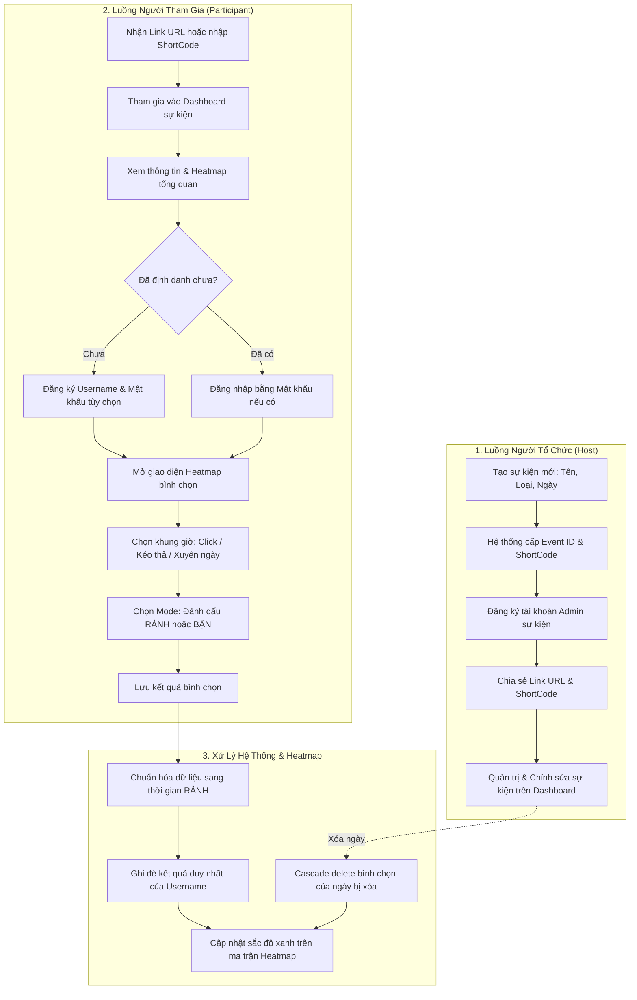

# Meetly — Nền Tảng Khảo Sát & Tối Ưu Lịch Họp Nhóm Qua Heatmap (`meetly`)

> **Mã dự án (Key)**: `meetly`  
> **Tên dự án**: `Meetly` (Meeting Scheduling & Visual Heatmap Polling Platform)  
> **Phương pháp tiếp cận**: Document-First System Specification (BDD Acceptance Criteria)  
> **Phiên bản tài liệu**: `v1.0`  
> **Trạng thái**: Hoàn tất đặc tả **6 User Stories**, **16 Business Rules** và **65 System Tests**  
> **Cập nhật gần nhất**: 2026-09-08  

---

## 📖 1. Tổng quan & Tầm nhìn Dự án

**Meetly** là nền tảng số hỗ trợ lập kế hoạch, khảo sát và tự động tìm kiếm thời gian gặp mặt tối ưu cho nhóm, tổ chức hoặc đối tác thông qua ma trận **Heatmap trực quan**:

### 🎯 4 Trụ Cột Năng Lực Cốt Lõi:
1. **Khảo sát thời gian đa mô hình**:
   - `Dates and Times`: Khảo sát theo các mốc ngày tháng năm cụ thể trong tương lai.
   - `Weekdays`: Khảo sát theo các thứ định kỳ lặp lại hằng tuần (Thứ Hai đến Chủ Nhật).
2. **Trực quan hóa mật độ rảnh qua Heatmap**:
   - Trục tung (Y) chia nhỏ tới **15 phút**, trục hoành (X) chia theo **1 ngày/thứ**.
   - Thang màu xanh từ nhạt đến đậm thể hiện trực tiếp mật độ thành viên khả dụng; ô trắng thể hiện khung giờ bận.
   - Hover chuột hoặc chạm trực tiếp hiển thị danh sách chi tiết các thành viên rảnh tại từng khung giờ.
3. **Bình chọn 2 chế độ thông minh & Xuyên ngày**:
   - Tích hợp 2 chế độ tương tác: **ĐÁNH DẤU THỜI GIAN RẢNH** và **ĐÁNH DẤU THỜI GIAN BẬN** (hệ thống tự động thực hiện phép bù logic và chỉ chuẩn hóa lưu trữ thời gian RẢNH).
   - Thao tác kéo thả (drag-and-drop) mượt mà; hỗ trợ bình chọn khung giờ xuyên đêm (ví dụ: `21:00` hôm nay đến `03:00` sáng hôm sau).
4. **Định danh phi tập trung theo sự kiện (Zero-Friction Event-Scoped Identity)**:
   - Người tham gia chỉ cần nhập Username trong phạm vi sự kiện, mật khẩu là tùy chọn.
   - Không bắt buộc đăng ký tài khoản toàn cục phức tạp, giúp tối đa hóa tỷ lệ phản hồi khảo sát.

---

## 📂 2. Cấu trúc Thư mục Phân hệ

```text
meetly/
├── README.md                              # Cổng thông tin & Cẩm nang tra cứu tổng thể dự án Meetly
├── BusinessRules/                         # 16 Quy tắc nghiệp vụ chuẩn hóa (BR-01 -> BR-16)
│   ├── BR-01.md -> BR-04.md               # Phân loại sự kiện, ngày tương lai, số ngày tối thiểu, tính bất biến ID
│   ├── BR-05.md, BR-06.md, BR-08.md       # Quyền quản trị duy nhất, độc nhất username, phạm vi tài khoản cục bộ
│   ├── BR-07.md, BR-09.md, BR-10.md       # Cascade delete khi xóa ngày, 1 vote duy nhất, tùy chọn mật khẩu
│   ├── BR-11.md -> BR-13.md               # Bắt buộc định danh khi vote, chặn quá hạn, chuẩn hóa mode RẢNH
│   └── BR-14.md -> BR-16.md               # Quy ước màu sắc Heatmap, chặn ngày quá khứ, bình chọn xuyên ngày
├── ConfirmedDoc/                          # Hợp đồng API & tài liệu kỹ thuật đã chốt phê duyệt
│   └── .gitkeep
├── Context/                               # Ngữ cảnh kiến trúc, mô hình CSDL (ERD) & Từ điển dữ liệu
│   └── .gitkeep
├── UserStory/                             # 6 User Stories đặc tả yêu cầu nghiệp vụ theo chuẩn BDD
│   ├── 01-CreateSurveyEvent.md            # US-01: Tạo sự kiện cần khảo sát
│   ├── 02-EditSurveyEvent.md              # US-02: Chỉnh sửa thông tin của sự kiện đã tạo
│   ├── 03-JoinEvent.md                    # US-03: Tham gia sự kiện
│   ├── 04-RegisterParticipantIdentity.md  # US-04: Đăng ký tài khoản định danh trong sự kiện
│   ├── 05-ViewResultsViaHeatmap.md        # US-05: Xem kết quả qua Heatmap
│   └── 06-VoteMeetingTime.md              # US-06: Bình chọn thời gian họp
├── SystemTest/                            # 65 Kịch bản kiểm thử hệ thống chuẩn hóa không vẽ bảng
│   ├── ST-US01-01.md -> ST-US01-10.md     # 10 test cases cho US-01 (Tạo sự kiện)
│   ├── ST-US02-01.md -> ST-US02-12.md     # 12 test cases cho US-02 (Chỉnh sửa sự kiện)
│   ├── ST-US03-01.md -> ST-US03-08.md     # 8 test cases cho US-03 (Tham gia sự kiện)
│   ├── ST-US04-01.md -> ST-US04-08.md     # 8 test cases cho US-04 (Định danh trong sự kiện)
│   ├── ST-US05-01.md -> ST-US05-11.md     # 11 test cases cho US-05 (Xem kết quả Heatmap)
│   └── ST-US06-01.md -> ST-US06-16.md     # 16 test cases cho US-06 (Bình chọn thời gian họp)
├── TDD/                                   # Thiết kế kỹ thuật chi tiết (Technical Design Documents)
│   └── .gitkeep
└── UnitTest/                              # Kịch bản kiểm thử đơn vị & Test suite form
    └── .gitkeep
```

---

## 🧩 3. Kiến Trúc Luồng Nghiệp Vụ (End-to-End Workflow)



---

## 📑 4. Danh Mục Toàn Bộ 6 User Stories

Toàn bộ User Stories được thiết kế theo cấu trúc chuẩn **Document-First**: `Metadata`, `Conditions` (Preconditions, Trigger), `Flows` (Main, Alternative, Exception), `Acceptance Criteria` (BDD: Given/When/Then), `Definition of Done (DoD)` và `References`:

| Mã Story | Tài liệu đặc tả | Nhóm chức năng | Sprint | Độ ưu tiên | Tiêu chí AC | DoD | Quy tắc liên quan | Tóm tắt nghiệp vụ chính |
| :--- | :--- | :--- | :---: | :---: | :---: | :---: | :--- | :--- |
| **US-01** | [`01-CreateSurveyEvent.md`](file:///d:/VNZ/document-first-brief/meetly/UserStory/01-CreateSurveyEvent.md) | Event Creation | **S1** | **Must** | 7 ACs | 9 DoDs | BR-01, BR-02, BR-03, BR-04, BR-05, BR-06 | Tạo sự kiện khảo sát, chọn loại ngày (Dates / Weekdays), sinh mã chia sẻ và đăng ký tài khoản Admin. |
| **US-02** | [`02-EditSurveyEvent.md`](file:///d:/VNZ/document-first-brief/meetly/UserStory/02-EditSurveyEvent.md) | Event Management | **S1** | **Must** | 11 ACs | 9 DoDs | BR-01, BR-02, BR-03, BR-04, BR-07 | Admin chỉnh sửa tên, loại và ngày bình chọn; cascade delete bình chọn của ngày bị loại bỏ. |
| **US-03** | [`03-JoinEvent.md`](file:///d:/VNZ/document-first-brief/meetly/UserStory/03-JoinEvent.md) | Event Access | **S1** | **Must** | 8 ACs | 9 DoDs | BR-01, BR-04, BR-11, BR-12 | Tham gia sự kiện qua URL trực tiếp hoặc ShortCode, xem Dashboard kể cả khi sự kiện đã kết thúc. |
| **US-04** | [`04-RegisterParticipantIdentity.md`](file:///d:/VNZ/document-first-brief/meetly/UserStory/04-RegisterParticipantIdentity.md) | Identity & Auth | **S1** | **Must** | 8 ACs | 9 DoDs | BR-06, BR-08, BR-10 | Đăng ký Username trong sự kiện (mật khẩu tùy chọn) để phân biệt người dùng và lưu vết bình chọn. |
| **US-05** | [`05-ViewResultsViaHeatmap.md`](file:///d:/VNZ/document-first-brief/meetly/UserStory/05-ViewResultsViaHeatmap.md) | Heatmap Visualization | **S1** | **Must** | 10 ACs | 9 DoDs | BR-14, BR-15 | Xem Heatmap chia lưới 15 phút và 1 ngày, hover xem danh sách người rảnh, làm mờ ngày quá khứ. |
| **US-06** | [`06-VoteMeetingTime.md`](file:///d:/VNZ/document-first-brief/meetly/UserStory/06-VoteMeetingTime.md) | Voting Interaction | **S1** | **Must** | 12 ACs | 9 DoDs | BR-09, BR-11, BR-12, BR-13, BR-14, BR-15, BR-16 | Bình chọn thời gian qua click/kéo thả, mode RẢNH/BẬN, hỗ trợ chọn xuyên đêm và ghi đè bình chọn cũ. |

---

## ⚖️ 5. Ma Trận 16 Quy Tắc Nghiệp Vụ (Business Rules Matrix)

Các quy tắc được phân bổ theo 4 nhóm miền nghiệp vụ chặt chẽ:

### 5.1. Nhóm Khởi tạo & Cấu hình Sự kiện (Event Configuration)
| Mã BR | Tên quy tắc nghiệp vụ | Tài liệu đặc tả | Tóm tắt phát biểu quy tắc | User Story áp dụng |
| :--- | :--- | :--- | :--- | :--- |
| **BR-01** | Phân loại loại sự kiện khảo sát | [`BR-01.md`](file:///d:/VNZ/document-first-brief/meetly/BusinessRules/BR-01.md) | Sự kiện có 2 loại: `Dates and Times` (ngày tháng cụ thể) và `Weekdays` (các thứ trong tuần). | US-01, US-02, US-03 |
| **BR-02** | Ràng buộc ngày bình chọn tương lai | [`BR-02.md`](file:///d:/VNZ/document-first-brief/meetly/BusinessRules/BR-02.md) | Danh sách ngày của sự kiện Dates and Times bắt buộc phải là ngày trong tương lai. | US-01, US-02 |
| **BR-03** | Số lượng ngày bình chọn tối thiểu | [`BR-03.md`](file:///d:/VNZ/document-first-brief/meetly/BusinessRules/BR-03.md) | Mỗi sự kiện bắt buộc có $\ge 1$ ngày/thứ được đưa vào danh sách bình chọn. | US-01, US-02 |
| **BR-04** | Tính duy nhất và bất biến của ID | [`BR-04.md`](file:///d:/VNZ/document-first-brief/meetly/BusinessRules/BR-04.md) | Event ID và ShortCode là duy nhất và bất biến sau khi tạo, không thể thay đổi khi sửa. | US-01, US-02, US-03 |

### 5.2. Nhóm Phân quyền & Định danh (Identity & Authorization)
| Mã BR | Tên quy tắc nghiệp vụ | Tài liệu đặc tả | Tóm tắt phát biểu quy tắc | User Story áp dụng |
| :--- | :--- | :--- | :--- | :--- |
| **BR-05** | Quyền quản trị duy nhất của người tạo | [`BR-05.md`](file:///d:/VNZ/document-first-brief/meetly/BusinessRules/BR-05.md) | Người tạo sự kiện là Admin duy nhất của sự kiện đó; chỉ Admin mới được mở form chỉnh sửa. | US-01, US-02 |
| **BR-06** | Tính độc nhất của Username | [`BR-06.md`](file:///d:/VNZ/document-first-brief/meetly/BusinessRules/BR-06.md) | Username phải là độc nhất trong phạm vi sự kiện (không phân biệt hoa/thường). | US-01, US-04 |
| **BR-08** | Phạm vi hiệu lực tài khoản cục bộ | [`BR-08.md`](file:///d:/VNZ/document-first-brief/meetly/BusinessRules/BR-08.md) | Username và mật khẩu chỉ tồn tại trong sự kiện đó, không dùng chung cho toàn hệ thống. | US-03, US-04 |
| **BR-10** | Quy định Username và Mật khẩu | [`BR-10.md`](file:///d:/VNZ/document-first-brief/meetly/BusinessRules/BR-10.md) | Khi đăng ký định danh, username là bắt buộc, mật khẩu là tùy chọn (không bắt buộc). | US-04 |
| **BR-11** | Bắt buộc định danh khi bình chọn | [`BR-11.md`](file:///d:/VNZ/document-first-brief/meetly/BusinessRules/BR-11.md) | Khi thực hiện bình chọn, người dùng bắt buộc phải đăng nhập vào tài khoản định danh. | US-03, US-04, US-06 |

### 5.3. Nhóm Logic Bình chọn & Chuẩn hóa Dữ liệu (Voting Engine)
| Mã BR | Tên quy tắc nghiệp vụ | Tài liệu đặc tả | Tóm tắt phát biểu quy tắc | User Story áp dụng |
| :--- | :--- | :--- | :--- | :--- |
| **BR-07** | Xóa bình chọn khi ngày bị xóa | [`BR-07.md`](file:///d:/VNZ/document-first-brief/meetly/BusinessRules/BR-07.md) | Nếu một ngày bình chọn bị xóa, toàn bộ bình chọn tương ứng nó cũng bị cascade delete. | US-02 |
| **BR-09** | Một kết quả bình chọn duy nhất | [`BR-09.md`](file:///d:/VNZ/document-first-brief/meetly/BusinessRules/BR-09.md) | Mỗi username trong sự kiện chỉ có một kết quả bình chọn duy nhất (ghi đè khi sửa). | US-06 |
| **BR-13** | Lưu trữ dữ liệu thời gian RẢNH | [`BR-13.md`](file:///d:/VNZ/document-first-brief/meetly/BusinessRules/BR-13.md) | Dữ liệu bình chọn được lưu dưới dạng thời gian RẢNH. Mode BẬN chỉ là phương thức nhập liệu. | US-06 |
| **BR-16** | Hỗ trợ bình chọn xuyên ngày | [`BR-16.md`](file:///d:/VNZ/document-first-brief/meetly/BusinessRules/BR-16.md) | Người tham gia có thể chọn mốc thời gian xuyên ngày (ví dụ: 21h hôm trước - 3h hôm sau). | US-06 |

### 5.4. Nhóm Trực quan hóa Heatmap & Ràng buộc Thời gian (Heatmap & Constraints)
| Mã BR | Tên quy tắc nghiệp vụ | Tài liệu đặc tả | Tóm tắt phát biểu quy tắc | User Story áp dụng |
| :--- | :--- | :--- | :--- | :--- |
| **BR-12** | Chặn bình chọn khi quá hạn | [`BR-12.md`](file:///d:/VNZ/document-first-brief/meetly/BusinessRules/BR-12.md) | Không được phép bình chọn khi hiện tại đã vượt quá ngày cuối cùng trong danh sách khảo sát. | US-03, US-06 |
| **BR-14** | Quy ước màu sắc Heatmap | [`BR-14.md`](file:///d:/VNZ/document-first-brief/meetly/BusinessRules/BR-14.md) | Ô trắng thể hiện bận (0 người), màu xanh từ nhạt đến đậm tương ứng số người rảnh tăng dần. | US-05, US-06 |
| **BR-15** | Chặn bình chọn ngày quá khứ | [`BR-15.md`](file:///d:/VNZ/document-first-brief/meetly/BusinessRules/BR-15.md) | Không thể bình chọn cho các ngày trong quá khứ; các ngày quá khứ hiển thị mờ/disabled. | US-05, US-06 |

---

## 🧪 6. Danh Mục 65 Kịch Bản Kiểm Thử Hệ Thống (System Tests Suite)

Toàn bộ **65 file kịch bản** trong [`meetly/SystemTest/`](file:///d:/VNZ/document-first-brief/meetly/SystemTest) được chuẩn hóa theo định dạng **chia dòng trực quan (không vẽ bảng ngang)**, phân tách chi tiết: `Tiền điều kiện`, `Các bước thực hiện (1, 2, 3...)`, `Dữ liệu kiểm thử`, `Kết quả mong đợi (UI/API/DB)`, `Truy vết` và `TEST_LINKS`.

### 📊 Thống kê Phân bổ Kiểm thử:
- **Theo Suite**: `SMOKE` (24 kịch bản) | `REGRESSION` (30 kịch bản) | `FULL` (11 kịch bản)
- **Theo Độ ưu tiên**: `P0 - Blocker` (6 kịch bản) | `P1 - Critical` (50 kịch bản) | `P2 - Major` (9 kịch bản)

---

### 6.1. Phân hệ `US-01`: Tạo sự kiện cần khảo sát (10 Tests)
| Test ID | Tên kịch bản kiểm thử | Loại | Suite | Priority | Truy vết (Trace to) |
| :--- | :--- | :---: | :---: | :---: | :--- |
| [`ST-US01-01`](file:///d:/VNZ/document-first-brief/meetly/SystemTest/ST-US01-01.md) | Mở chức năng tạo sự kiện | `Main` | `SMOKE` | `P1` | US-01/AC-001 |
| [`ST-US01-02`](file:///d:/VNZ/document-first-brief/meetly/SystemTest/ST-US01-02.md) | Tạo sự kiện Dates and Times hợp lệ | `Main` | `SMOKE` | `P0` | US-01/AC-002, US-01/AC-004, US-01/AC-006, BR-01, BR-02, BR-04, BR-05 |
| [`ST-US01-03`](file:///d:/VNZ/document-first-brief/meetly/SystemTest/ST-US01-03.md) | Tạo sự kiện Weekdays hợp lệ | `Main` | `REGRESSION` | `P1` | US-01/AC-002, US-01/AC-004, BR-01, BR-03 |
| [`ST-US01-04`](file:///d:/VNZ/document-first-brief/meetly/SystemTest/ST-US01-04.md) | Bỏ trống tên sự kiện | `EXC` | `REGRESSION` | `P1` | US-01/AC-003 |
| [`ST-US01-05`](file:///d:/VNZ/document-first-brief/meetly/SystemTest/ST-US01-05.md) | Không chọn loại sự kiện | `EXC` | `REGRESSION` | `P1` | US-01/AC-003, BR-01 |
| [`ST-US01-06`](file:///d:/VNZ/document-first-brief/meetly/SystemTest/ST-US01-06.md) | Không thêm ngày hoặc thứ bình chọn | `EXC` | `REGRESSION` | `P1` | US-01/AC-003, BR-03 |
| [`ST-US01-07`](file:///d:/VNZ/document-first-brief/meetly/SystemTest/ST-US01-07.md) | Nhập ngày quá khứ | `EXC` | `REGRESSION` | `P1` | US-01/AC-003, BR-02 |
| [`ST-US01-08`](file:///d:/VNZ/document-first-brief/meetly/SystemTest/ST-US01-08.md) | Đăng ký thông tin người tổ chức sau khi tạo | `Main` | `SMOKE` | `P0` | US-01/AC-006, BR-05, BR-06 |
| [`ST-US01-09`](file:///d:/VNZ/document-first-brief/meetly/SystemTest/ST-US01-09.md) | Kiểm tra chuyển hướng sau khi tạo | `Main` | `SMOKE` | `P1` | US-01/AC-005 |
| [`ST-US01-10`](file:///d:/VNZ/document-first-brief/meetly/SystemTest/ST-US01-10.md) | Kiểm tra link và ID sự kiện | `Main` | `SMOKE` | `P1` | US-01/AC-007, BR-04 |

---

### 6.2. Phân hệ `US-02`: Chỉnh sửa thông tin sự kiện (12 Tests)
| Test ID | Tên kịch bản kiểm thử | Loại | Suite | Priority | Truy vết (Trace to) |
| :--- | :--- | :---: | :---: | :---: | :--- |
| [`ST-US02-01`](file:///d:/VNZ/document-first-brief/meetly/SystemTest/ST-US02-01.md) | Admin mở chức năng chỉnh sửa | `Main` | `SMOKE` | `P1` | US-02/AC-001, US-02/AC-004, BR-05 |
| [`ST-US02-02`](file:///d:/VNZ/document-first-brief/meetly/SystemTest/ST-US02-02.md) | Participant truy cập chức năng chỉnh sửa | `EXC` | `REGRESSION` | `P1` | US-02/AC-002, US-02/AC-004, BR-05 |
| [`ST-US02-03`](file:///d:/VNZ/document-first-brief/meetly/SystemTest/ST-US02-03.md) | Người chưa đăng nhập truy cập chỉnh sửa | `EXC` | `REGRESSION` | `P1` | US-02/AC-002, BR-05 |
| [`ST-US02-04`](file:///d:/VNZ/document-first-brief/meetly/SystemTest/ST-US02-04.md) | Hiển thị dữ liệu hiện tại | `Main` | `REGRESSION` | `P1` | US-02/AC-005 |
| [`ST-US02-05`](file:///d:/VNZ/document-first-brief/meetly/SystemTest/ST-US02-05.md) | Cập nhật tên sự kiện | `Main` | `SMOKE` | `P1` | US-02/AC-006, US-02/AC-009 |
| [`ST-US02-06`](file:///d:/VNZ/document-first-brief/meetly/SystemTest/ST-US02-06.md) | Cập nhật danh sách ngày bình chọn | `Main` | `REGRESSION` | `P1` | US-02/AC-006, US-02/AC-009, BR-02 |
| [`ST-US02-07`](file:///d:/VNZ/document-first-brief/meetly/SystemTest/ST-US02-07.md) | Đổi loại sự kiện | `ALT` | `REGRESSION` | `P1` | US-02/AC-007, BR-01 |
| [`ST-US02-08`](file:///d:/VNZ/document-first-brief/meetly/SystemTest/ST-US02-08.md) | Xóa toàn bộ lựa chọn bình chọn | `EXC` | `REGRESSION` | `P1` | US-02/AC-008, BR-03 |
| [`ST-US02-09`](file:///d:/VNZ/document-first-brief/meetly/SystemTest/ST-US02-09.md) | Xóa ngày đã có bình chọn | `ALT / Main` | `FULL` | `P1` | US-02/AC-006, BR-07 |
| [`ST-US02-10`](file:///d:/VNZ/document-first-brief/meetly/SystemTest/ST-US02-10.md) | Hủy thay đổi | `ALT` | `REGRESSION` | `P2` | US-02/AC-010 |
| [`ST-US02-11`](file:///d:/VNZ/document-first-brief/meetly/SystemTest/ST-US02-11.md) | Lỗi khi cập nhật | `EXC` | `FULL` | `P2` | US-02/AC-011 |
| [`ST-US02-12`](file:///d:/VNZ/document-first-brief/meetly/SystemTest/ST-US02-12.md) | Kiểm tra ID sau chỉnh sửa | `Main` | `REGRESSION` | `P0` | US-02/AC-009, BR-04 |

---

### 6.3. Phân hệ `US-03`: Tham gia sự kiện (8 Tests)
| Test ID | Tên kịch bản kiểm thử | Loại | Suite | Priority | Truy vết (Trace to) |
| :--- | :--- | :---: | :---: | :---: | :--- |
| [`ST-US03-01`](file:///d:/VNZ/document-first-brief/meetly/SystemTest/ST-US03-01.md) | Tham gia bằng URL | `Main` | `SMOKE` | `P0` | US-03/AC-001, US-03/AC-004 |
| [`ST-US03-02`](file:///d:/VNZ/document-first-brief/meetly/SystemTest/ST-US03-02.md) | Tham gia bằng ShortCode | `Main` | `SMOKE` | `P0` | US-03/AC-002, US-03/AC-004 |
| [`ST-US03-03`](file:///d:/VNZ/document-first-brief/meetly/SystemTest/ST-US03-03.md) | Nhập ShortCode không tồn tại | `EXC` | `REGRESSION` | `P1` | US-03/AC-003 |
| [`ST-US03-04`](file:///d:/VNZ/document-first-brief/meetly/SystemTest/ST-US03-04.md) | Để trống ShortCode | `EXC` | `REGRESSION` | `P2` | US-03/AC-003 |
| [`ST-US03-05`](file:///d:/VNZ/document-first-brief/meetly/SystemTest/ST-US03-05.md) | Xem nội dung sau khi tham gia | `Main` | `FULL` | `P1` | US-03/AC-005 |
| [`ST-US03-06`](file:///d:/VNZ/document-first-brief/meetly/SystemTest/ST-US03-06.md) | Bình chọn khi chưa định danh | `ALT` | `SMOKE` | `P1` | US-03/AC-006, BR-11 |
| [`ST-US03-07`](file:///d:/VNZ/document-first-brief/meetly/SystemTest/ST-US03-07.md) | Truy cập Dashboard khi chưa tham gia | `EXC` | `REGRESSION` | `P1` | US-03/AC-007 |
| [`ST-US03-08`](file:///d:/VNZ/document-first-brief/meetly/SystemTest/ST-US03-08.md) | Tham gia sự kiện đã kết thúc | `ALT` | `FULL` | `P2` | US-03/AC-008, BR-12 |

---

### 6.4. Phân hệ `US-04`: Đăng ký tài khoản định danh trong sự kiện (8 Tests)
| Test ID | Tên kịch bản kiểm thử | Loại | Suite | Priority | Truy vết (Trace to) |
| :--- | :--- | :---: | :---: | :---: | :--- |
| [`ST-US04-01`](file:///d:/VNZ/document-first-brief/meetly/SystemTest/ST-US04-01.md) | Đăng ký định danh sau khi tham gia | `Main` | `SMOKE` | `P0` | US-04/AC-001, US-04/AC-004, BR-06, BR-10 |
| [`ST-US04-02`](file:///d:/VNZ/document-first-brief/meetly/SystemTest/ST-US04-02.md) | Đăng ký khi chưa tham gia sự kiện | `EXC` | `REGRESSION` | `P1` | US-04/AC-002, US-04/AC-007 |
| [`ST-US04-03`](file:///d:/VNZ/document-first-brief/meetly/SystemTest/ST-US04-03.md) | Đăng ký username sai format | `EXC` | `REGRESSION` | `P1` | US-04/AC-003 |
| [`ST-US04-04`](file:///d:/VNZ/document-first-brief/meetly/SystemTest/ST-US04-04.md) | Đăng ký username đã tồn tại | `ALT` | `REGRESSION` | `P1` | US-04/AC-005, BR-06 |
| [`ST-US04-05`](file:///d:/VNZ/document-first-brief/meetly/SystemTest/ST-US04-05.md) | Đăng ký không nhập mật khẩu | `Main` | `SMOKE` | `P1` | US-04/AC-004, BR-10 |
| [`ST-US04-06`](file:///d:/VNZ/document-first-brief/meetly/SystemTest/ST-US04-06.md) | Kiểm tra phạm vi tài khoản | `Integration` | `FULL` | `P1` | US-04/AC-006, BR-08 |
| [`ST-US04-07`](file:///d:/VNZ/document-first-brief/meetly/SystemTest/ST-US04-07.md) | Đăng nhập username đã đăng ký | `Main` | `REGRESSION` | `P1` | US-04/AC-005 |
| [`ST-US04-08`](file:///d:/VNZ/document-first-brief/meetly/SystemTest/ST-US04-08.md) | Truy cập nội dung khi chưa định danh | `Main` | `REGRESSION` | `P2` | US-04/AC-001, BR-11 |

---

### 6.5. Phân hệ `US-05`: Xem kết quả qua Heatmap (11 Tests)
| Test ID | Tên kịch bản kiểm thử | Loại | Suite | Priority | Truy vết (Trace to) |
| :--- | :--- | :---: | :---: | :---: | :--- |
| [`ST-US05-01`](file:///d:/VNZ/document-first-brief/meetly/SystemTest/ST-US05-01.md) | Xem Heatmap sau khi tham gia | `Main` | `SMOKE` | `P0` | US-05/AC-001 |
| [`ST-US05-02`](file:///d:/VNZ/document-first-brief/meetly/SystemTest/ST-US05-02.md) | Kiểm tra phạm vi ngày và giờ | `Main` | `REGRESSION` | `P1` | US-05/AC-002 |
| [`ST-US05-03`](file:///d:/VNZ/document-first-brief/meetly/SystemTest/ST-US05-03.md) | Kiểm tra trục thời gian | `Main` | `REGRESSION` | `P1` | US-05/AC-006 |
| [`ST-US05-04`](file:///d:/VNZ/document-first-brief/meetly/SystemTest/ST-US05-04.md) | Kiểm tra trục ngày | `Main` | `REGRESSION` | `P1` | US-05/AC-007 |
| [`ST-US05-05`](file:///d:/VNZ/document-first-brief/meetly/SystemTest/ST-US05-05.md) | Heatmap khi chưa có bình chọn | `Main` | `REGRESSION` | `P1` | US-05/AC-008, BR-14 |
| [`ST-US05-06`](file:///d:/VNZ/document-first-brief/meetly/SystemTest/ST-US05-06.md) | Hiển thị số người rảnh | `Main` | `SMOKE` | `P1` | US-05/AC-003 |
| [`ST-US05-07`](file:///d:/VNZ/document-first-brief/meetly/SystemTest/ST-US05-07.md) | Kiểm tra màu sắc Heatmap | `Main` | `FULL` | `P1` | US-05/AC-005, BR-14 |
| [`ST-US05-08`](file:///d:/VNZ/document-first-brief/meetly/SystemTest/ST-US05-08.md) | Cập nhật Heatmap | `Main` | `FULL` | `P1` | US-05/AC-005 |
| [`ST-US05-09`](file:///d:/VNZ/document-first-brief/meetly/SystemTest/ST-US05-09.md) | Người chưa tham gia xem Heatmap | `EXC` | `REGRESSION` | `P1` | US-05/AC-004 |
| [`ST-US05-10`](file:///d:/VNZ/document-first-brief/meetly/SystemTest/ST-US05-10.md) | Hiển thị ngày quá khứ | `Main` | `REGRESSION` | `P2` | US-05/AC-010, BR-15 |
| [`ST-US05-11`](file:///d:/VNZ/document-first-brief/meetly/SystemTest/ST-US05-11.md) | Kiểm tra chú thích màu sắc | `Main` | `REGRESSION` | `P2` | US-05/AC-009, BR-14 |

---

### 6.6. Phân hệ `US-06`: Bình chọn thời gian họp (16 Tests)
| Test ID | Tên kịch bản kiểm thử | Loại | Suite | Priority | Truy vết (Trace to) |
| :--- | :--- | :---: | :---: | :---: | :--- |
| [`ST-US06-01`](file:///d:/VNZ/document-first-brief/meetly/SystemTest/ST-US06-01.md) | Bình chọn khi chưa định danh | `EXC` | `SMOKE` | `P1` | US-06/AC-001, BR-11 |
| [`ST-US06-02`](file:///d:/VNZ/document-first-brief/meetly/SystemTest/ST-US06-02.md) | Mở Heatmap bình chọn | `Main` | `SMOKE` | `P1` | US-06/AC-002 |
| [`ST-US06-03`](file:///d:/VNZ/document-first-brief/meetly/SystemTest/ST-US06-03.md) | Bình chọn bằng thao tác click | `Main` | `SMOKE` | `P1` | US-06/AC-003, US-06/AC-004 |
| [`ST-US06-04`](file:///d:/VNZ/document-first-brief/meetly/SystemTest/ST-US06-04.md) | Bình chọn bằng thao tác kéo thả | `Main` | `SMOKE` | `P1` | US-06/AC-003 |
| [`ST-US06-05`](file:///d:/VNZ/document-first-brief/meetly/SystemTest/ST-US06-05.md) | Chọn nhiều khoảng thời gian | `Main` | `REGRESSION` | `P1` | US-06/AC-005 |
| [`ST-US06-06`](file:///d:/VNZ/document-first-brief/meetly/SystemTest/ST-US06-06.md) | Chọn ngày đã qua | `EXC` | `REGRESSION` | `P1` | US-06/AC-005, BR-15 |
| [`ST-US06-07`](file:///d:/VNZ/document-first-brief/meetly/SystemTest/ST-US06-07.md) | Bình chọn sau thời hạn | `EXC` | `REGRESSION` | `P1` | BR-12 |
| [`ST-US06-08`](file:///d:/VNZ/document-first-brief/meetly/SystemTest/ST-US06-08.md) | Sử dụng mode RẢNH | `Main` | `SMOKE` | `P1` | US-06/AC-006, US-06/AC-007, BR-13 |
| [`ST-US06-09`](file:///d:/VNZ/document-first-brief/meetly/SystemTest/ST-US06-09.md) | Sử dụng mode BẬN | `ALT` | `REGRESSION` | `P1` | US-06/AC-006, US-06/AC-007, BR-13 |
| [`ST-US06-10`](file:///d:/VNZ/document-first-brief/meetly/SystemTest/ST-US06-10.md) | Lưu kết quả bình chọn | `Main` | `SMOKE` | `P0` | US-06/AC-010 |
| [`ST-US06-11`](file:///d:/VNZ/document-first-brief/meetly/SystemTest/ST-US06-11.md) | Chỉnh sửa bình chọn | `Main` | `REGRESSION` | `P1` | US-06/AC-008, US-06/AC-009 |
| [`ST-US06-12`](file:///d:/VNZ/document-first-brief/meetly/SystemTest/ST-US06-12.md) | Không tạo bản ghi bình chọn mới | `Main` | `REGRESSION` | `P1` | US-06/AC-009, BR-09 |
| [`ST-US06-13`](file:///d:/VNZ/document-first-brief/meetly/SystemTest/ST-US06-13.md) | Hủy bình chọn | `ALT` | `REGRESSION` | `P2` | US-06/AC-011 |
| [`ST-US06-14`](file:///d:/VNZ/document-first-brief/meetly/SystemTest/ST-US06-14.md) | Lỗi khi lưu bình chọn | `EXC` | `FULL` | `P2` | US-06/AC-012 |
| [`ST-US06-15`](file:///d:/VNZ/document-first-brief/meetly/SystemTest/ST-US06-15.md) | Bình chọn xuyên ngày | `Main` | `FULL` | `P1` | BR-16 |
| [`ST-US06-16`](file:///d:/VNZ/document-first-brief/meetly/SystemTest/ST-US06-16.md) | Hiển thị kết quả sau khi lưu | `Main` | `SMOKE` | `P1` | US-06/AC-011, BR-13 |

---

## 📐 7. Nguyên Tắc Thiết Kế & Quy Chuẩn Tài Liệu

Kho tài liệu dự án Meetly tuân thủ nghiêm ngặt các nguyên tắc của phương pháp tiếp cận **Document-First**:

1. **Nguyên tắc Truy Vết Đầy Đủ (Full Traceability)**:
   - Mọi kiểm thử hệ thống đều phải bắt nguồn từ ít nhất một tiêu chí Acceptance Criteria (`US-xx/AC-yyy`) hoặc một Business Rule (`BR-zz`).
   - Mọi quy tắc nghiệp vụ vi phạm đều có kịch bản Exception tương ứng để kiểm chứng xử lý lỗi.
2. **Quy tắc Kiểm Thử Dễ Đọc (Readable Line-by-Line Spec)**:
   - Các kịch bản kiểm thử hệ thống không sử dụng bảng markdown tràn ngang gây khó đọc.
   - Trình bày dạng danh sách gạch đầu dòng và đánh số rõ ràng theo 13 trường dữ liệu chuẩn.
3. **Biểu Mẫu Chuẩn Toàn Hệ Thống**:
   - **User Story**: [`../template-US.md`](file:///d:/VNZ/document-first-brief/template-US.md)
   - **Business Rule**: [`../template-BR.md`](file:///d:/VNZ/document-first-brief/template-BR.md)
   - **System Test**: [`../template-SystemTest.md`](file:///d:/VNZ/document-first-brief/template-SystemTest.md)
   - **Technical Design Document**: [`../template-TDD.md`](file:///d:/VNZ/document-first-brief/template-TDD.md)
   - **Unit Test**: [`../template-UnitTest.md`](file:///d:/VNZ/document-first-brief/template-UnitTest.md)
