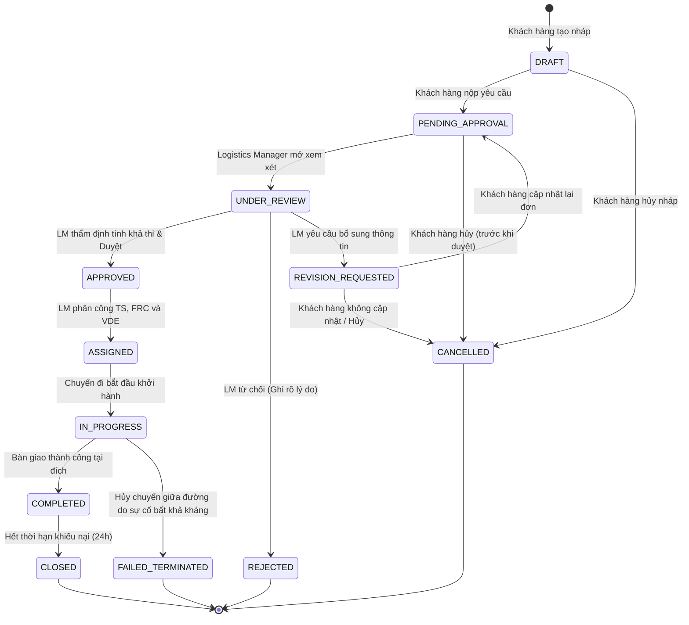
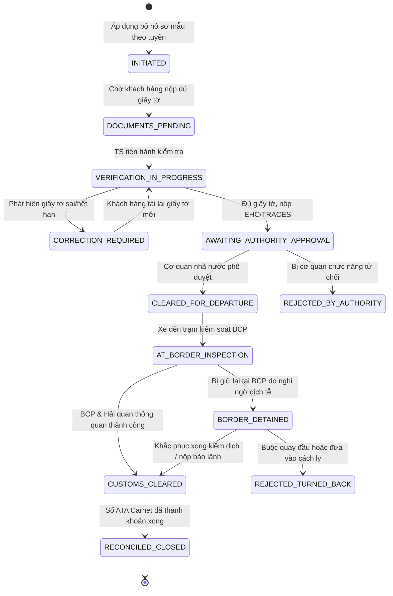
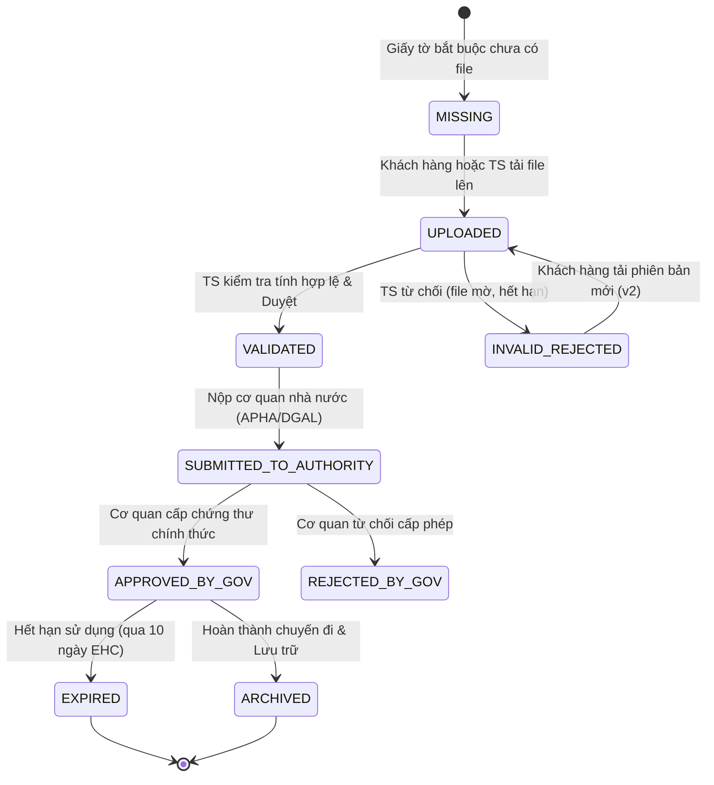
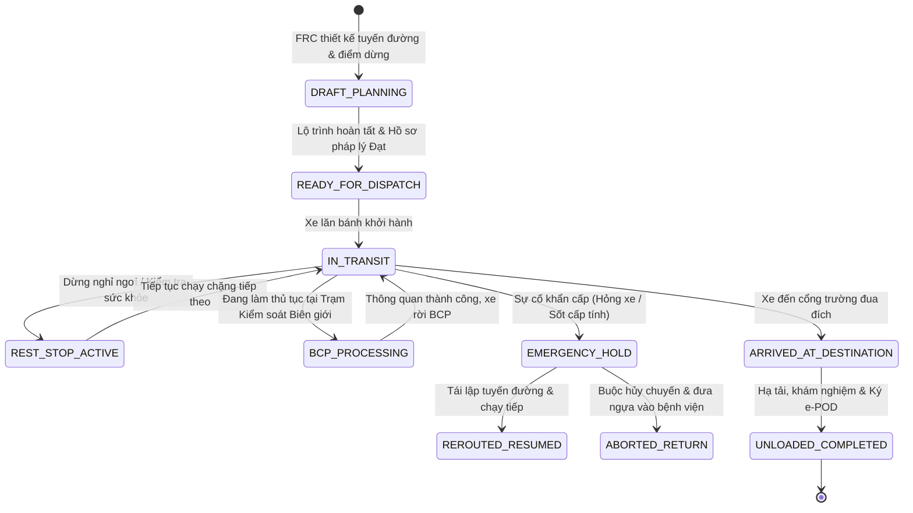
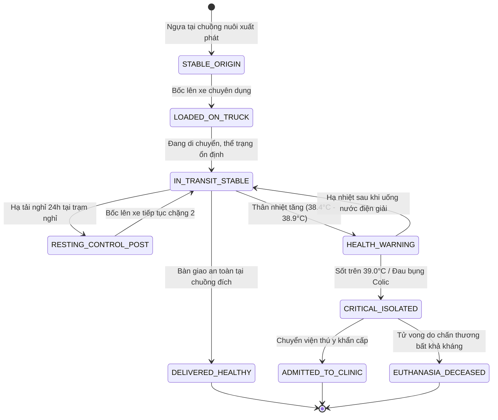
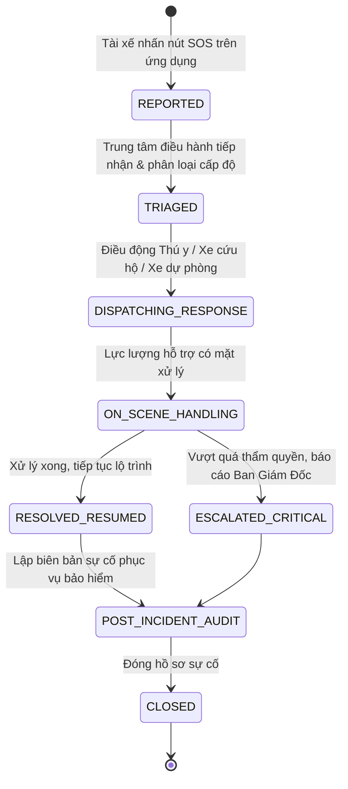

# Đặc Tả Vòng Đời & Máy Trạng Thái Toàn Hệ Thống (Master Lifecycle State Machines)
## Cross-Border Racehorse Transport System — Specification v2.0

> **Mã tài liệu**: `SPEC-LIFECYCLE-STATE-MACHINE`  
> **Áp dụng cho**: Toàn bộ kiến trúc dữ liệu và logic chuyển trạng thái của hệ thống.  
> **Mục tiêu**: Định nghĩa rõ ràng điều kiện kích hoạt, tác nhân thực hiện, trạng thái hợp lệ và cơ chế hoàn tác (Rollback) cho 6 thực thể cốt lõi.

---

## 📑 Mục Lục Các Máy Trạng Thái (State Machines)

1. [Máy Trạng Thái 1: Yêu Cầu Vận Chuyển (`TransportRequestStatus`)](#1-máy-trạng-thái-1-yêu-cầu-vận-chuyển-transportrequeststatus)
2. [Máy Trạng Thái 2: Bộ Hồ Sơ Pháp Lý (`TripLegalDossierStatus`)](#2-máy-trạng-thái-2-bộ-hồ-sơ-pháp-lý-triplegaldossierstatus)
3. [Máy Trạng Thái 3: Giấy Tờ Pháp Lý Đơn Lẻ (`DossierDocumentItemStatus`)](#3-máy-trạng-thái-3-giấy-tờ-pháp-lý-đơn-lẻ-dossierdocumentitemstatus)
4. [Máy Trạng Thái 4: Kế Hoạch Chuyến Đi (`TripPlanStatus`)](#4-máy-trạng-thái-4-kế-hoạch-chuyến-đi-tripplanstatus)
5. [Máy Trạng Thái 5: Cá Thể Ngựa Trong Hành Trình (`HorseTransitStatus`)](#5-máy-trạng-thái-5-cá-thể-ngựa-trong-hành-trình-horsetransitstatus)
6. [Máy Trạng Thái 6: Sự Cố Khẩn Cấp Hiện Trường (`IncidentReportStatus`)](#6-máy-trạng-thái-6-sự-cố-khẩn-cấp-hiện-trường-incidentreportstatus)

---

## 1. Máy Trạng Thái 1: Yêu Cầu Vận Chuyển (`TransportRequestStatus`)

Vòng đời của đơn đặt hàng từ lúc khách hàng khởi tạo đến khi đóng đơn:

### Bảng Ma Trận Chuyển Trạng Thái (`TransportRequest`)

| Trạng thái hiện tại | Sự kiện kích hoạt (Trigger) | Tác nhân thực hiện | Trạng thái tiếp theo | Điều kiện kiểm tra (Guards) |
|---|---|---|---|---|
| `DRAFT` | `SUBMIT_REQUEST` | Customer | `PENDING_APPROVAL` | Điểm đi, điểm đến, thời gian, danh sách ngựa >= 1 con. |
| `PENDING_APPROVAL` | `START_REVIEW` | Logistics Manager | `UNDER_REVIEW` | LM mở chi tiết đơn hàng thẩm định năng lực xe/tài xế. |
| `UNDER_REVIEW` | `APPROVE_REQUEST` | Logistics Manager | `APPROVED` | Lộ trình khả thi, đội xe còn chỗ, thời gian thỏa mãn Lead Time. |
| `UNDER_REVIEW` | `REJECT_REQUEST` | Logistics Manager | `REJECTED` | Bắt buộc nhập lý do từ chối (`rejectionReason != null`). |
| `UNDER_REVIEW` | `REQUEST_CHANGE` | Logistics Manager | `REVISION_REQUESTED` | Bắt buộc nhập nội dung cần sửa đổi (`notes != null`). |
| `APPROVED` | `DISPATCH_TEAM` | Logistics Manager | `ASSIGNED` | Đã gán đủ 3 vai trò: Transport Specialist, Coordinator, Driver. |
| `ASSIGNED` | `DEPART_TRIP` | Vehicle Driver | `IN_PROGRESS` | Bộ hồ sơ pháp lý đã `CLEARED_FOR_DEPARTURE`. |
| `IN_PROGRESS` | `DELIVERY_CONFIRMED` | Driver & Customer | `COMPLETED` | Ký e-POD thành công, Section 3 Journey Log hoàn tất. |
| `COMPLETED` | `CLOSE_ORDER` | Hệ thống tự động | `CLOSED` | Sau 24h kể từ thời điểm ký e-POD và không có khiếu nại. |

---

## 2. Máy Trạng Thái 2: Bộ Hồ Sơ Pháp Lý (`TripLegalDossierStatus`)

Quản lý tiến độ hoàn thiện toàn bộ giấy tờ của một chuyến vận chuyển:

---

## 3. Máy Trạng Thái 3: Giấy Tờ Pháp Lý Đơn Lẻ (`DossierDocumentItemStatus`)

Vòng đời của từng tệp chứng từ (Hộ chiếu, EHC, ATA Carnet, Test Coggins):

---

## 4. Máy Trạng Thái 4: Kế Hoạch Chuyến Đi (`TripPlanStatus`)

---

## 5. Máy Trạng Thái 5: Cá Thể Ngựa Trong Hành Trình (`HorseTransitStatus`)

> **Quy tắc quan trọng**: Một chuyến xe chở nhiều con ngựa; nếu 1 con ngựa bị bệnh, con ngựa đó chuyển trạng thái riêng biệt mà không làm ảnh hưởng đến định danh của các cá thể khỏe mạnh khác.

---

## 6. Máy Trạng Thái 6: Sự Cố Khẩn Cấp Hiện Trường (`IncidentReportStatus`)

---

## 7. Bảng Tổng Hợp Kiểm Soát Tính Toàn Vẹn Chuyển Đổi Trạng Thái (Guard Conditions)

Bảng này cung cấp các điều kiện logic (IF-THEN) để lập trình viên cài đặt vào backend (Spring Boot / NestJS / C#):

| Entity | Từ trạng thái | Sang trạng thái | Điều kiện tiên quyết (Guard Condition) | Ngoại lệ xử lý nếu vi phạm |
|---|---|---|---|---|
| `TransportRequest` | `APPROVED` | `ASSIGNED` | Đã gán `specialistId != null`, `coordinatorId != null`, `driverId != null`. | Báo lỗi `400: UnassignedTeamException`. |
| `TripPlan` | `READY_FOR_DISPATCH` | `IN_TRANSIT` | `TripLegalDossier.overallStatus == 'CLEARED_FOR_DEPARTURE'`. | Khóa nút xuất phát `403: DossierNotClearedException`. |
| `DossierDocumentItem` | `MISSING` | `VALIDATED` | Không được nhảy cóc qua trạng thái `UPLOADED`. | Báo lỗi `400: InvalidStateTransitionException`. |
| `TripPlan` | `BCP_PROCESSING` | `IN_TRANSIT` | Phải có mã phê duyệt Phần II CHED-A và dấu hải quan. | Không cho phép rời BCP `403: BorderClearanceRequired`. |
| `TripPlan` | `ARRIVED` | `UNLOADED_COMPLETED` | Bắt buộc phải có `ePodSignature != null` và tọa độ GPS hợp lệ. | Báo lỗi `400: SignatureMissingException`. |
