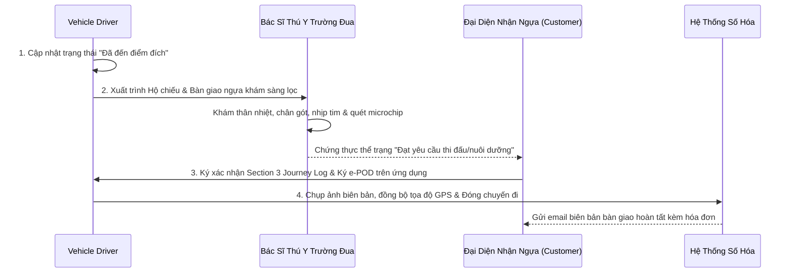

# Quy Trình Vận Hành Chuẩn: Bàn Giao Tại Đích, Nghiệm Thu Y Tế & Quyết Toán Hồ Sơ Hải Quan (SOP-HANDOVER-03)
## Standard Operating Procedure: Destination Arrival, Clinical Handover, Electronic POD & Customs Clearance Reconciliation

> **Mã quy trình**: `SOP-HANDOVER-03`  
> **Áp dụng cho**: Tài xế / Nhân viên Đi kèm (`Vehicle Driver / Escort`), Khách hàng / Đại diện Trường Đua (`Customer / Consignee`), Chuyên viên Kiểm dịch (`Transport Specialist`) và Quản lý Logistics (`Logistics Manager`).  
> **Phạm vi nghiệp vụ**: Các bước kết thúc hành trình vận chuyển, bàn giao an toàn tại chuồng trại đích và hoàn tất thủ tục hải quan tái xuất/tái nhập.

---

## 1. Mục Đích & Phạm Vi Áp Dụng

Chuẩn hóa các bước tiếp nhận cá thể ngựa tại điểm đến; thực hiện khám sàng lọc lâm sàng sau di chuyển; ký biên bản giao nhận điện tử (Electronic Proof of Delivery - e-POD); đối soát và thanh khoản sổ hải quan ATA Carnet; và xử lý các khiếu nại chấn thương hoặc bảo hiểm sinh học phát sinh sau chuyến đi.

---

## 2. Quy Trình 4 Bước Bàn Giao & Nghiệm Thu Tại Đích



### Bước 1: Tiếp Cận Điểm Đích & Khai Báo Trạng Thái
- Tài xế cập nhật trạng thái **"Đã Tới Điểm Đích" (Arrived at Destination)** trên ứng dụng di động ngay khi xe dừng tại cổng khu vực chuồng cách ly của trường đua (như Hippodrome de ParisLongchamp, Ascot Racecourse) hoặc trang trại đích.
- Hệ thống tự động ghi nhận tọa độ định vị GPS và mốc thời gian thực tế để đối chiếu với chỉ số Giao hàng Đúng hạn (*On-time Delivery - OTD*).

### Bước 2: Khám Sàng Lọc Lâm Sàng & Đối Chiếu Nhận Dạng
- Bác sĩ Thú y của trường đua tiếp nhận hoặc Bác sĩ Thú y tư nhân của khách hàng tiến hành kiểm tra ngay tại cửa sau của xe tải trước khi hạ tải:
  1. **Quét mã Microchip**: Sử dụng máy đọc tiêu chuẩn ISO đối chiếu với dãy số in trong Hộ chiếu ngựa (Equine Passport) và Tờ khai nhập cảnh CHED-A.
  2. **Đo Thân nhiệt & Khám Nhịp tim**: Xác nhận thân nhiệt dưới 38.3°C, không có biểu hiện kiệt sức, sốt do vận chuyển hoặc triệu chứng co giật.
  3. **Kiểm tra Vận động (Trot-up Examination)**: Cho ngựa đi bộ và chạy nước kiệu ngắn 20 mét trên đường thẳng mặt phẳng để kiểm tra xem có hiện tượng đi khập khiễng (*Lameness*) hoặc chấn thương gân do va chạm trên đường hay không.

### Bước 3: Ký Biên Bản Giao Nhận Điện Tử (Electronic Proof of Delivery - e-POD)
- Sau khi đại diện nhận ngựa và bác sĩ thú y đồng thuận về thể trạng:
  1. **Ký Section 3 của Nhật ký Hành trình (Journey Log)**: Đại diện nhận ngựa ký tên, ghi rõ ngày giờ tiếp nhận và tình trạng số lượng ngựa khỏe mạnh vào bản giấy Journey Log.
  2. **Ký số trên ứng dụng di động (e-POD)**:
     - Đại diện khách hàng ký tay trực tiếp lên màn hình cảm ứng điện thoại của tài xế.
     - Tài xế chụp 3 bức ảnh bằng chứng: Ảnh chụp ngựa trong ô chuồng đích, ảnh chụp hộ chiếu đã đóng dấu tiếp nhận và ảnh chụp chữ ký trên Journey Log.
     - Ứng dụng tự động mã hóa chữ ký số kèm tọa độ GPS và thời gian chính xác, tạo tệp biên bản bàn giao điện tử không thể chỉnh sửa (`Signed_ePOD.pdf`).

### Bước 4: Hoàn Trả Hồ Sơ Gốc Cho Khách Hàng
- Tài xế bàn giao lại tận tay cho người nhận:
  - Sổ Hộ chiếu ngựa gốc (Equine Passport) có đầy đủ tem tiêm phòng.
  - Bản sao công chứng Chứng thư Thú y (EHC hoặc TRACES EQUI-INTRA) đã có dấu thông quan của trạm BCP.
  - Phiếu kết quả xét nghiệm máu gốc (Coggins Test).
- *Lưu ý quan trọng*: **Sổ ATA Carnet bản gốc tuyệt đối KHÔNG bàn giao cho khách hàng**, tài xế phải giữ lại trong cabin xe để chuyển về văn phòng logistics phục vụ thủ tục tái xuất khẩu khi ngựa kết thúc giải đấu.

---

## 3. Quy Trình Thanh Khoản & Đóng Sổ Hải Quan ATA Carnet

Sau khi ngựa hoàn tất kỳ thi đấu tại EU và được vận chuyển quay trở lại trụ sở tại Vương quốc Anh (hoặc ngược lại):

```
[Xuất phát từ EU] ────────> [Hải Quan Cửa Khẩu Xuất] ────────> [Hải Quan Cửa Khẩu Nhập] ────────> [Quyết Toán LCCI]
Ngựa kết thúc giải đua,     Hải quan EU (Calais/Coquelles)    Hải quan Anh (HMRC Dover)         Gửi trả sổ gốc về
xe tải chở ngựa về lại      kiểm tra và đóng dấu vào          kiểm tra và đóng dấu vào          Phòng Thương mại Luân Đôn,
Vương quốc Anh              White Re-exportation Voucher      Yellow Re-importation Voucher     thu hồi tiền bảo lãnh ngân hàng
```

1. **Tại Cửa Khẩu Rời Khỏi EU (BCP Calais / Coquelles)**:
   - Tài xế xuất trình Sổ ATA Carnet cho Hải quan Pháp (Douane).
   - Cán bộ hải quan kiểm tra thực tế cá thể ngựa, đối chiếu mã microchip với danh mục tài sản trong sổ Carnet.
   - Hải quan xé cuống **Tờ khai Tái xuất khẩu (White Re-exportation Voucher)** và đóng dấu mực chính thức lên phần cuống lưu (Counterfoil). Đây là bằng chứng pháp lý chứng minh tài sản đã rời khỏi lãnh thổ EU đúng hạn hợp pháp, giải tỏa nghĩa vụ thuế nhập khẩu tại EU.
2. **Tại Cửa Khẩu Tái Nhập Cảnh Anh (HMRC Dover / Sevington)**:
   - Tài xế xuất trình sổ cho Hải quan Anh (HMRC).
   - Hải quan Anh xé cuống **Tờ khai Tái nhập khẩu (Yellow Re-importation Voucher)** và đóng dấu xác nhận tài sản gốc đã quay về nước an toàn.
3. **Quyết Toán Với Phòng Thương Mại (LCCI Reconciliation)**:
   - Trong vòng 7 ngày làm việc kể từ khi kết thúc chuyến đi, `Transport Specialist` gửi toàn bộ tập sổ ATA Carnet bản gốc về Phòng Thương mại Luân Đôn (LCCI).
   - LCCI kiểm tra đầy đủ các con dấu xuất cảnh, tạm nhập, tái xuất và tái nhập. Sau khi xác nhận không có bất kỳ vi phạm hay khoản truy thu thuế nào từ hải quan nước ngoài, LCCI phát hành văn bản giải tỏa bảo lãnh và hoàn trả toàn bộ số tiền đặt cọc (hoặc giải phóng chứng thư bảo lãnh ngân hàng) cho công ty logistics/chủ ngựa.

---

## 4. Quy Trình Tiếp Nhận & Xử Lý Khiếu Nại Bồi Thường (Claims Protocol)

Trường hợp ngựa bị phát hiện chấn thương, trầy xước, sốt cao hoặc phát sinh sự cố sau chuyến đi:

1. **Khởi tạo Khiếu nại trong vòng 24 Giờ**: Khách hàng (`Customer`) có quyền gửi phiếu khiếu nại qua cổng thông tin trực tuyến trong vòng tối đa **24 giờ** kể từ thời điểm ký e-POD. Mọi khiếu nại sau 24 giờ sẽ không được chấp nhận vì ngựa có thể bị chấn thương do sinh hoạt tại chuồng mới.
2. **Bằng chứng Giám định Thú y Bắt buộc**: Hồ sơ khiếu nại bắt buộc phải đính kèm:
   - Biên bản khám nghiệm có chữ ký của Bác sĩ Thú y có chứng chỉ hành nghề độc lập (*Independent Equine Veterinary Report*).
   - Ảnh chụp/video cận cảnh vết thương, kết quả siêu âm gân hoặc chụp X-quang xương.
   - Trích xuất dữ liệu cảm biến nhiệt độ và gia tốc trọng trường (G-Force sensor log) từ hộp đen của xe tải chuyên dụng tại thời điểm nghi vấn xảy ra sự cố.
3. **Kích hoạt Hợp đồng Bảo hiểm Sinh học (Equine Transit Insurance Policy)**:
   - Nếu chấn thương được giám định xác nhận là do lỗi kỹ thuật vận tải (phanh gấp bất ngờ, lỗi hệ thống điều hòa gây sốc nhiệt), `Logistics Manager` chuyển toàn bộ hồ sơ cho Công ty Bảo hiểm Chuyên trách Ngành Ngựa (như Lloyd's of London Equine Syndicate hoặc Markel Insurance) để chi trả viện phí điều trị hoặc bồi thường giá trị bảo hiểm theo hợp đồng dịch vụ đã ký.
