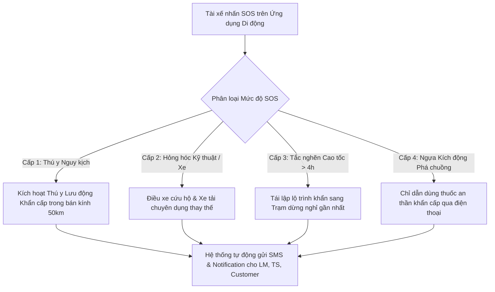

# Quy Trình Vận Hành Chuẩn: Giám Sát Sức Khỏe Ngựa Dọc Đường & Ứng Phó Sự Cố Khẩn Cấp (SOP-HEALTH-SOS-02)
## Standard Operating Procedure: In-Transit Equine Health Telemetry & Emergency SOS Response

> **Mã quy trình**: `SOP-HEALTH-SOS-02`  
> **Áp dụng cho**: Tài xế / Nhân viên Đi kèm (`Vehicle Driver / Escort`), Điều phối viên Đội xe (`Fleet & Route Coordinator`), Quản lý Logistics (`Logistics Manager`) và Bác sĩ Thú y Tháp tùng.  
> **Phạm vi nghiệp vụ**: Vận hành dọc tuyến đường bộ, đường biển và hàng không trong suốt quá trình vận chuyển.

---

## 1. Mục Đích & Phạm Vi Áp Dụng

Thiết lập quy chuẩn thao tác kiểm tra các chỉ số sinh tồn của ngựa tại mỗi trạm dừng; hướng dẫn nhận biết sớm các dấu hiệu kiệt sức, sốc nhiệt và hội chứng Sốt Vận chuyển (*Shipping Fever / Pleuropneumonia*); và quy định quy trình kích hoạt báo động khẩn cấp SOS kết nối Mạng lưới Thú y Khẩn cấp Xuyên Quốc gia.

---

## 2. Bảng Chỉ Số Sinh Tồn Chuẩn Của Ngựa Đua (Equine Vital Signs Reference)

Tại mỗi trạm dừng (tối thiểu 4 đến 6 tiếng một lần), Tài xế / Người đi kèm bắt buộc phải đo và ghi nhận vào Nhật ký Sức khỏe Điện tử trên ứng dụng di động:

| Chỉ số Sinh tồn | Giá trị Bình thường (Normal Range) | Ngưỡng Cảnh báo Sớm (Warning Flag) | Ngưỡng Khẩn cấp (Critical SOS Alert) | Phương pháp Đo lường Hiện trường |
|---|---|---|---|---|
| **Thân nhiệt (Body Temp)** | **37.2°C – 38.3°C** (99.0°F – 101.0°F) | **38.4°C – 38.9°C** | **> 39.0°C** (Sốt cấp tính / Sốc nhiệt) | Nhiệt kế điện tử kỹ thuật số đo trực tràng (dùng chất bôi trơn). |
| **Nhịp tim (Heart Rate)** | **28 – 44 nhịp/phút** | **45 – 60 nhịp/phút** | **> 60 nhịp/phút** (Đau đớn dữ dội / Đau bụng Colic) | Ống nghe y tế đặt tại hõm nách ngực trái hoặc cảm biến dây đeo ngực. |
| **Nhịp thở (Respiratory Rate)** | **8 – 16 nhịp/phút** | **18 – 28 nhịp/phút** | **> 30 nhịp/phút** (Thở gấp, phập phồng cánh mũi) | Quan sát chuyển động phập phồng của cơ sườn hoặc cánh mũi. |
| **Độ ẩm & Màu niêm mạc lợi** | **Hồng nhạt, bóng ẩm** | Nhạt màu, khô ráp | Đỏ sẫm, tím tái hoặc vàng nhạt (Thiếu oxy / Nhiễm độc) | Vạch môi trên của ngựa, kiểm tra độ ẩm và màu sắc niêm mạc. |
| **Thời gian hồi phục mao mạch (CRT)** | **Dưới 2 giây** (Ấn ngón tay vào lợi, thả ra) | 2 – 3 giây | **> 3 giây** (Mất nước nghiêm trọng, tuần hoàn suy sụp) | Ấn mạnh ngón tay cái vào lợi 2 giây, đếm giây khi màu hồng quay lại. |
| **Độ đàn hồi của da (Skin Pinch Test)** | Da phẳng lại ngay tức thì (< 1 giây) | Da đàn hồi chậm (2 – 3 giây) | **> 4 giây** (Mất nước cấp tính > 8-10%) | Véo nếp gấp da ở giữa cổ ngựa, thả ra và quan sát tốc độ da phẳng lại. |
| **Âm ruột (Gut Sounds)** | Tiếng sôi ùng ục đều đặn ở 4 góc bụng | Âm ruột giảm, rời rạc | **Hoàn toàn im lặng (Không có âm ruột)** | Áp ống nghe vào 4 góc mạn sườn trái/phải kiểm tra nguy cơ Colic. |

---

## 3. Quy Trình Kiểm Tra Sức Khỏe Định Kỳ Tại Trạm Dừng (Every Rest Stop)

Tài xế / Người đi kèm thực hiện quy trình 5 bước trong vòng 20 phút dừng xe:

```
[Bước 1: Quan sát Thần thái] ──> [Bước 2: Cung cấp Nước uống] ──> [Bước 3: Đo Thân nhiệt] ──> [Bước 4: Kiểm tra Chân móng] ──> [Bước 5: Đồng bộ App]
Độ tỉnh táo, mắt sáng,           Bù nước điện giải,               Nhiệt kế trực tràng,           Bọc bảo vệ chân gót,          Chụp ảnh thực tế,
tư thế đứng cân bằng             kiểm tra lượng nước uống         đối chiếu ngưỡng an toàn       nhiệt độ và độ ẩm thùng xe    gửi dữ liệu về tổng đài
```

1. **Bước 1 — Đánh giá Thần thái & Tư thế**: Ngựa phải đứng vững trên cả 4 chân, tai cử động linh hoạt, mắt sáng, không gục đầu sát sàn xe hoặc liên tục cào móng kích động.
2. **Bước 2 — Cung cấp Nước Uống Bù Điện Giải**: Cho ngựa uống nước ấm pha dung dịch điện giải sinh học (khoảng 10-15 lít/lần). Nếu ngựa từ chối uống nước liên tục quá 2 trạm dừng (trên 8 tiếng), phải kích hoạt cảnh báo mất nước trên ứng dụng.
3. **Bước 3 — Đo Thân nhiệt & Khám Hô hấp**: Đo nhiệt độ trực tràng. Kiểm tra xem có dịch nhầy chảy ra từ mũi hay không (dấu hiệu ban đầu của nhiễm khuẩn đường hô hấp).
4. **Bước 4 — Kiểm tra Băng Quấn Chân & Móng (Travel Boots)**: Đảm bảo băng quấn bảo vệ gân gót không bị xê dịch, không siết quá chặt gây cản trở tuần hoàn máu; gầm sàn chuồng khô ráo, không bị trơn trượt bởi phân/nước tiểu.
5. **Bước 5 — Đồng bộ Nhật ký Điện tử (App Check-in)**: Chụp 2 bức ảnh thực tế của ngựa (toàn thân và góc cận đầu), nhập các chỉ số vào biểu mẫu ứng dụng di động để hệ thống ghi nhận mốc thời gian thực và tự động báo cáo cho Chủ ngựa (`Customer`).

---

## 4. Giao Thức Kích Hoạt Báo Động Khẩn Cấp SOS (Emergency Protocol)

Khi xảy ra sự cố đột xuất trên đường cao tốc hoặc trạm kiểm soát, tài xế kích hoạt nút **SOS** trên ứng dụng di động theo 4 cấp độ ưu tiên:



### 4.1. Sự Cố Thú Y Khẩn Cấp (Cấp 1 — Critical Health)
- **Tình huống**: Ngựa sốt trên 39.5°C, có biểu hiện đau bụng cấp tính (*Colic* - cào móng, lăn lộn, vã mồ hôi đầm đìa) hoặc chấn thương gãy xương/rách da chảy máu nhiều.
- **Hành động tức thời của Tài xế**:
  1. Tấp xe an toàn vào làn dừng khẩn cấp hoặc trạm xăng gần nhất trên đường cao tốc. Bật đèn cảnh báo nguy hiểm và quạt thông gió tối đa.
  2. Bấm nút **SOS Cấp 1 (Y Tế Khẩn Cấp)** trên ứng dụng.
  3. Hệ thống tự động quét tọa độ GPS của xe, đối chiếu cơ sở dữ liệu **Mạng Lưới Bác Sĩ Thú Y Khẩn Cấp Xuyên Châu Âu (Equine Emergency Vet Network)** và tự động kết nối cuộc gọi thoại trực tiếp đến phòng khám thú y lớn gần nhất trong bán kính 30-50 km.
  4. Duy trì ngựa ở tư thế đứng, tuyệt đối không cho ngựa nằm xuống hoặc lăn lộn trong chuồng xe.

### 4.2. Sự Cố Cơ Học / Hỏng Hệ Thống Lạnh & Thông Gió (Cấp 2 — Vehicle Breakdown)
- **Tình huống**: Xe nổ lốp kép, hỏng động cơ hoặc hệ thống giảm xóc khí nén/quạt thông gió ngừng hoạt động giữa trời nắng nóng trên 32°C.
- **Hành động tức thời**:
  1. Tài xế mở toàn bộ cửa sổ thông gió phụ cơ học của xe để đón gió tự nhiên.
  2. Bấm **SOS Cấp 2 (Sự Cố Phương Tiện)**.
  3. `Fleet & Route Coordinator` tại trung tâm điều hành lập tức liên hệ dịch vụ cứu hộ chuyên dụng đường cao tốc (như SANEF/APRR tại Pháp, Highways England tại Anh, ADAC tại Đức) và điều phối một xe tải Horse Truck dự phòng từ chi nhánh gần nhất đến hiện trường để sang xe (*Cross-docking*).

### 4.3. Quy Định Sử Dụng Thuốc An Thần Khẩn Cấp (Emergency Sedation Protocol)
- Trong trường hợp ngựa hoảng loạn tột độ, đá chuồng dữ dội có nguy cơ tự gây chấn thương vỡ xương hoặc đe dọa tính mạng tài xế:
- Tài xế **chỉ được phép tiêm thuốc an thần khẩn cấp** (như Acepromazine hoặc Detomidine dạng gel ngậm dưới lưỡi) khi:
  - Có sự hướng dẫn và chấp thuận trực tiếp qua điện thoại/video call của Bác sĩ Thú y Chính thức phụ trách chuyến đi.
  - Sau khi tiêm, bắt buộc phải ghi rõ tên thuốc, liều lượng, số lô và giờ tiêm vào Nhật ký Sức khỏe để khai báo với Ban Thú y Trường đua đích (tránh vi phạm quy định Anti-Doping của FEI và Hiệp hội Đua ngựa).
