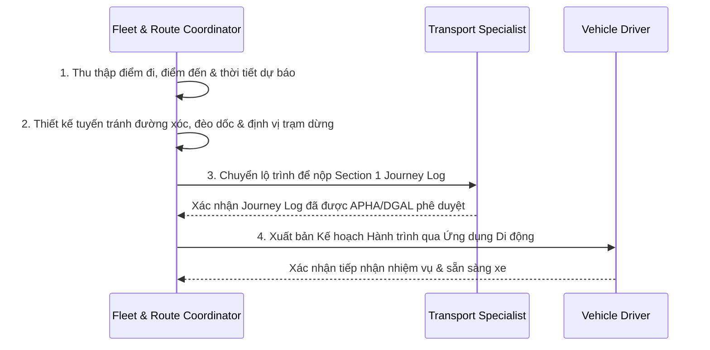

# Quy Trình Vận Hành Chuẩn: Lập Kế Hoạch Lộ Trình & Trạm Dừng Nghỉ Phúc Lợi Thú Y (SOP-ROUTE-01)
## Standard Operating Procedure: Route Planning, Vehicle Dispatch & Control Post Rest Stops

> **Mã quy trình**: `SOP-ROUTE-01`  
> **Áp dụng cho**: Điều phối viên Đội xe & Lộ trình (`Fleet & Route Coordinator`), Quản lý Logistics (`Logistics Manager`) và Tài xế (`Vehicle Driver / Escort`).  
> **Cơ sở pháp lý**: [Council Regulation (EC) No 1/2005 (Phúc lợi động vật khi vận chuyển)](https://eur-lex.europa.eu/legal-content/EN/TXT/?uri=CELEX:32005R0001), Quy định Vận chuyển Ngựa Thể thao Quốc tế của FEI.

---

## 1. Mục Đích & Phạm Vi Áp Dụng

Quy định các bước bắt buộc để thiết kế tuyến đường vận chuyển ngựa đua tối ưu, hạn chế tối đa nguy cơ sốc nhiệt và chấn thương cơ bắp do dằn xóc; thiết lập các điểm dừng nghỉ ngơi bắt buộc (*Control Posts / Rest Stops*) theo luật định châu Âu; và phân bổ phương tiện chuyên dụng đạt chuẩn.

---

## 2. Tiêu Chuẩn Kỹ Thuật Phương Tiện Vận Tải Chuyên Dụng

Mọi phương tiện (xe tải Horse Trucks/Vans hoặc thùng vận chuyển hàng không Jet Stalls) trước khi phân công chuyến đi bắt buộc phải đáp ứng:

1. **Hệ thống Giảm xóc Khí nén (Air Suspension)**: Bắt buộc trang bị trên toàn bộ các trục xe để triệt tiêu rung chấn tần số cao gây mỏi cơ và chấn thương gân gót của ngựa đua.
2. **Hệ thống Thông gió Cưỡng bức (Forced Mechanical Ventilation)**: Công suất quạt hút/thổi độc lập với động cơ xe, duy trì lưu lượng không khí tối thiểu 60 m³/giờ trên mỗi cá thể ngựa, hoạt động liên tục ngay cả khi xe dừng chờ phà hoặc kẹt xe.
3. **Cảm biến & Thiết bị Ghi nhận Nhiệt độ Tự động (Autonomous Temperature Logger)**: Đặt tại 3 vị trí (khoang đầu, khoang giữa, khoang đuôi), liên tục cảnh báo về cabin tài xế nếu nhiệt độ thùng xe vượt ngoài dải an toàn:
   - Dải nhiệt độ tối ưu: **10°C đến 25°C**.
   - Ngưỡng cảnh báo nguy hiểm: **Dưới 5°C hoặc trên 30°C**.
4. **Vách ngăn Chuồng êm ái & Chống trượt (Padded Partitions & Anti-slip Flooring)**: Sàn cao su đúc nguyên khối dày tối thiểu 15mm có rãnh thoát nước tiểu, phủ lớp dăm bào hoặc rơm sạch khử bụi; vách ngăn bọc đệm mút chống va đập khi xe vào cua.
5. **Nguồn cấp nước tự động (Automatic Watering System)**: Bình chứa nước sạch dung tích tối thiểu 150 lít trên xe kèm vòi uống tự động tại từng ô chuồng.

---

## 3. Quy Chuẩn Thời Gian Hành Trình & Điểm Dừng Nghỉ (Theo EC 1/2005)

### 3.1. Giới Hạn Thời Gian Chạy Xe Liên Tục
- **Chặng ngắn (Short Journey)**: Thời gian di chuyển dưới 8 giờ. Chỉ yêu cầu kiểm tra nước uống sau mỗi 4 giờ dừng xe 15-30 phút.
- **Chặng dài (Long Journey)**: Thời gian di chuyển vượt quá 8 giờ. Bắt buộc:
  - **Sau mỗi 8 giờ chạy xe**: Dừng nghỉ tối thiểu **45 phút** (không hạ tải ngựa), tài xế kiểm tra thông gió, cho ngựa uống nước sạch và kiểm tra chốt khóa an toàn.
  - **Sau tối đa 24 giờ di chuyển**: **Bắt buộc hạ tải toàn bộ ngựa xuống Trạm Dừng Nghỉ Phê Duyệt (Approved Control Post)** để ngựa được nghỉ ngơi, đi lại tự do trong chuồng đơn, ăn cỏ khô và uống nước trong **thời gian tối thiểu trọn vẹn 24 giờ liên tục** trước khi được phép bốc lên xe chạy chặng tiếp theo.

### 3.2. Danh Mục Các Trạm Dừng Nghỉ Phê Duyệt Cốt Lõi (Core Approved Control Posts)

| Vùng địa lý | Tên Trạm Dừng Nghỉ (Control Post) | Vị trí / Tuyến đường | Tiện ích chuyên dụng cho ngựa đua |
|---|---|---|---|
| **Anh (UK)** | Dover Equine Rest Stables | Gần Cảng Dover (Cao tốc M20) | 12 chuồng đơn cách ly, nước sạch, kết nối Bác sĩ Thú y APHA trực 24/7. |
| **Pháp (Bắc)** | Centre d'Accueil Équin de Saint-Omer | Cách Cảng Calais 35 km (Cao tốc A26) | Chuồng tiêu chuẩn FEI, sân đi dạo có mái che, kiểm dịch thú y SIVEP. |
| **Pháp (Trung)** | Relais Équestre de Bourgogne (Beaune) | Nút giao Cao tốc A6 (Tuyến Paris - Lyon) | Trạm nghỉ trung chuyển cho các chuyến đi Ý hoặc Tây Ban Nha. |
| **Bỉ (Trung tâm)** | Liège Airport Horse Inn | Sân bay Liège (Giao lộ E40 / E42) | Khách sạn ngựa đẳng cấp Olympic, 55 chuồng đệm cao su, bệnh viện thú y tại chỗ. |
| **Đức (Tây Nam)** | Pferderaststation Baden-Württemberg | Gần Cao tốc A5 (Tuyến đi Thụy Sĩ/Ý) | 20 chuồng đơn đạt chuẩn BMEL, khu tắm ngựa và xả stress. |
| **Ý (Bắc)** | Centro Sosta Cavalli del Piemonte | Cửa hầm Fréjus / Mont Blanc | Trạm nghỉ hồi sức sau khi vượt dãy Alps trước khi vào đồng bằng Po (Milan). |

---

## 4. Quy Trình 4 Bước Thiết Kế & Xuất Bản Lộ Trình

1. **Bước 1 — Khảo sát & Dự báo Yếu tố Ngoại cảnh**: Điều phối viên kiểm tra dự báo thời tiết 48h dọc hành lang di chuyển (nhiệt độ, cảnh báo bão tuyết, sóng biển eo biển Manche) và tình trạng giao thông cửa khẩu.
2. **Bước 2 — Thiết kế Lộ trình & Lựa chọn Trạm Dừng Nghỉ**:
   - Ưu tiên 100% đường cao tốc mặt nhựa phẳng (Motorways/Autoroutes), tránh tuyệt đối các cung đường đèo quanh co nhiều cua gấp gây mất thăng bằng cho ngựa.
   - Định vị chính xác trạm dừng nghỉ 24h nếu tổng thời gian vượt quá 14-16 giờ (tính cả thời gian phà biển/thủ tục BCP).
   - Đặt trước chuồng tại Trạm Kiểm soát (Control Post Reservation) tối thiểu 48h trước chuyến đi.
3. **Bước 3 — Đồng bộ với Hồ sơ Pháp lý (Section 1 Journey Log)**: Chuyển bản đồ lộ trình chi tiết cho Chuyên viên Kiểm dịch (`Transport Specialist`) để nộp cho cơ quan thú y chính thức phê duyệt kế hoạch di chuyển.
4. **Bước 4 — Bàn giao Nhiệm vụ Kỹ thuật số**: Hệ thống tự động gửi tọa độ GPS các mốc dừng, giờ xuất phát khuyến nghị và số điện thoại khẩn cấp của các trạm dừng đến ứng dụng di động của Tài xế.
