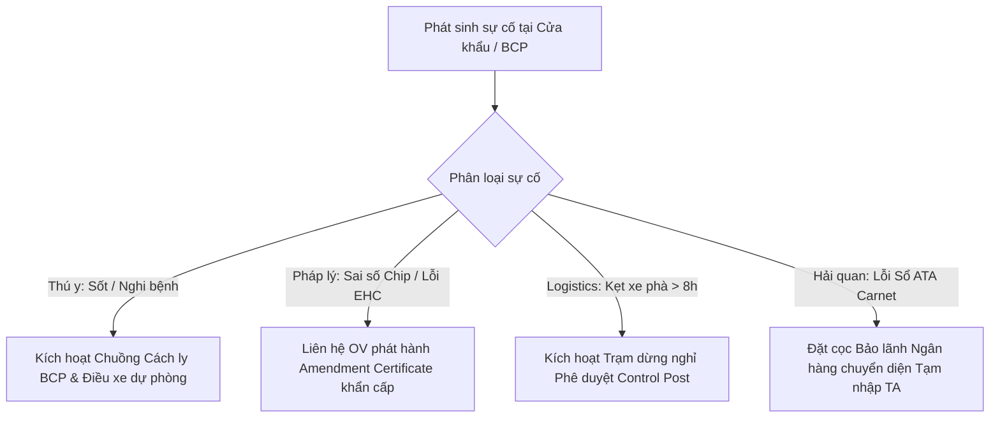

# Sổ Tay Quy Trình Vận Hành Chuẩn (SOP) & Bộ Dữ Liệu Mẫu 5 Tuyến Vận Chuyển Ngựa Đua Điển Hình
## Cross-Border Racehorse Transport System — Operational SOP & Seed Data Reference v1.0

> **Dự án**: Hệ thống Quản lý Vận chuyển Ngựa đua Xuyên Biên giới (`swp391-cross-border-racehorse-transport-system`)  
> **Tài liệu phối hợp**: Đi kèm với [EU_UK_Racehorse_Transport_Documents_Specification.md](file:///d:/VNZ/document-first-brief/swp391-cross-border-racehorse-transport-system/ConfirmedDoc/EU_UK_Racehorse_Transport_Documents_Specification.md)  
> **Mục tiêu**: Cung cấp quy trình thao tác chuẩn (SOP) theo mốc thời gian thực tế, phương án xử lý sự cố tại trạm BCP/Hải quan và bộ dữ liệu mẫu (Seed Data / Fixtures) cho 5 kịch bản vận chuyển thực tế.

---

## 📑 Mục Lục Tài Liệu (Table of Contents)

1. [Phần 1: Quy Trình Vận Hành Chuẩn (SOP) Theo Mốc Thời Gian (Timeline Milestones)](#phần-1-quy-trình-vận-hành-chuẩn-sop-theo-mốc-thời-gian-timeline-milestones)
2. [Phần 2: Quy Trình Xử Lý Sự Cố Khẩn Cấp Tại Cửa Khẩu & Biên Giới (Contingency SOP)](#phần-2-quy-trình-xử-lý-sự-cố-khẩn-cấp-tại-cửa-khẩu--biên-giới-contingency-sop)
3. [Phần 3: Bộ Dữ Liệu Hồ Sơ Mẫu Cho 5 Tuyến Vận Chuyển Điển Hình (Seed Data Payloads)](#phần-3-bộ-dữ-liệu-hồ-sơ-mẫu-cho-5-tuyến-vận-chuyển-điển-hình-seed-data-payloads)
   - 3.1. [Tuyến 1 (Tuyến A sang B): Newmarket (Anh) sang ParisLongchamp (Pháp)](#31-tuyến-1-tuyến-a-sang-b-newmarket-anh-sang-parislongchamp-pháp)
   - 3.2. [Tuyến 2 (Tuyến A sang C): Curragh (Ireland) sang Ascot (Anh)](#32-tuyến-2-tuyến-a-sang-c-curragh-ireland-sang-ascot-anh)
   - 3.3. [Tuyến 3 (Nội khối EU): Chantilly (Pháp) sang Baden-Baden (Đức)](#33-tuyến-3-nội-khối-eu-chantilly-pháp-sang-baden-baden-đức)
   - 3.4. [Tuyến 4 (Nội khối EU + Modello 4): Deauville (Pháp) sang San Siro, Milan (Ý)](#34-tuyến-4-nội-khối-eu--modello-4-deauville-pháp-sang-san-siro-milan-ý)
   - 3.5. [Tuyến 5 (Nội địa Anh): Lambourn (Berkshire) sang Ayr Racecourse (Scotland)](#35-tuyến-5-nội-địa-anh-lambourn-berkshire-sang-ayr-racecourse-scotland)
4. [Phần 4: Bảng Kiểm Tra Bàn Giao Hồ Sơ Dành Cho Tài Xế (Driver Cabin Checklist)](#phần-4-bảng-kiểm-tra-bàn-giao-hồ-sơ-dành-cho-tài-xế-driver-cabin-checklist)

---

## Phần 1: Quy Trình Vận Hành Chuẩn (SOP) Theo Mốc Thời Gian (Timeline Milestones)

Để một chuyến vận chuyển ngựa đua xuyên biên giới không bị từ chối nhập cảnh hoặc bị cách ly bắt buộc tại cửa khẩu, Chuyên viên Kiểm dịch (`Transport Specialist`) và Quản lý Điều phối (`Logistics Manager`) phải tuân thủ nghiêm ngặt tiến độ mốc thời gian đếm ngược (Count-down Milestones):

```
[T-30 Ngày] ──────> [T-7 Ngày] ──────> [T-48 Giờ] ──────> [T-24 Giờ] ──────> [T-0 Giờ] ──────> [Đích đến]
Định danh &         Xét nghiệm Lab      Khám lâm sàng       TRACES-NT CHED-A     Khởi hành &        Bàn giao &
Kiểm tra Vaccine    & Sổ ATA Carnet     & Ký chứng thư EHC  & Khai báo BCP       Giám sát GPS       Nghiệm thu
```

### 1.1. Mốc T-30 Ngày (Chuẩn bị căn bản & Rà soát dịch tễ)
- **Tác nhân thực hiện**: `Transport Specialist` & `Customer` (Chủ ngựa).
- **Các đầu việc bắt buộc**:
  1. Kiểm tra tình trạng pháp lý của Hộ chiếu ngựa (Equine Passport): Đảm bảo số UELN, số microchip trùng khớp với thân thể ngựa, sơ đồ vết bớt/xoáy lông (Silhouette) rõ ràng và có xác nhận loại trừ khỏi chuỗi cung ứng thực phẩm nhân loại.
  2. Rà soát lịch sử tiêm phòng Cúm ngựa (Equine Influenza): Mũi tiêm ban đầu (Primary course) gồm 2 mũi cách nhau 21-60 ngày; mũi nhắc lại (Booster) phải được tiêm trong vòng 6 tháng đến tối đa 12 tháng trước ngày thi đấu (nếu tham gia thi đấu FEI, không được tiêm trong vòng 7 ngày trước khi đến trường đua).
  3. Đăng ký thông tin cơ sở chuồng nuôi (Establishment of origin) trên hệ thống thú y quốc gia.

### 1.2. Mốc T-7 Ngày (Xét nghiệm Lab & Thủ tục Hải quan tạm thời)
- **Tác nhân thực hiện**: `Transport Specialist`.
- **Các đầu việc bắt buộc**:
  1. **Lấy mẫu máu xét nghiệm Coggins Test (EIA)**: Bác sĩ Thú y lấy mẫu máu tĩnh mạch gửi đến phòng xét nghiệm tham chiếu quốc gia (như APHA Weybridge tại Anh, ANSES tại Pháp). Kết quả âm tính phải được cập nhật lên hệ thống.
  2. **Nộp hồ sơ xin cấp Sổ ATA Carnet**: Nộp danh mục chi tiết ngựa (Tên, UELN, giá trị bảo hiểm, thiết bị yên cương chuyên dụng đi kèm) cho Phòng Thương mại (như LCCI tại Anh) để phát hành sổ ATA Carnet bản giấy.
  3. **Kiểm tra năng lực phương tiện & tài xế**: Kiểm tra hạn kiểm định của xe chuyên dụng chở ngựa (Air suspension, quạt thông gió, thiết bị đo nhiệt độ tự động) và Chứng chỉ năng lực của tài xế (`Driver Competence Certificate`).

### 1.3. Mốc T-48 Giờ (Khám lâm sàng chính thức & Cấp chứng thư kiểm dịch)
- **Tác nhân thực hiện**: `Transport Specialist` & Bác sĩ Thú y Chính thức (`Official Veterinarian - OV`).
- **Các đầu việc bắt buộc**:
  1. Bác sĩ Thú y OV trực tiếp đến chuồng kiểm tra thân nhiệt, nhịp tim, nhịp thở, mắt, niêm mạc mũi và tình trạng vận động của từng cá thể ngựa để xác nhận: "Ngựa hoàn toàn khỏe mạnh, không có triệu chứng lâm sàng của bệnh truyền nhiễm và đủ thể lực để vận chuyển" (*Fit for transport*).
  2. Ký và đóng dấu nổi lên **Chứng thư Kiểm dịch Xuất khẩu (EHC Form 8438)** (nếu xuất từ Anh) hoặc **Chứng thư Thú y Nội khối (TRACES EQUI-INTRA)** (nếu di chuyển trong EU).
  3. Ký xác nhận vào Phần 1 (Planning) của **Nhật ký Hành trình (Journey Log)**.

### 1.4. Mốc T-24 Giờ (Khai báo điện tử biên giới & Phê duyệt trước)
- **Tác nhân thực hiện**: `Transport Specialist` & `Fleet & Route Coordinator`.
- **Các đầu việc bắt buộc**:
  1. **Tạo tờ khai CHED-A trên hệ thống TRACES-NT**: Nhập toàn bộ dữ liệu từ chứng thư EHC vào Phần I của CHED-A trên cổng TRACES-NT, đính kèm file scan chứng thư EHC và kết quả xét nghiệm Coggins. Chỉ định trạm BCP nhập cảnh (ví dụ: `FRCAL1 - Calais Port BCP` hoặc `IEDUB1 - Dublin Port BCP`).
  2. **Khai báo Hải quan thông minh (Smart Border)**:
     - Tuyến Anh sang Pháp: Quét mã vạch sổ ATA Carnet hoặc nộp tờ khai hải quan CDS để tạo mã ghép cặp (Logistics Envelope / Pass En Douane) liên kết với biển số xe tải trên hệ thống `SI Brexit`.
     - Tuyến Anh sang Ireland: Nộp tờ khai trước trên hệ thống `AIS` của Hải quan Ireland và gửi thông báo kiểm dịch trước cho đội thú y Cảng Dublin.
  3. **Xuất bản Kế hoạch Hành trình cho Tài xế**: Gửi toàn bộ lộ trình, danh sách trạm dừng nghỉ 24h và file hồ sơ điện tử đến thiết bị của Tài xế (`Vehicle Driver`).

### 1.5. Mốc T-0 Giờ Đến Khi Bàn Giao (Hiện trường & Cửa khẩu BCP)
- **Tác nhân thực hiện**: `Vehicle Driver / Escort`.
- **Các đầu việc bắt buộc**:
  1. Bốc ngựa lên xe chuyên dụng, tài xế ký xác nhận vào Section 2 của Journey Log (Thời điểm bốc hàng thực tế và xác nhận ngựa khỏe mạnh).
  2. Tại trạm kiểm soát BCP cửa khẩu: Lái xe vào luồng kiểm tra động vật sống (SIVEP tại Calais hoặc BCP Cảng Dublin). Bàn giao bộ hồ sơ bản cứng (Hộ chiếu, EHC bản gốc dấu nổi, Sổ ATA Carnet, Journey Log) cho nhân viên kiểm dịch.
  3. Bác sĩ thú y BCP quét microchip đối chiếu với hộ chiếu, kiểm tra thân nhiệt ngựa. Sau khi đạt, BCP phê duyệt Phần II của CHED-A trên TRACES-NT, hải quan đóng dấu White Voucher của sổ ATA Carnet, đóng dấu Journey Log.
  4. Tiếp tục lộ trình đến chuồng trại đích, tài xế ghi nhận thể trạng ngựa, cùng đại diện khách hàng ký biên bản bàn giao Section 3 của Journey Log.

---

## Phần 2: Quy Trình Xử Lý Sự Cố Khẩn Cấp Tại Cửa Khẩu & Biên Giới (Contingency SOP)

Trong quá trình vận chuyển xuyên biên giới, các sự cố phát sinh có thể dẫn đến việc ngựa bị ách tắc tại cửa khẩu. Bảng dưới đây quy định phương án xử lý khẩn cấp (Contingency Protocol):



### 2.1. Sự Cố 1: Ngựa Tăng Thân Nhiệt (> 38.5°C) Hoặc Nghi Bệnh Sốt Vận Chuyển (*Shipping Fever*)
- **Dấu hiệu**: Ngựa thở dốc, mắt lờ đờ, ho hoặc thân nhiệt đo tại trạm BCP vượt quá 38.5°C.
- **Quy trình xử lý**:
  1. Bác sĩ thú y BCP lập tức đình chỉ thông quan cá thể ngựa bị sốt, yêu cầu cách ly tạm thời tại chuồng cách ly của trạm BCP (BCP Isolation Box).
  2. Bác sĩ thú y tháp tùng hoặc bác sĩ thú y chỉ định của BCP lấy máu kiểm tra bạch cầu và điều trị hạ sốt, bù điện giải.
  3. Các cá thể ngựa còn lại trên cùng chuyến xe (nếu không tiếp xúc dịch tiết trực tiếp và có thân nhiệt bình thường) được phép làm thủ tục thông quan tiếp tục hoặc phải chờ kết luận lâm sàng sau 2-4 giờ.
  4. Tài xế kích hoạt báo cáo SOS trên ứng dụng, `Logistics Manager` điều động xe tải chuyên dụng thứ 2 đến BCP để đón các cá thể ngựa khỏe mạnh đi tiếp, tránh làm lỡ lịch thi đấu.

### 2.2. Sự Cố 2: Sai Lệch Dữ Liệu Microchip Hoặc Lỗi Chứng Thư EHC
- **Dấu hiệu**: Bác sĩ thú y BCP quét microchip thấy sai lệch 1 chữ số so với chứng thư EHC hoặc chứng thư bị thiếu dấu nổi của cơ quan APHA.
- **Quy trình xử lý**:
  1. Không cho phép ngựa quay đầu về biển hoặc quay lại đường hầm (vì khi đã rời khỏi lãnh thổ Anh, ngựa không thể tự động tái nhập cảnh Anh nếu không có EHC mới).
  2. `Transport Specialist` lập tức liên hệ Bác sĩ Thú y Chính thức (OV) tại Anh và Trung tâm Cấp chứng thư Quốc tế APHA Carlisle qua kênh ưu tiên khẩn cấp (*Urgent Certificate Amendment Service*).
  3. APHA phát hành **Văn bản Sửa đổi Thay thế Chính thức (Official Replacement / Attestation Letter)** gửi trực tiếp qua hệ thống TRACES-NT đến tài khoản của Trạm trưởng BCP cửa khẩu nhập.
  4. Thời gian xử lý cam kết tối đa 3-6 giờ trong khi ngựa được lưu trú tạm tại chuồng trung chuyển BCP.

### 2.3. Sự Cố 3: Kẹt Xe Hoặc Đình Công Bãi Biển Kéo Dài Quá 8 Giờ
- **Dấu hiệu**: Bão biển gây đình chỉ phà Dover-Calais hoặc tắc nghẽn đường cao tốc dẫn đến thời gian di chuyển vượt quá giới hạn 8 giờ theo Quy định (EC) 1/2005.
- **Quy trình xử lý**:
  1. `Fleet & Route Coordinator` kích hoạt tuyến đường thay thế chỉ định xe di chuyển ngay đến **Trạm Dừng Nghỉ Phê Duyệt Cận Biên Giới (Approved Control Post)** (ví dụ: Khu nghỉ ngựa gần Dover hoặc Trạm nghỉ ngựa Saint-Omer gần Calais).
  2. Hạ tải toàn bộ ngựa xuống chuồng, cung cấp nước uống sạch, cỏ khô và cho ngựa nghỉ ngơi tối thiểu 12 đến 24 giờ để hồi phục thể trạng.
  3. Ghi nhận thời gian và lý do bất khả kháng vào Section 4 & 5 (Anomaly Report) của Journey Log để giải trình với cơ quan kiểm soát giao thông và thú y biên giới.

### 2.4. Sự Cố 4: Hải Quan Nghi Ngờ Sổ ATA Carnet Hoặc Lỗi Khai Báo SI Brexit
- **Dấu hiệu**: Cán bộ Hải quan Pháp từ chối đóng dấu White Voucher vì mô tả tài sản chưa rõ hoặc mã định danh xe tải chưa được ghép cặp hợp lệ trên cổng Pass En Douane.
- **Quy trình xử lý**:
  1. Nhân viên đại lý hải quan đối tác của công ty tại Calais trực tiếp vào văn phòng hải quan xuất trình bản sao điện tử hợp đồng vận chuyển, thư mời tham dự giải đua của France Galop hoặc FEI.
  2. Trong trường hợp sổ ATA Carnet bị lỗi kỹ thuật không thể khắc phục ngay, kích hoạt phương án dự phòng: Mở **Tờ khai Hải quan Nhập khẩu Tạm thời (Temporary Admission - TA)** trên hệ thống Delta-G có sử dụng Chứng thư Bảo lãnh Thuế Ngân hàng Toàn cầu của công ty logistics để giải phóng hàng trước, xử lý hoàn thuế sau.

---

## Phần 3: Bộ Dữ Liệu Hồ Sơ Mẫu Cho 5 Tuyến Vận Chuyển Điển Hình (Seed Data Payloads)

Dưới đây là 5 bộ hồ sơ mẫu hoàn chỉnh tương ứng với 5 tuyến vận chuyển thực tế để nạp vào cơ sở dữ liệu làm dữ liệu mẫu (Seed Data) hoặc phục vụ kiểm thử hệ thống:

### 3.1. Tuyến 1 (Tuyến A sang B): Newmarket (Anh) sang ParisLongchamp (Pháp)
- **Tên chuyến**: Vận chuyển ngựa thi đấu giải *Prix de l'Arc de Triomphe (Group 1)*.
- **Cung đường**: Newmarket (Suffolk, UK) -> M20 -> Dover Port -> Ferry -> Calais Port BCP -> A16 -> Hippodrome de ParisLongchamp (Paris, Pháp).
- **Tổng cự ly & Thời gian dự kiến**: 460 km (~8 giờ 30 phút, bao gồm 1h30 qua phà).
- **Hồ sơ dữ liệu mẫu (JSON)**:

```json
{
  "tripCode": "TRIP-UK-FR-2026-001",
  "routeType": "EXTRA_EU_EXPORT",
  "origin": {
    "stableName": "Juddmonte Stables",
    "address": "Bury Road, Newmarket, CB8 7BY, United Kingdom",
    "countryCode": "GB"
  },
  "destination": {
    "stableName": "Hippodrome de ParisLongchamp",
    "address": "2 Route des Tribunes, 75016 Paris, France",
    "countryCode": "FR"
  },
  "assignedVehicle": {
    "truckPlate": "GN24 XYZ (UK) / Semi-Trailer: C-891-AA (FR Dual)",
    "suspension": "Air-Pneumatic",
    "temperatureSensorsActive": true
  },
  "horseList": [
    {
      "horseName": "Noble Sovereign",
      "ueln": "8260GB021009876",
      "microchip": "985141001234567",
      "breed": "Thoroughbred",
      "sex": "Stallion",
      "age": 4,
      "feiCard": "106XX89",
      "estimatedValueGBP": 4500000.00
    }
  ],
  "requiredDossierDocuments": [
    {
      "docType": "EQUINE_PASSPORT",
      "docNumber": "GB-WB-2022-876",
      "authority": "Weatherbys General Stud Book",
      "status": "VERIFIED"
    },
    {
      "docType": "EXPORT_HEALTH_CERTIFICATE",
      "docNumber": "EHC.8438.GB.2026.00981",
      "authority": "APHA (Dr. Robert Davies, MRCVS - OV 4409)",
      "signedDate": "2026-09-12",
      "status": "APPROVED"
    },
    {
      "docType": "LAB_TEST_REPORT",
      "docNumber": "LAB-APHA-WEY-2026-4432",
      "testType": "Coggins Test (EIA)",
      "result": "Negative",
      "validUntil": "2026-12-05",
      "status": "VERIFIED"
    },
    {
      "docType": "CHED_A_DOCUMENT",
      "docNumber": "CHEDA.FR.2026.0441290",
      "nominatedBcp": "FRCAL1 - Calais Port BCP",
      "status": "PRE_NOTIFIED"
    },
    {
      "docType": "ATA_CARNET",
      "docNumber": "GB/LCCI/2026/88921",
      "chamber": "London Chamber of Commerce and Industry",
      "validUntil": "2027-09-10",
      "status": "ISSUED"
    },
    {
      "docType": "JOURNEY_LOG",
      "docNumber": "JL-UK-2026-00441",
      "section1PlanningApprovedBy": "APHA Carlisle",
      "status": "CLEARED_FOR_DEPARTURE"
    }
  ]
}
```

---

### 3.2. Tuyến 2 (Tuyến A sang C): Curragh (Ireland) sang Ascot (Anh)
- **Tên chuyến**: Vận chuyển ngựa thi đấu giải *Royal Ascot (Gold Cup)*.
- **Cung đường**: Kildare (Curragh, IE) -> M7 -> Dublin Port BCP -> Irish Ferries -> Holyhead Port (Wales, UK) -> A55 / M6 / M40 -> Ascot Racecourse (Berkshire, UK).
- **Tổng cự ly & Thời gian dự kiến**: 520 km (~10 giờ, bao gồm 3h15 đi phà biển Irish Sea).
- **Hồ sơ dữ liệu mẫu (JSON)**:

```json
{
  "tripCode": "TRIP-IE-UK-2026-002",
  "routeType": "EU_TO_THIRD_COUNTRY",
  "origin": {
    "stableName": "Ballydoyle Racing Stable",
    "address": "Rosegreen, Cashel, Co. Tipperary, Ireland",
    "countryCode": "IE"
  },
  "destination": {
    "stableName": "Ascot Racecourse",
    "address": "High St, Ascot, SL5 7JX, United Kingdom",
    "countryCode": "GB"
  },
  "assignedVehicle": {
    "truckPlate": "231-KE-4402 (Ireland) / UK Dual Authorised",
    "suspension": "Air-Pneumatic",
    "temperatureSensorsActive": true
  },
  "horseList": [
    {
      "horseName": "Emerald Champion",
      "ueln": "372003001889912",
      "microchip": "972000002345678",
      "breed": "Thoroughbred",
      "sex": "Gelding",
      "age": 5,
      "feiCard": "105YY12",
      "estimatedValueGBP": 2800000.00
    }
  ],
  "requiredDossierDocuments": [
    {
      "docType": "EQUINE_PASSPORT",
      "docNumber": "IE-WB-2021-9912",
      "authority": "Weatherbys Ireland Stud Book",
      "status": "VERIFIED"
    },
    {
      "docType": "INTRA_EU_HEALTH_CERTIFICATE",
      "docNumber": "EQUI.EXPORT.IE.2026.00231",
      "authority": "DAFM Ireland (Veterinary Officer Dr. Sean O'Connor)",
      "signedDate": "2026-09-12",
      "status": "APPROVED"
    },
    {
      "docType": "IPAFFS_PRE_NOTIFICATION",
      "docNumber": "UNN.2026.0913881",
      "authority": "UK Defra IPAFFS Portal",
      "bcpOfEntry": "GBHOL1 - Holyhead Port BCP",
      "status": "VERIFIED"
    },
    {
      "docType": "ATA_CARNET",
      "docNumber": "IE/DUB/2026/00192",
      "chamber": "Dublin Chamber of Commerce",
      "validUntil": "2027-09-11",
      "status": "ISSUED"
    },
    {
      "docType": "JOURNEY_LOG",
      "docNumber": "JL-IE-2026-0992",
      "authority": "DAFM Transport Section",
      "status": "CLEARED_FOR_DEPARTURE"
    }
  ]
}
```

---

### 3.3. Tuyến 3 (Nội khối EU): Chantilly (Pháp) sang Baden-Baden (Đức)
- **Tên chuyến**: Vận chuyển ngựa tham gia giải *Grosser Preis von Baden (Group 1)*.
- **Cung đường**: Chantilly (Oise, Pháp) -> A4 -> Strasbourg Biên giới Pháp-Đức (Không dừng biên giới) -> A5 -> Iffezheim Racecourse (Baden-Baden, Đức).
- **Tổng cự ly & Thời gian dự kiến**: 510 km (~5 giờ 45 phút chạy xe đường cao tốc).
- **Hồ sơ dữ liệu mẫu (JSON)**:

```json
{
  "tripCode": "TRIP-FR-DE-2026-003",
  "routeType": "INTRA_EU_FREE_MOVEMENT",
  "origin": {
    "stableName": "Chantilly Training Centre",
    "address": "Avenue du Général Leclerc, 60500 Chantilly, France",
    "countryCode": "FR"
  },
  "destination": {
    "stableName": "Baden Racing (Galopprennbahn Iffezheim)",
    "address": "Rennbahnstraße 16, 76473 Iffezheim, Germany",
    "countryCode": "DE"
  },
  "assignedVehicle": {
    "truckPlate": "EK-404-ZZ (France)",
    "euAuthorisationType2": "FR/DGAL/TYPE2/0091",
    "suspension": "Air Suspension"
  },
  "horseList": [
    {
      "horseName": "Roi de Soleil",
      "ueln": "2500FR19001234A",
      "microchip": "250269600987654",
      "breed": "Thoroughbred",
      "sex": "Colt",
      "age": 3,
      "feiCard": "107AA44",
      "estimatedValueGBP": 1500000.00
    }
  ],
  "requiredDossierDocuments": [
    {
      "docType": "EQUINE_PASSPORT",
      "docNumber": "FR-SIRE-19001234",
      "authority": "IFCE / France Galop",
      "status": "VERIFIED"
    },
    {
      "docType": "INTRA_EU_HEALTH_CERTIFICATE",
      "docNumber": "EQUI.INTRA.FR.2026.0094182",
      "authority": "DGAL France (TRACES-NT System)",
      "signedDate": "2026-09-12",
      "status": "APPROVED"
    },
    {
      "docType": "JOURNEY_LOG",
      "docNumber": "JL-FR-2026-8812",
      "section1PlanningApprovedBy": "DDPP Oise (France)",
      "status": "CLEARED_FOR_DEPARTURE"
    },
    {
      "docType": "CUSTOMS_EXEMPTION_NOTE",
      "docNumber": "EU-INTERNAL-MARKET-DIRECTIVE",
      "note": "Miễn trừ hải quan và thuế quan 100% theo quy chế Thị trường chung Châu Âu",
      "status": "EXEMPT"
    }
  ]
}
```

---

### 3.4. Tuyến 4 (Nội khối EU + Modello 4): Deauville (Pháp) sang San Siro, Milan (Ý)
- **Tên chuyến**: Vận chuyển ngựa tham dự giải *Gran Premio di Milano (Group 2)*.
- **Cung đường**: Deauville (Normandy, Pháp) -> A13 -> Paris -> A6 -> Lyon -> Hầm Fréjus Tunnel (Biên giới Pháp-Ý) -> A32 -> Ippodromo Snai San Siro (Milan, Ý).
- **Tổng cự ly & Thời gian dự kiến**: 980 km (~11 giờ chạy xe). Bắt buộc có điểm dừng nghỉ chân cho ngựa uống nước 1 tiếng tại Lyon và đổi tài xế.
- **Hồ sơ dữ liệu mẫu (JSON)**:

```json
{
  "tripCode": "TRIP-FR-IT-2026-004",
  "routeType": "INTRA_EU_WITH_NATIONAL_SYSTEM",
  "origin": {
    "stableName": "Deauville Equine Training Grounds",
    "address": "Rue Mauger, 14800 Deauville, France",
    "countryCode": "FR"
  },
  "destination": {
    "stableName": "Ippodromo Snai San Siro",
    "address": "Piazzale dello Sport 16, 20151 Milano, Italy",
    "countryCode": "IT"
  },
  "assignedVehicle": {
    "truckPlate": "FV-901-BB (France)",
    "suspension": "Air Suspension",
    "temperatureSensorsActive": true,
    "automaticWateringSystem": true
  },
  "horseList": [
    {
      "horseName": "Bella Stella",
      "ueln": "2500FR20008819B",
      "microchip": "250269600112233",
      "breed": "Thoroughbred",
      "sex": "Filly",
      "age": 3,
      "estimatedValueGBP": 950000.00
    }
  ],
  "requiredDossierDocuments": [
    {
      "docType": "EQUINE_PASSPORT",
      "docNumber": "FR-SIRE-20008819",
      "authority": "IFCE / France Galop",
      "status": "VERIFIED"
    },
    {
      "docType": "INTRA_EU_HEALTH_CERTIFICATE",
      "docNumber": "EQUI.INTRA.FR.2026.0099411",
      "authority": "DGAL France (TRACES-NT)",
      "status": "APPROVED"
    },
    {
      "docType": "ITALIAN_MODELLO_4",
      "docNumber": "MOD4-IT-2026-MI-99812",
      "authority": "Ministero della Salute (Cổng Vetinfo.it)",
      "qrCodePayload": "VETINFO-SAN-SIRO-20260913-99812",
      "status": "REGISTERED_ACTIVE"
    },
    {
      "docType": "JOURNEY_LOG",
      "docNumber": "JL-FR-2026-9041",
      "section1PlanningApprovedBy": "DDPP Calvados",
      "scheduledRestStop": "Lyon Stables (1h Rest & Water)",
      "status": "CLEARED_FOR_DEPARTURE"
    }
  ]
}
```

---

### 3.5. Tuyến 5 (Nội địa Anh): Lambourn (Berkshire) sang Ayr Racecourse (Scotland)
- **Tên chuyến**: Vận chuyển ngựa nội địa tham dự giải *Scottish Grand National*.
- **Cung đường**: Lambourn (Berkshire, UK) -> M4 -> M6 North -> A74(M) -> M77 -> Ayr Racecourse (Ayrshire, Scotland).
- **Tổng cự ly & Thời gian dự kiến**: 610 km (~6 giờ 45 phút chạy xe liên tục).
- **Hồ sơ dữ liệu mẫu (JSON)**:

```json
{
  "tripCode": "TRIP-UK-DOM-2026-005",
  "routeType": "DOMESTIC_UK",
  "origin": {
    "stableName": "Seven Barrows Racing Yard",
    "address": "Upper Lambourn, Hungerford, RG17 8RJ, United Kingdom",
    "countryCode": "GB"
  },
  "destination": {
    "stableName": "Ayr Racecourse",
    "address": "2 Whitletts Rd, Ayr, KA8 0JE, Scotland, UK",
    "countryCode": "GB"
  },
  "assignedVehicle": {
    "truckPlate": "KX21 ABC (UK)",
    "ukAuthorisationType1": "UK/APHA/TYPE1/4412",
    "suspension": "Air Suspension"
  },
  "horseList": [
    {
      "horseName": "Highland Storm",
      "ueln": "8260GB019004455",
      "microchip": "985141009988776",
      "breed": "Thoroughbred",
      "sex": "Gelding",
      "age": 7,
      "estimatedValueGBP": 450000.00
    }
  ],
  "requiredDossierDocuments": [
    {
      "docType": "EQUINE_PASSPORT",
      "docNumber": "GB-WB-2019-4455",
      "authority": "Weatherbys General Stud Book",
      "status": "VERIFIED"
    },
    {
      "docType": "ANIMAL_TRANSPORT_CERTIFICATE",
      "docNumber": "ATC-UK-2026-0081",
      "authority": "APHA (Tự kê khai hành trình nội địa)",
      "departureTime": "2026-09-13T05:00:00Z",
      "status": "COMPLETED"
    },
    {
      "docType": "DRIVER_COMPETENCE_CERTIFICATE",
      "docNumber": "CG-7559-99412",
      "holderName": "John Higgins (Lead Driver)",
      "authority": "City & Guilds NPTC",
      "status": "VERIFIED"
    },
    {
      "docType": "CUSTOMS_AND_VET_EXEMPTION",
      "docNumber": "UK-INTERNAL-MOVEMENT",
      "note": "Di chuyển hoàn toàn trong Vương quốc Anh. Miễn trừ kiểm dịch biên giới và tờ khai hải quan.",
      "status": "EXEMPT"
    }
  ]
}
```

---

## Phần 4: Bảng Kiểm Tra Bàn Giao Hồ Sơ Dành Cho Tài Xế (Driver Cabin Checklist)

Trước khi xe lăn bánh rời khỏi chuồng trại xuất phát, Tài xế (`Vehicle Driver / Escort`) bắt buộc phải kiểm tra vật lý túi hồ sơ chuyên dụng (Waterproof Dossier Pouch) trong cabin xe theo bảng kiểm tra sau:

| STT | Tên Chứng Từ Bắt Buộc Trong Cabin Xe | Dạng Chứng Từ | Mục Đích Kiểm Tra Hiện Trường | Đạt (Tick) |
|:---:|---|---|---|:---:|
| 1 | **Hộ chiếu ngựa gốc (Equine Passport)** | Sổ bìa cứng màu xanh lá (FEI) hoặc đỏ bầm (Weatherbys) | Kiểm tra tem tiêm phòng Cúm ngựa còn hạn, đối chiếu số chip với máy quét cầm tay trên xe. | [ ] |
| 2 | **Chứng thư Thú y bản gốc (EHC 8438 hoặc TRACES EQUI-INTRA)** | Văn bản giấy có chữ ký mực xanh và dấu tròn dập nổi của Bác sĩ Thú y OV | Bắt buộc nộp bản gốc tại trạm thú y biên giới BCP (Bản photocopy hoặc file PDF trên điện thoại bị từ chối 100%). | [ ] |
| 3 | **Bản in Tờ khai Nhập cảnh CHED-A** | Bản in PDF từ hệ thống TRACES-NT có mã vạch và số tham chiếu | Xuất trình tại quầy kiểm tra hải quan/thú y cửa khẩu để cán bộ đối chiếu trên hệ thống máy tính. | [ ] |
| 4 | **Phiếu kết quả xét nghiệm máu (Coggins Test EIA)** | Bản gốc hoặc bản sao có chứng thực của phòng thí nghiệm | Chứng minh âm tính trong 90 ngày khi Bác sĩ thú y BCP yêu cầu giải trình dịch tễ. | [ ] |
| 5 | **Sổ tạm nhập tái xuất ATA Carnet** | Tập chứng từ khổ A4 bìa màu xanh lá của Phòng Thương mại (LCCI) | Đưa cho Hải quan Anh đóng dấu xuất cảnh (Yellow Voucher) và Hải quan EU đóng dấu nhập cảnh (White Voucher). | [ ] |
| 6 | **Mã vạch ghép cặp Hải quan Biên giới (Logistics Envelope / Pass En Douane)** | Bản in mã vạch QR Code trên giấy hoặc trên ứng dụng di động | Quét tại cổng tự động trước khi xe vào bãi chờ lên phà hoặc vào làn Eurotunnel. | [ ] |
| 7 | **Nhật ký Hành trình (Journey Log Section 1 & 2)** | Bản in có chữ ký phê duyệt kế hoạch lộ trình | Ghi lại giờ khởi hành thực tế tại Section 2 trước khi xe lăn bánh. | [ ] |
| 8 | **Giấy phép Xe chở động vật & Chứng chỉ tài xế** | Thẻ cứng và Giấy chứng nhận của APHA / DREAL | Xuất trình khi Cảnh sát Giao thông hoặc Thanh tra Giao thông đường bộ kiểm tra dọc đường cao tốc. | [ ] |
| 9 | **Tờ khai Modello 4 điện tử (Nếu đi vào Ý)** | Bản in mã QR Code từ hệ thống Vetinfo | Xuất trình tại trạm dừng kiểm tra thú y đường bộ tại biên giới Ý (Hầm Mont Blanc hoặc Fréjus). | [ ] |
| 10 | **Túi vật tư y tế sơ cứu ngựa khẩn cấp (Equine First Aid Kit)** | Vali y tế trên xe | Băng gạc vô trùng, thuốc sát trùng, nhiệt kế điện tử đo trực tràng, dung dịch bù điện giải khẩn cấp. | [ ] |
