# Đánh Giá & Hướng Dẫn Sửa Đổi Sơ Đồ ERD — Cross-Border Racehorse Transport System

> **Dự án**: Hệ thống Quản lý Vận chuyển Ngựa đua Xuyên Quốc gia (`swp391-cross-border-racehorse-transport-system`)  
> **Tài liệu**: Phân tích Lỗ hổng, Sửa lỗi Quan hệ Logic & Đặc tả ERD Chuẩn hóa  
> **Đối tượng áp dụng**: Sơ đồ Concept Database / Domain Model hiện tại  
> **Ngày lập**: 11/09/2026  

---

## 📌 1. Bảng Tổng Hợp Các Điểm Cần Sửa Đổi

| STT | Vấn đề / Thực thể | Hiện trạng trên Concept | Rủi ro / Hậu quả kỹ thuật | Phương án Sửa đổi & Chuẩn hóa | Mức độ ưu tiên |
| :---: | :--- | :--- | :--- | :--- | :---: |
| **1** | **Khối Pháp lý & Kiểm dịch (Flow 2)** | Tách riêng cho Teammate làm | Do thành viên khác trong nhóm phụ trách (Hộ chiếu FEI, kiểm dịch, hải quan). | Tạm thời tách khỏi canvas chính của bạn; kết nối qua `booking_id`. | **TEAMMATE SCOPE** |
| **2** | **Nhật ký Sức khỏe Ngựa (Flow 4)** | Chỉ có `HorseHealthIncidentDetail` (khi có sự cố) | Vi phạm tiêu chuẩn phúc lợi động vật FEI/WOAH; không theo dõi được thân nhiệt, ăn uống dọc đường. | Thêm: `HorseHealthLog` để giám sát định kỳ mỗi 4–6 tiếng. | **CRITICAL** |
| **3** | **Quan hệ `Vehicle` $\to$ `Horse`** | `Vehicle` nối trực tiếp `1 - N` tới `Horse` | Sai bản chất nghiệp vụ: Xe không sở hữu ngựa vĩnh viễn; không thể đổi xe hay luân chuyển ngựa. | Xóa đường nối trực tiếp này. Ngựa được xếp vào xe thông qua chặng vận chuyển `TransportLeg`. | **HIGH** |
| **4** | **Phân mảnh thực thể `Booking`** | Xuất hiện 2 ô: `Booking` bên phải và `Booking***` bên trái | Xung đột dữ liệu; không mô hình hóa được quan hệ nhiều - nhiều (1 đơn có nhiều ngựa). | Gom thành 1 thực thể `Booking`, tạo bảng trung gian `BookingHorse` lưu `stall_type`, chế độ ăn. | **HIGH** |
| **5** | **Quan hệ `Route` & `Location`** | `Route` chỉ nối `TransportPlan`; `Location` nối bơ vơ với `IncidentReport` | Tuyến đường chỉ là đường thẳng; không quản lý được các trạm nghỉ, trạm kiểm dịch và cửa khẩu. | Xóa bảng `Location` thừa. Thay bằng `RouteCheckpoint` (có thứ tự `sequenceOrder`) nối với `Route`. | **HIGH** |
| **6** | **`Transport` vs `TransportPlan`** | Đặt 2 bảng song song mơ hồ | Nhầm lẫn giữa Kế hoạch tổng thể và Hành trình thực tế đa phương thức (xe tải + máy bay). | Giữ `TransportPlan` (Kế hoạch), thay `Transport` bằng `TransportLeg` (Từng chặng: Đường bộ, Bay). | **MEDIUM** |
| **7** | **Đóng cứng bảng Sự cố (Incidents)** | Tách cứng 2 bảng: `VehicleIncidentDetail` và `HorseHealthIncidentDetail` | Không lưu được sự cố: Kẹt xe cửa khẩu, bão tuyết, máy bay hoãn chuyến. | Gom hoặc chuẩn hóa: `IncidentReport` nối `TransportLeg`, `EmergencyCostRequest`. | **MEDIUM** |

---

## 🔍 2. Chi Tiết Các Lỗ Hổng Cốt Lõi (Architecture Gaps)

### 2.1. Lỗ hổng 1: Thiếu 100% Khối Hồ sơ Pháp lý & Kiểm dịch (Flow 2)
Ngựa đua là động vật sống đặc biệt giá trị cao. Điểm phân biệt giữa một hệ thống logistics thông thường và **Cross-Border Racehorse Transport System** nằm ở **Khâu Hồ sơ Pháp lý & Kiểm dịch Thông quan**:
* **Thực trạng**: Trên sơ đồ concept không có bất kỳ bảng nào lưu trữ giấy tờ, kiểm tra kiểm dịch, hồ sơ hải quan.
* **Tác động**: Không thể hiện thực hóa bất kỳ Use Case nào trong 16 Use Cases của Flow 2 (đã đặc tả trong [UseCase-Catalog.md](file:///d:/VNZ/document-first-brief/swp391-cross-border-racehorse-transport-system/UseCase-Catalog.md)).
* **Thực thể bắt buộc phải thêm**:
  1. `TripLegalDossier`: Bộ hồ sơ pháp lý tổng của chuyến đi, quản lý trạng thái hoàn thiện hồ sơ và cờ `clearedForDeparture`.
  2. `DossierDocument`: Từng loại giấy tờ bắt buộc (Hộ chiếu ngựa FEI, Sổ tiêm phòng, Giấy xét nghiệm Coggins âm tính, Giấy phép xuất/nhập cảnh, ATA Carnet...).
  3. `DocumentVersion`: Lưu vết các lần tải file lên, cho phép thay thế khi file bị từ chối mà vẫn giữ bản cũ để đối soát.
  4. `QuarantineRecord`: Ghi nhận kết quả kiểm dịch động vật sống tại trạm cách ly hoặc cửa khẩu (Đạt / Không đạt / Tái kiểm tra).
  5. `CustomsClearanceRecord`: Ghi nhận thông quan tờ khai hải quan tại từng cửa khẩu quốc tế.

### 2.2. Lỗ hổng 2: Thiếu Nhật ký Sức khỏe & Phúc lợi Định kỳ (Flow 4)
* **Thực trạng**: Concept hiện tại chỉ có `HorseHealthIncidentDetail` liên kết với `IncidentReport`. Nghĩa là hệ thống chỉ ghi nhận sức khỏe khi **đã xảy ra tai nạn hoặc ngựa phát bệnh nặng**.
* **Thực tế nghiệp vụ**:
  * Theo luật bảo vệ động vật của Hiệp hội Thú y Thế giới (WOAH) và Liên đoàn Đua ngựa Quốc tế (FEI), ngựa vận chuyển đường dài bắt buộc phải được kiểm tra mỗi **4 đến 6 tiếng một lần** tại các trạm dừng nghỉ.
  * Tài xế / Người đi kèm (Vehicle Driver / Escort) phải đo thân nhiệt (tránh sốt vận chuyển *Shipping Fever*), kiểm tra mức độ mất nước (Skin Pinch Test), lượng thức ăn/nước uống tiêu thụ, và độ sạch của đệm lót chuồng.
* **Thực thể bắt buộc phải thêm**:
  1. `RouteCheckpoint`: Các điểm mốc quy định dọc tuyến đường (Trạm dừng nghỉ ngơi, Trạm thú y, Trạm kiểm dịch, Cảng hàng không).
  2. `HorseHealthLog`: Ghi nhận thân nhiệt, chỉ số hydrat hóa, mức ăn, mức uống, nhịp thở và trạng thái stress tại mỗi trạm dừng.
  3. `HorseCareLog`: Ghi nhận việc cho ăn, bổ sung nước điện giải, dọn phân và thay đệm lót chuồng.

---

## 🛠️ 3. Chi Tiết Các Lỗi Sai Logic Quan Hệ & Cách Sửa

### 3.1. Lỗi Quan hệ `Vehicle` nối trực tiếp `1 - N` tới `Horse`
* **Điểm sai**: Trên hình vẽ có đường nối `1` (từ `Vehicle`) tới `N` (tới `Horse`). Mối quan hệ này biểu thị: "Một chiếc xe sở hữu vĩnh viễn nhiều con ngựa, và mỗi con ngựa chỉ thuộc về đúng 1 chiếc xe duy nhất".
* **Thực tế**: Xe là tài sản phương tiện của công ty logistics. Ngựa là tài sản sinh học của Khách hàng (`Customer`). Ngựa chỉ được xếp lên xe trong thời gian thực hiện một chặng vận chuyển cụ thể.
* **Cách sửa**: 
  * Xóa hoàn toàn đường nối trực tiếp `Vehicle` $\to$ `Horse`.
  * Nối `Customer` $\to$ `Horse` (`1 - N`: Khách hàng sở hữu nhiều ngựa).
  * Nối `Horse` $\to$ `BookingHorse` $\to$ `Booking` (Ngựa tham gia vào đơn đặt vận chuyển).
  * Nối `Vehicle` $\to$ `TransportLeg` (Xe được phân công chạy chặng nào).

### 3.2. Lỗi Phân mảnh 2 ô `Booking`
* **Điểm sai**: Góc phải có ô `Booking` (nối với `Customer`, `Transport`, `Claim`), góc dưới trái lại có ô vàng `Booking***` (nối với `Horse`).
* **Cách sửa**:
  * Gom về một bảng duy nhất là `Booking` (hoặc `TransportRequest`).
  * Tạo bảng phụ `BookingHorse` (hoặc `RequestHorseItem`):
    * Khóa ngoại: `booking_id` trỏ về `Booking`.
    * Khóa ngoại: `horse_id` trỏ về `Horse`.
    * Thuộc tính riêng cho chuyến đi: `stall_preference` (chuồng đơn / chuồng đôi), `dietary_notes` (khẩu phần ăn riêng), `accompanying_groom` (có người chăm riêng không).

### 3.3. Lỗi Bảng `Location` Đứng Cô Lập & Tuyến Đường Không Có Trạm Dừng
* **Điểm sai**: Bảng `Location` trên hình chỉ nối với `IncidentReport` và `TransportPlan`, không gắn với mạng lưới tuyến đường. Trong khi đó bảng `Route` không có các điểm dừng mốc.
* **Cách sửa**:
  * Xóa bảng `Location` cô lập.
  * Bổ sung bảng `RouteCheckpoint` nối với `Route` theo quan hệ `1 - N`:
    ```sql
    Table RouteCheckpoint {
      id uuid PK
      route_id uuid FK
      sequence_order int         -- 1, 2, 3...
      checkpoint_name varchar    -- "Trạm dừng chân Mộc Bài", "Khu kiểm dịch Tân Sơn Nhất"
      checkpoint_type varchar    -- REST_STOP, QUARANTINE_STATION, BORDER_GATE, AIRPORT, DESTINATION
      latitude decimal
      longitude decimal
      estimated_duration_minutes int
    }
    ```

### 3.4. Cấu Trúc Khối Sự Cố (Incidents) Cần Linh Hoạt
* **Điểm sai**: Tách cứng `VehicleIncidentDetail` và `HorseHealthIncidentDetail` nối vào `IncidentReport`. Nếu phát sinh sự cố giao thông (kẹt xe đèo, sạt lở đường), thời tiết (bão tuyết, đình trệ chuyến bay), hoặc hải quan giữ hàng thì không có bảng nào chứa.
* **Cách sửa**:
  * Gom thành một bảng `IncidentReport` thống nhất với thuộc tính `incident_type` (ENUM: `VEHICLE_BREAKDOWN`, `HORSE_HEALTH_EMERGENCY`, `TRAFFIC_BLOCK`, `WEATHER_DELAY`, `CUSTOMS_HOLD`).
  * Sử dụng trường `details (jsonb)` để lưu thông tin động tùy theo loại sự cố, hoặc liên kết tùy chọn `affected_horse_id` (nếu là bệnh ngựa) và `vehicle_id` (nếu là hỏng xe).

---

## 🏗️ 4. Sơ Đồ ERD Đề Xuất Chuẩn Hóa Toàn Diện

Sơ đồ Mermaid dưới đây đã khắc phục toàn bộ các lỗi quan hệ và bổ sung đầy đủ các thực thể thiếu:

```mermaid
erDiagram
    %% ==========================================
    %% PHÂN HỆ 1: TÀI KHOẢN & NGƯỜI DÙNG
    %% ==========================================
    Account {
        uuid id PK
        varchar email UK
        varchar phone UK
        varchar password_hash
        varchar status "ACTIVE, INACTIVE, BLOCKED"
        timestamp created_at
    }

    Customer {
        uuid id PK
        uuid account_id FK
        varchar full_name
        varchar club_name "CLB Đua / Trang trại"
        varchar contact_address
        varchar tax_code
    }

    Employee {
        uuid id PK
        uuid account_id FK
        varchar full_name
        varchar role "LOGISTICS_MANAGER, TRANSPORT_SPECIALIST, FLEET_COORDINATOR, VEHICLE_DRIVER"
        varchar license_number "Bằng lái chuyên dụng hoặc thẻ thú y"
    }

    Account ||--o| Customer : "identity"
    Account ||--o| Employee : "identity"

    %% ==========================================
    %% PHÂN HỆ 2: ĐẶT CHUYẾN & ĐỐI TƯỢNG VẬN CHUYỂN
    %% ==========================================
    Horse {
        uuid id PK
        uuid customer_id FK
        varchar name
        varchar breed "Giống ngựa"
        varchar microchip_number UK "Mã chip điện tử"
        varchar passport_fei_number "Số hộ chiếu FEI"
        varchar gender "STALLION, MARE, GELDING"
        date date_of_birth
        text special_notes
    }

    Booking {
        uuid id PK
        varchar booking_code UK
        uuid customer_id FK
        varchar departure_location
        varchar destination_location
        timestamp requested_departure_time
        varchar status "DRAFT, PENDING_APPROVAL, APPROVED, REJECTED, CANCELLED, COMPLETED"
        decimal estimated_total_cost
        text notes
        timestamp created_at
    }

    BookingHorse {
        uuid id PK
        uuid booking_id FK
        uuid horse_id FK
        varchar stall_preference "SINGLE, DOUBLE"
        text dietary_requirements
        boolean requires_groom
    }

    Customer ||--o{ Horse : "owns"
    Customer ||--o{ Booking : "requests"
    Booking ||--o{ BookingHorse : "includes"
    Horse ||--o{ BookingHorse : "enrolled_in"

    %% ==========================================
    %% PHÂN HỆ 3: HỒ SƠ PHÁP LÝ & KIỂM DỊCH (FLOW 2)
    %% ==========================================
    TripLegalDossier {
        uuid id PK
        uuid booking_id FK
        varchar overall_status "INCOMPLETE, READY_FOR_REVIEW, SUBMITTED, CLEARED, REJECTED"
        boolean cleared_for_departure "Đủ điều kiện khởi hành"
        uuid cleared_by FK "Transport Specialist"
        timestamp cleared_at
    }

    DossierDocument {
        uuid id PK
        uuid dossier_id FK
        uuid horse_id FK "NULL nếu là giấy tờ chung của cả chuyến"
        varchar document_type "FEI_PASSPORT, HEALTH_CERT, COGGINS_TEST, VACCINE_RECORD, EXPORT_PERMIT, IMPORT_PERMIT, ATA_CARNET"
        varchar document_number
        varchar issuing_authority
        date issue_date
        date expiry_date
        varchar current_file_url
        int current_version
        varchar verification_status "PENDING, VALID, INVALID, EXPIRED"
        text rejection_reason
    }

    QuarantineRecord {
        uuid id PK
        uuid dossier_id FK
        uuid horse_id FK
        varchar checkpoint_name "Tên trạm kiểm dịch / Cửa khẩu"
        date inspection_date
        varchar result "PASSED, FAILED, RE_INSPECT"
        text findings
        text action_taken
        uuid recorded_by FK
    }

    CustomsClearance {
        uuid id PK
        uuid dossier_id FK
        varchar border_gate_name
        varchar declaration_number
        varchar clearance_status "PENDING, IN_PROGRESS, CLEARED, HELD, REJECTED"
        timestamp cleared_at
        uuid recorded_by FK
    }

    Booking ||--|| TripLegalDossier : "mandates"
    TripLegalDossier ||--o{ DossierDocument : "contains"
    Horse ||--o{ DossierDocument : "documented_by"
    TripLegalDossier ||--o{ QuarantineRecord : "inspected_at"
    TripLegalDossier ||--o{ CustomsClearance : "cleared_at"

    %% ==========================================
    %% PHÂN HỆ 4: KẾ HOẠCH LỘ TRÌNH & ĐIỀU PHỐI (FLOW 3)
    %% ==========================================
    Route {
        uuid id PK
        varchar route_name
        varchar origin_country
        varchar destination_country
        decimal total_distance_km
        int estimated_transit_hours
    }

    RouteCheckpoint {
        uuid id PK
        uuid route_id FK
        int sequence_order
        varchar checkpoint_name
        varchar checkpoint_type "REST_STOP, QUARANTINE_STATION, BORDER_GATE, AIRPORT, DESTINATION"
        decimal latitude
        decimal longitude
        int mandatory_rest_minutes
    }

    TransportPlan {
        uuid id PK
        uuid booking_id FK
        uuid route_id FK
        uuid coordinator_id FK "Fleet & Route Coordinator"
        timestamp planned_departure
        timestamp planned_arrival
        varchar plan_status "PLANNED, ACTIVE, COMPLETED, DIVERTED"
    }

    Vehicle {
        uuid id PK
        varchar plate_number UK
        varchar vehicle_type "HORSE_TRUCK_AIR_SUSPENSION, JET_STALL_CONTAINER"
        int stall_capacity
        varchar maintenance_status "READY, IN_TRANSIT, UNDER_MAINTENANCE"
    }

    TransportLeg {
        uuid id PK
        uuid transport_plan_id FK
        int leg_order
        varchar transport_mode "ROAD, AIR"
        uuid vehicle_id FK
        uuid driver_id FK "Vehicle Driver / Escort"
        varchar start_checkpoint
        varchar end_checkpoint
        timestamp actual_start_time
        timestamp actual_end_time
        varchar leg_status "SCHEDULED, IN_PROGRESS, COMPLETED, DELAYED"
    }

    Route ||--o{ RouteCheckpoint : "consists_of"
    Booking ||--|| TransportPlan : "executed_via"
    Route ||--o{ TransportPlan : "guided_by"
    TransportPlan ||--o{ TransportLeg : "divided_into"
    Vehicle ||--o{ TransportLeg : "serves"
    Employee ||--o{ TransportLeg : "operates"

    %% ==========================================
    %% PHÂN HỆ 5: THEO DÕI HÀNH TRÌNH & SỨC KHỎE (FLOW 4)
    %% ==========================================
    HorseHealthLog {
        uuid id PK
        uuid transport_leg_id FK
        uuid checkpoint_id FK
        uuid horse_id FK
        decimal body_temperature "Thân nhiệt (°C)"
        varchar appetite_status "NORMAL, REDUCED, REFUSED"
        varchar hydration_status "NORMAL, MILD_DEHYDRATION, SEVERE"
        varchar stress_behavior "CALM, RESTLESS, AGITATED"
        varchar stall_bedding_condition "CLEAN, SOILED, WET"
        text notes
        varchar attachment_image_url
        timestamp recorded_at
        uuid recorded_by FK
    }

    TransportLeg ||--o{ HorseHealthLog : "logged_during"
    RouteCheckpoint ||--o{ HorseHealthLog : "verified_at"
    Horse ||--o{ HorseHealthLog : "status_of"

    %% ==========================================
    %% PHÂN HỆ 6: SỰ CỐ & DUYỆT CHI PHÍ (FLOW 5)
    %% ==========================================
    IncidentReport {
        uuid id PK
        uuid transport_leg_id FK
        uuid checkpoint_id FK "NULL nếu xảy ra giữa đường"
        uuid horse_id FK "NULL nếu là sự cố xe/giao thông"
        varchar incident_type "VEHICLE_BREAKDOWN, HORSE_HEALTH_EMERGENCY, TRAFFIC_BLOCK, WEATHER_DELAY, CUSTOMS_HOLD"
        varchar severity "LOW, MEDIUM, HIGH, CRITICAL_SOS"
        text description
        decimal current_latitude
        decimal current_longitude
        varchar status "REPORTED, ACKNOWLEDGED, RESOLVED"
        timestamp reported_at
        uuid reported_by FK
    }

    EmergencyCostRequest {
        uuid id PK
        uuid incident_id FK
        decimal requested_amount
        varchar currency "USD, EUR, VND"
        text expense_reason "Phí thuê bác sĩ thú y khẩn cấp, phí cứu hộ xe, phí lưu kho kiểm dịch"
        varchar receipt_image_url
        timestamp requested_at
        uuid requested_by FK
    }

    CostApprovalDecision {
        uuid id PK
        uuid cost_request_id FK
        varchar decision "APPROVED, REJECTED, ADJUSTED"
        decimal approved_amount
        text decision_reason
        timestamp decided_at
        uuid decided_by FK "Logistics Manager"
    }

    TransportLeg ||--o{ IncidentReport : "encounters"
    IncidentReport ||--o| EmergencyCostRequest : "requires_funding"
    EmergencyCostRequest ||--o| CostApprovalDecision : "reviewed_by"

    %% ==========================================
    %% PHÂN HỆ 7: BÀN GIAO & KHIẾU NẠI (FLOW 6)
    %% ==========================================
    HandoverRecord {
        uuid id PK
        uuid booking_id FK
        timestamp handover_time
        varchar destination_address
        varchar receiver_name
        varchar receiver_phone
        text horse_condition_at_delivery "Bình thường / Trầy xước nhẹ / Mệt mỏi"
        varchar digital_signature_url
        uuid driver_sign_id FK
    }

    Claim {
        uuid id PK
        uuid booking_id FK
        uuid horse_id FK
        varchar claim_type "HEALTH_INJURY, DELAY_DAMAGE, LOST_ITEMS"
        text claim_description
        decimal claimed_amount
        varchar status "SUBMITTED, UNDER_INVESTIGATION, SETTLED, REJECTED"
        timestamp submitted_at
    }

    ClaimResolution {
        uuid id PK
        uuid claim_id FK
        varchar outcome "COMPENSATED, REJECTED"
        decimal compensation_amount
        text settlement_terms
        timestamp resolved_at
        uuid resolved_by FK "Logistics Manager"
    }

    Booking ||--o| HandoverRecord : "finalizes"
    Booking ||--o{ Claim : "disputed_with"
    Claim ||--o| ClaimResolution : "settled_by"
```



---

## 🚀 5. Kế Hoạch Các Bước Thực Hiện Chỉnh Sửa Tiếp Theo

1. **Bước 1 — Phê duyệt Sơ đồ ERD Chuẩn**:
   - Xác nhận cấu trúc 7 phân hệ thực thể nêu trên đã đáp ứng đầy đủ yêu cầu của đề tài SWP391.
2. **Bước 2 — Cập nhật Ngữ cảnh Kiến trúc (`Context`)**:
   - Đồng bộ sơ đồ Mermaid này vào Mục 4 của file [`Racehorse_Transport_Context.md`](file:///d:/VNZ/document-first-brief/swp391-cross-border-racehorse-transport-system/Context/Racehorse_Transport_Context.md).
3. **Bước 3 — Tạo Danh mục Quy tắc Nghiệp vụ (`BusinessRules/`)**:
   - Viết các file BR chuẩn (`BR-001` đến `BR-030`) cho:
     - Giới hạn thời gian di chuyển liên tục tối đa không nghỉ (tối đa 4–6 tiếng).
     - Ràng buộc 100% giấy tờ kiểm dịch phải `VALID` mới cho phép chuyển trạng thái `cleared_for_departure`.
     - Hạn mức phê duyệt chi phí khẩn cấp của Logistics Manager.
4. **Bước 4 — Sinh User Stories chi tiết (`UserStory/`)**:
   - Chuyển 15 Use Cases của Flow 1 và 16 Use Cases của Flow 2 thành User Story chuẩn BDD Acceptance Criteria.
