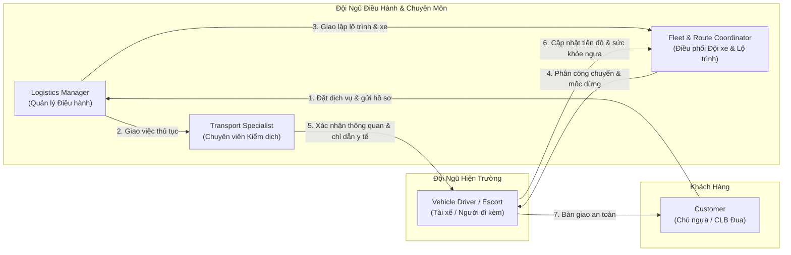
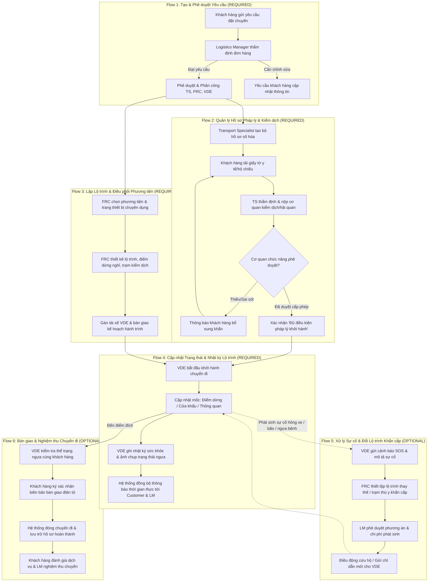
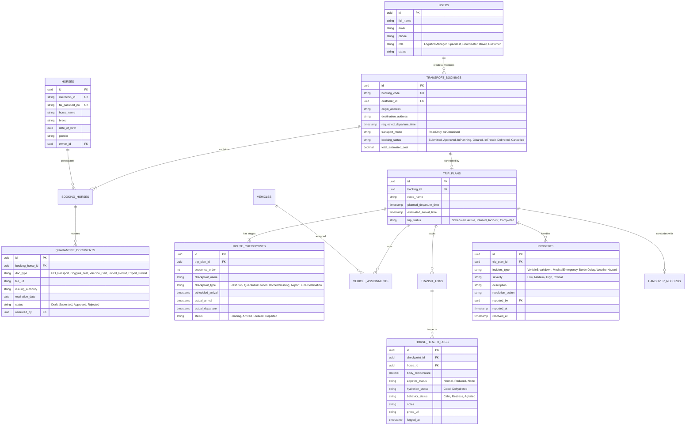

# Ngữ Cảnh Kiến Trúc & Nghiệp Vụ Hệ Thống — Cross-Border Racehorse Transport System

> **Dự án**: Hệ thống Quản lý Vận chuyển Ngựa đua Xuyên Quốc gia (`swp391-cross-border-racehorse-transport-system`)  
> **Tên tiếng Anh**: `Cross-Border Racehorse Transport System`  
> **Mã đề tài / Phụ trách**: `2 — HoangNT20`  
> **Môn học**: SWP391 (Software Project)  
> **Phương pháp tiếp cận**: Document-First System Specification (BDD Acceptance Criteria)  
> **Trạng thái tài liệu**: Official Context Specification v1.0  
> **Cập nhật gần nhất**: 2026-09-08  

---

## 📖 1. Tổng Quan Bối Cảnh & Mục Tiêu Hệ Thống

### 1.1. Bài toán Thực tế của Logistics Ngựa Đua Xuyên Quốc Gia
Ngựa đua là tài sản sinh học có giá trị kinh tế cực kỳ cao (từ hàng trăm nghìn đến hàng chục triệu USD/cá thể), đòi hỏi các tiêu chuẩn vận chuyển khắt khe nhất trong ngành logistics quốc tế:
- **Tiêu chuẩn phúc lợi động vật & y tế nghiêm ngặt**: Cần theo dõi liên tục tình trạng thể lực, thân nhiệt, nhịp thở, mức độ căng thẳng (stress), nguy cơ mất nước và bệnh đường hô hấp (*Shipping Fever*) trong suốt hành trình đường bộ và đường hàng không.
- **Rào cản pháp lý & kiểm dịch xuyên biên giới**: Mỗi quốc gia và cửa khẩu có danh mục dịch tễ riêng (xét nghiệm bệnh Viêm thiếu máu truyền nhiễm - EIA, Cúm ngựa - Equine Influenza, Viêm động mạch do virus - EVA...), yêu cầu đầy đủ Hộ chiếu FEI (Liên đoàn Thể thao Cưỡi ngựa Quốc tế), Giấy phép CITES (nếu liên quan giống thuần chủng bảo tồn), và giấy phép tạm nhập - tái xuất (ATA Carnet).
- **Điều phối đa phương thức phức tạp**: Kết hợp xe tải chuyên dụng (Horse Trucks/Vans trang bị giảm xóc khí nén), khoang máy bay vận chuyển động vật sống (Jet Stalls) và các trạm trung chuyển cách ly kiểm dịch (*Quarantine Stations*).

### 1.2. Sứ Mệnh của Hệ Thống
Hệ thống số hóa toàn diện vòng đời của một chuyến vận chuyển ngựa đua từ khi khách hàng đặt yêu cầu đến khi bàn giao an toàn tại điểm đích:
1. Số hóa và liên kết hồ sơ kiểm dịch, pháp lý theo thời gian thực.
2. Tối ưu hóa kế hoạch hành trình, lộ trình và phân bổ phương tiện chuyên dụng.
3. Giám sát nhật ký sức khỏe ngựa và mốc tiến độ theo từng chặng di chuyển.
4. Quản trị sự cố khẩn cấp và kích hoạt phương án thay đổi lộ trình tức thời.

---

## 👥 2. Ma Trận Vai Trò Người Dùng (Actors & Responsibilities)

Hệ thống phục vụ **5 nhóm tác nhân (Actors)** với trách nhiệm và quyền hạn phân định rõ ràng:

### 2.1. Logistics Manager (Quản lý Điều hành Logistics)
- **Tiếp nhận & Phê duyệt đơn hàng**: Thẩm định tính khả thi, thời gian và chi phí của các yêu cầu vận chuyển nội địa và quốc tế từ khách hàng.
- **Lập kế hoạch tổng thể**: Chọn phương thức vận chuyển (đường bộ, hàng không kết hợp), hãng hàng không đối tác, chuỗi trạm dừng trung chuyển và thời gian biểu sơ bộ.
- **Phân công nhiệm vụ**: Chỉ định Chuyên viên thủ tục (`Transport Specialist`), Điều phối viên (`Fleet & Route Coordinator`) và Đội tài xế/người đi kèm (`Vehicle Driver / Escort`).
- **Phê duyệt ngoại lệ & chi phí phát sinh**: Phê duyệt phương án thay đổi lộ trình khẩn cấp, phát sinh phí kiểm dịch đột xuất hoặc dịch vụ thú y dọc đường.
- **Báo cáo & Phân tích hiệu suất**: Theo dõi doanh thu, tỷ lệ đúng hạn (*On-time Delivery - OTD*), chi phí nhiên liệu/phí cầu đường/phí hải quan và chỉ số an toàn sinh học.

### 2.2. Transport Specialist (Chuyên viên Thủ tục & Kiểm dịch)
- **Quản lý danh mục quy định kiểm dịch**: Cập nhật bộ luật y tế thú y, danh sách vaccine bắt buộc và yêu cầu hải quan của từng quốc gia/cửa khẩu quốc tế.
- **Khởi tạo & Lưu trữ Hồ sơ vận chuyển số hóa**: Số hóa Hộ chiếu ngựa (FEI Passport), Giấy chứng nhận tiêm phòng, Giấy chứng nhận xét nghiệm máu âm tính (*Coggins Test*), Giấy phép xuất nhập cảnh và tờ khai hải quan.
- **Theo dõi tiến độ phê duyệt từ cơ quan công quyền**: Làm việc trực tuyến với Cục Thú y, Bộ Nông nghiệp, Cơ quan Hải quan cửa khẩu để đảm bảo giấy phép được thông qua trước giờ khởi hành.
- **Hướng dẫn & Đôn đốc khách hàng**: Gửi thông báo tự động và trực tiếp hỗ trợ khách hàng bổ sung các giấy tờ pháp lý còn thiếu trước hạn chót (Deadline).

### 2.3. Fleet & Route Coordinator (Điều phối viên Đội xe & Lộ trình)
- **Quản lý tài nguyên phương tiện**: Giám sát tình trạng kỹ thuật của xe tải chuyên dụng (Horse Trucks), thùng chứa hàng không (*Jet Stalls/Containers*), thiết bị thông gió và giám sát môi trường.
- **Lập lộ trình tối ưu**: Thiết kế đường đi tránh đoạn đường xóc, đèo dốc nguy hiểm; xác định chính xác các điểm dừng nghỉ ngơi cho ngựa ăn uống (*Rest Stops*), trạm kiểm dịch và trạm tiếp nhiên liệu.
- **Theo dõi & Cập nhật tiến độ chặng**: Theo dõi định vị GPS, ghi nhận mốc thời gian thực khi xe xuất phát, đến điểm dừng, hoàn tất thủ tục hải quan và bàn giao.
- **Điều chỉnh lộ trình khi có biến động**: Phát hiện sớm nguy cơ kẹt xe cửa khẩu, bão tuyết/thời tiết cực đoan hoặc sự cố giao thông để tái lập tuyến đường thay thế và gửi cảnh báo đến tài xế.

### 2.4. Vehicle Driver / Escort (Tài xế / Nhân viên Đi kèm & Chăm sóc)
- **Tiếp nhận nhiệm vụ & Lịch trình**: Nắm rõ danh sách cá thể ngựa phụ trách (tên, tính nết, yêu cầu dinh dưỡng đặc biệt), thông tin phương tiện và danh sách các điểm dừng bắt buộc.
- **Báo cáo mốc tiến độ thủ công**: Xác nhận trạng thái tại từng điểm mốc (Đã xuất phát, Đã tới điểm dừng nghỉ, Đã vào khu vực kiểm dịch cửa khẩu, Đã thông quan thành công).
- **Ghi nhật ký sức khỏe & phúc lợi ngựa**: Định kỳ ghi nhận thể trạng ngựa tại mỗi trạm dừng (Sức khỏe ổn định, Bỏ ăn/uống nước, Căng thẳng/kích động, Thân nhiệt, Tình trạng chuồng) kèm văn bản và hình ảnh chụp thực tế.
- **Báo cáo sự cố khẩn cấp tại hiện trường**: Gửi tín hiệu SOS khẩn cấp (Hỏng xe cơ học, Tai nạn giao thông, Kẹt xe kéo dài gây sốc nhiệt, Ngựa phát bệnh/chấn thương đột xuất) về trung tâm điều hành.

### 2.5. Customer (Khách hàng — Chủ Ngựa / CLB Đua Ngựa / Trang Trại)
- **Đặt dịch vụ vận chuyển**: Tạo yêu cầu vận chuyển trực tuyến, cung cấp địa điểm đi/đến, thời gian mong muốn, số lượng ngựa và các yêu cầu chăm sóc chuyên biệt.
- **Tải lên hồ sơ lý lịch & y tế**: Tải lên bản chụp Hộ chiếu ngựa, chứng nhận tiêm phòng, lịch sử y khoa theo danh mục yêu cầu.
- **Theo dõi tiến độ hành trình trực quan**: Giám sát vị trí chuyến đi trên bản đồ và nhận các cập nhật trạng thái chặng theo thời gian thực.
- **Nhận thông báo & Nghiệm thu**: Nhận thông báo tự động khi ngựa thông quan thành công hoặc đến địa điểm đích; ký biên bản bàn giao và đánh giá chất lượng dịch vụ.

---

## 🔄 3. Đặc Tả 6 Luồng Nghiệp Vụ Cốt Lõi (Core & Optional Flows)

### 3.1. Flow 1: Luồng Tạo & Phê duyệt Yêu cầu Vận chuyển (`REQUIRED`)
- **Mục tiêu**: Thiết lập hợp đồng vận chuyển khả thi giữa khách hàng và công ty logistics.
- **Tiền điều kiện**: Khách hàng đã đăng nhập tài khoản hợp lệ.
- **Các bước thực hiện**:
  1. Khách hàng nhập thông tin yêu cầu: Điểm đi, điểm đến, thời gian dự kiến, số lượng ngựa, danh sách tên/giống ngựa, yêu cầu chăm sóc (chế độ ăn, chuồng đơn/đôi).
  2. Hệ thống tính toán báo giá sơ bộ dựa trên khoảng cách, phương thức (đường bộ/hàng không) và phụ phí kiểm dịch.
  3. Logistics Manager nhận thông báo đơn hàng mới, kiểm tra tính khả thi của đội xe và lịch trình bay.
  4. Logistics Manager phê duyệt đơn hàng, chỉ định `Transport Specialist` phụ trách pháp lý, `Fleet & Route Coordinator` phụ trách lộ trình, và gán mã định danh duy nhất (`Booking ID`).

### 3.2. Flow 2: Luồng Quản lý Hồ sơ Pháp lý & Kiểm dịch Thông quan (`REQUIRED`)
- **Mục tiêu**: Đảm bảo 100% giấy tờ y tế, kiểm dịch và hải quan được cấp phép trước khi phương tiện lăn bánh.
- **Tiền điều kiện**: Đơn vận chuyển đã được phê duyệt ở Flow 1.
- **Các bước thực hiện**:
  1. Transport Specialist khởi tạo `Hồ sơ kiểm dịch số hóa` cho từng cá thể ngựa trong chuyến đi.
  2. Hệ thống tạo danh mục giấy tờ bắt buộc dựa theo quy định của quốc gia xuất khẩu, quá cảnh và nhập khẩu.
  3. Khách hàng tải lên ảnh/bản scan: Hộ chiếu FEI, Giấy chứng nhận xét nghiệm máu âm tính (Coggins Test), Sổ tiêm chủng (phải tiêm đủ vaccine cúm trong 6 tháng gần nhất).
  4. Transport Specialist thẩm tra tính hợp lệ; nộp hồ sơ xin giấy phép kiểm dịch động vật sống và tờ khai hải quan.
  5. Khi cơ quan thẩm quyền phê duyệt, Transport Specialist đánh dấu trạng thái `Đủ điều kiện pháp lý khởi hành` (`Cleared for Departure`).

### 3.3. Flow 3: Luồng Lập Kế hoạch Lộ trình & Điều phối Phương tiện (`REQUIRED`)
- **Mục tiêu**: Tối ưu hóa tuyến đường, đảm bảo các điểm dừng nghỉ ngơi bắt buộc cho ngựa theo luật bảo vệ động vật.
- **Tiền điều kiện**: Đơn hàng đã duyệt, đã xác định số lượng cá thể ngựa.
- **Các bước thực hiện**:
  1. Fleet & Route Coordinator kiểm tra tính sẵn sàng của đội xe chuyên dụng và thùng vận chuyển (Stalls).
  2. Thiết lập lộ trình chặng: Điểm xuất phát $\to$ Trạm nghỉ 1 (sau tối đa 4-6 tiếng di chuyển) $\to$ Trạm kiểm dịch cửa khẩu $\to$ Sân bay/Cảng $\to$ Điểm đích.
  3. Xác định các điểm hỗ trợ thú y dọc tuyến phòng trường hợp khẩn cấp.
  4. Gán tài xế (`Vehicle Driver / Escort`) và xuất bản bản đồ lộ trình chi tiết lên ứng dụng hiện trường của tài xế.

### 3.4. Flow 4: Luồng Cập nhật Trạng thái & Nhật ký Lộ trình (`REQUIRED`)
- **Mục tiêu**: Cung cấp khả năng hiển thị thời gian thực về tiến độ chuyến đi và thể trạng ngựa cho cả đội điều hành lẫn khách hàng.
- **Tiền điều kiện**: Chuyến đi đã xuất phát.
- **Các bước thực hiện**:
  1. Tài xế (VDE) nhấn `Bắt đầu xuất phát` trên ứng dụng.
  2. Tại mỗi mốc quy định (đến trạm nghỉ, vào khu kiểm dịch, thông quan xong), tài xế ấn nút cập nhật mốc tương ứng.
  3. Trong thời gian dừng nghỉ, tài xế kiểm tra thể trạng từng con ngựa, điền bảng kiểm nhanh (Nhiệt độ, mức ăn uống, hành vi kích động) và chụp ảnh thực tế tải lên hệ thống.
  4. Hệ thống tức thời cập nhật trạng thái lên bảng điều khiển của Logistics Manager và gửi thông báo *Push/SMS/Email* cho Khách hàng.

### 3.5. Flow 5: Luồng Xử lý Sự cố & Điều chỉnh Lộ trình Khẩn cấp (`OPTIONAL`)
- **Mục tiêu**: Kích hoạt quy trình phản ứng nhanh khi xảy ra biến cố giao thông, thiên tai hoặc vấn đề sức khỏe của ngựa.
- **Tiền điều kiện**: Chuyến đi đang trong hành trình (`In Transit`).
- **Các bước thực hiện**:
  1. Tài xế bấm nút `Báo cáo sự cố khẩn cấp` (SOS), chọn loại sự cố: Hỏng xe cơ học, Tắc nghẽn cửa khẩu kéo dài, Ngựa sốt cao/chấn thương.
  2. Trung tâm điều phối nhận chuông cảnh báo đỏ và vị trí GPS hiện thời của xe.
  3. FRC liên hệ trạm cứu hộ hoặc phòng khám thú y gần nhất; tính toán lộ trình nhánh tránh điểm ùn tắc.
  4. Logistics Manager phê duyệt phương án điều chỉnh lộ trình hoặc phát sinh chi phí y tế.
  5. Lộ trình mới được đẩy thẳng xuống thiết bị của tài xế; đồng thời gửi thông báo giải trình minh bạch tới khách hàng.

### 3.6. Flow 6: Luồng Bàn giao & Nghiệm thu Chuyến đi (`OPTIONAL`)
- **Mục tiêu**: Hoàn tất chuyến đi an toàn, xác nhận trách nhiệm pháp lý và đóng hồ sơ đơn hàng.
- **Tiền điều kiện**: Phương tiện đã tới điểm đích an toàn.
- **Các bước thực hiện**:
  1. Tài xế cùng đại diện khách hàng tiến hành dắt ngựa xuống chuồng nhận, kiểm tra ngoại quan vết thương hoặc dấu hiệu mệt mỏi.
  2. Bàn giao lại toàn bộ hồ sơ gốc (Hộ chiếu ngựa, giấy kiểm dịch đóng mộc đỏ).
  3. Khách hàng ký chữ ký điện tử xác nhận vào Biên bản bàn giao (`Digital Delivery Handover`).
  4. Hệ thống chuyển trạng thái đơn hàng sang `Hoàn thành` (`Completed`), mở cổng cho khách hàng đánh giá xếp hạng chất lượng phục vụ và xuất hóa đơn tài chính.

---

## 🗄️ 4. Mô Hình Dữ Liệu Khái Niệm Dự Kiến (Data Architecture Entities)

> **Tài liệu Đánh giá & Chuẩn hóa Chi tiết ERD**: Xem chi tiết phân tích lỗi quan hệ logic, các lỗ hổng cần vá và sơ đồ Mermaid ERD chuẩn hóa 7 phân hệ tại [ERD_Review_And_Fixes.md](file:///d:/VNZ/document-first-brief/swp391-cross-border-racehorse-transport-system/Context/ERD_Review_And_Fixes.md).

---

## 📊 5. Ma Trận Phân Quyền Trách Nhiệm (RACI Matrix)

| Quy trình / Luồng nghiệp vụ | Logistics Manager | Transport Specialist | Fleet & Route Coordinator | Vehicle Driver / Escort | Customer |
| :--- | :---: | :---: | :---: | :---: | :---: |
| **Flow 1: Tạo & Duyệt yêu cầu đặt chuyến** | **A / R** | C | C | I | **R** |
| **Flow 2: Thẩm định hồ sơ y tế & Kiểm dịch** | I | **A / R** | I | I | **R (Cung cấp)** |
| **Flow 3: Thiết kế lộ trình & Gán xe/tài xế** | A | C | **A / R** | C | I |
| **Flow 4: Cập nhật tiến độ & Nhật ký ngựa** | I | I | C | **A / R** | I (Theo dõi) |
| **Flow 5: Ứng phó sự cố & Đổi tuyến đường** | **A** | C | **R** | **R (Báo cáo)** | I |
| **Flow 6: Bàn giao an toàn & Nghiệm thu** | A | I | I | **R** | **A / R (Ký nhận)** |

> *Ghi chú chữ viết tắt RACI:*
> - **R (Responsible)**: Người trực tiếp thực hiện nhiệm vụ.
> - **A (Accountable)**: Người chịu trách nhiệm cuối cùng phê duyệt.
> - **C (Consulted)**: Người được tham vấn chuyên môn 2 chiều.
> - **I (Informed)**: Người được cập nhật thông tin 1 chiều.

---

## 🎯 6. Kế Hoạch Áp Dụng Document-First Cho Đề Tài SWP391

1. **User Stories (`UserStory/`)**: Sẽ được xây dựng tương ứng theo 4 luồng bắt buộc (Required) và 2 luồng mở rộng (Optional), bao gồm:
   - `US-01`: Đặt yêu cầu dịch vụ vận chuyển ngựa đua (Customer).
   - `US-02`: Thẩm định và phê duyệt yêu cầu vận chuyển (Logistics Manager).
   - `US-03`: Số hóa và quản lý hồ sơ kiểm dịch xuất nhập cảnh (Transport Specialist).
   - `US-04`: Thiết kế lộ trình điểm dừng và gán phương tiện chuyên dụng (Fleet & Route Coordinator).
   - `US-05`: Báo cáo mốc tiến độ chặng và cập nhật thông quan (Vehicle Driver).
   - `US-06`: Ghi nhật ký sức khỏe và phúc lợi ngựa tại trạm nghỉ (Vehicle Driver).
   - `US-07`: Báo cáo và kích hoạt xử lý sự cố khẩn cấp (Vehicle Driver / Coordinator / Manager).
   - `US-08`: Nghiệm thu và ký biên bản bàn giao điện tử (Customer / Driver).
2. **Business Rules (`BusinessRules/`)**: Quy định tiêm chủng bắt buộc, thời gian tối đa ngựa di chuyển liên tục trước khi phải dừng nghỉ ($\le 6$ tiếng), thẩm quyền phê duyệt thay đổi lộ trình, v.v.
3. **System Tests (`SystemTest/`)**: Các kịch bản kiểm thử hành vi người dùng theo định dạng chuẩn chia dòng.
