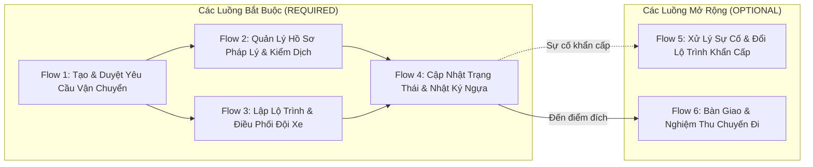

# Hệ Thống Quản Lý Vận Chuyển Ngựa Đua Xuyên Quốc Gia (`swp391-cross-border-racehorse-transport-system`)

> **Mã dự án (Key)**: `swp391-cross-border-racehorse-transport-system`  
> **Tên dự án**: `Cross-Border Racehorse Transport System` (Hệ thống Quản lý Vận chuyển Ngựa đua Xuyên Quốc gia)  
> **Mã đề tài / Phụ trách**: `2 — HoangNT20`  
> **Khóa học / Đề tài**: SWP391 (Software Project)  
> **Phương pháp tiếp cận**: Document-First System Specification (BDD Acceptance Criteria)  
> **Trạng thái**: Đã hoàn tất tài liệu Ngữ cảnh Kiến trúc & Nghiệp vụ (`Context`)  
> **Cập nhật gần nhất**: 2026-09-08  

---

## 📖 1. Tổng Quan & Tầm Nhìn Dự Án

**Cross-Border Racehorse Transport System** là nền tảng số chuyên biệt quản lý quy trình logistics, kiểm dịch thú y, thủ tục hải quan và theo dõi hành trình vận chuyển ngựa đua qua biên giới giữa các quốc gia, bảo đảm an toàn sức khỏe sinh học tối đa và tuân thủ các công ước quốc tế (OIE/WOAH, FEI).

Chi tiết đặc tả kiến trúc: 👉 [**`Racehorse_Transport_Context.md`**](file:///d:/VNZ/document-first-brief/swp391-cross-border-racehorse-transport-system/Context/Racehorse_Transport_Context.md)

---

## 👥 2. 5 Vai Trò Người Dùng (Actors & Responsibilities)

| Vai trò người dùng | Tên tiếng Việt | Trách nhiệm cốt lõi |
| :--- | :--- | :--- |
| **Logistics Manager** | Quản lý Điều hành Logistics | Tiếp nhận & duyệt đơn; lập kế hoạch tổng thể; phân công nhiệm vụ cho Specialist, Coordinator, Driver; duyệt đổi lộ trình & chi phí phát sinh khẩn cấp; xem báo cáo OTD. |
| **Transport Specialist** | Chuyên viên Thủ tục & Kiểm dịch | Quản lý danh mục quy định y tế/kiểm dịch từng quốc gia; khởi tạo & lưu trữ hồ sơ số hóa của ngựa (Hộ chiếu FEI, tiêm phòng, xuất nhập cảnh); làm việc với cơ quan chức năng; đôn đốc khách bổ sung giấy tờ. |
| **Fleet & Route Coordinator** | Điều phối viên Đội xe & Lộ trình | Quản lý phương tiện chuyên dụng (xe chở ngựa, thùng Air Stalls); thiết kế lộ trình tối ưu và các điểm dừng nghỉ/kiểm dịch; theo dõi tiến độ chặng; điều chỉnh lộ trình khi có biến động thời tiết/giao thông. |
| **Vehicle Driver / Escort** | Tài xế / Nhân viên Đi kèm | Xem lịch trình & danh sách ngựa phụ trách; báo cáo thủ công mốc tiến độ (xuất phát, đến trạm, thông quan); ghi nhật ký sức khỏe & ảnh chụp ngựa; gửi báo cáo sự cố khẩn cấp (SOS). |
| **Customer** | Khách hàng (CLB / Chủ ngựa) | Tạo yêu cầu đặt dịch vụ vận chuyển; tải lên hồ sơ lý lịch & y tế của ngựa; theo dõi tiến độ và vị trí thời gian thực; nhận thông báo thông quan & ký biên bản bàn giao. |

---

## 🔄 3. Danh Mục 6 Luồng Nghiệp Vụ Cốt Lõi



1. **Flow 1: Luồng Tạo & Phê duyệt Yêu cầu Vận chuyển (`REQUIRED`)**: Khách hàng đặt chuyến $\to$ Hệ thống tính phí $\to$ Logistics Manager thẩm định & duyệt $\to$ Phân công đội ngũ.
2. **Flow 2: Luồng Quản lý Hồ sơ Pháp lý & Kiểm dịch Thông quan (`REQUIRED`)**: Khởi tạo hồ sơ số $\to$ Khách hàng nộp hộ chiếu/xét nghiệm $\to$ Specialist nộp cơ quan thẩm quyền $\to$ Phê duyệt xuất hành.
3. **Flow 3: Luồng Lập Kế hoạch Lộ trình & Điều phối Phương tiện (`REQUIRED`)**: Coordinator gán xe/thùng $\to$ Thiết lập trạm nghỉ ngơi & kiểm dịch $\to$ Bàn giao lịch trình cho tài xế.
4. **Flow 4: Luồng Cập nhật Trạng thái & Nhật ký Lộ trình (`REQUIRED`)**: Tài xế cập nhật mốc hành trình $\to$ Ghi nhận thể trạng/thân nhiệt/ăn uống & ảnh chụp ngựa $\to$ Đồng bộ thời gian thực cho Customer & Manager.
5. **Flow 5: Luồng Xử lý Sự cố & Điều chỉnh Lộ trình Khẩn cấp (`OPTIONAL`)**: Tài xế bấm SOS $\to$ FRC lập lộ trình tránh điểm ùn tắc/chuyển trạm thú y $\to$ Manager duyệt chi phí $\to$ Cập nhật chỉ dẫn mới.
6. **Flow 6: Luồng Bàn giao & Nghiệm thu Chuyến đi (`OPTIONAL`)**: Bàn giao thể trạng ngựa tại đích $\to$ Khách hàng ký nhận điện tử $\to$ Hoàn thành đơn hàng & đánh giá dịch vụ.

---

## 📂 4. Cấu Trúc Thư Mục Phân Hệ

```text
swp391-cross-border-racehorse-transport-system/
├── README.md                              # Cổng thông tin & Cẩm nang tra cứu tổng thể dự án (File hiện tại)
├── BusinessRules/                         # Quy tắc nghiệp vụ (Kiểm dịch, Hải quan, Giới hạn thời gian di chuyển)
├── ConfirmedDoc/                          # Hợp đồng API & Tài liệu kỹ thuật đã phê duyệt
├── Context/                               # Ngữ cảnh kiến trúc, mô hình CSDL (ERD) & Từ điển dữ liệu
│   └── Racehorse_Transport_Context.md     # Đặc tả chi tiết 5 Actors, 6 Flows, ERD và Ma trận RACI
├── UserStory/                             # User Stories đặc tả yêu cầu nghiệp vụ theo chuẩn BDD (US-01 -> US-08)
├── SystemTest/                            # Kịch bản kiểm thử hệ thống chuẩn hóa (theo format chia dòng)
├── TDD/                                   # Thiết kế kỹ thuật chi tiết (Technical Design Documents)
└── UnitTest/                              # Kịch bản kiểm thử đơn vị & Ma trận Test Cases
```

---

## 📐 5. Biểu Mẫu Chuẩn Áp Dụng (Document-First Templates)

- **User Story**: [`../template-US.md`](file:///d:/VNZ/document-first-brief/template-US.md)
- **Business Rule**: [`../template-BR.md`](file:///d:/VNZ/document-first-brief/template-BR.md)
- **System Test**: [`../template-SystemTest.md`](file:///d:/VNZ/document-first-brief/template-SystemTest.md)
- **Technical Design Document**: [`../template-TDD.md`](file:///d:/VNZ/document-first-brief/template-TDD.md)
- **Unit Test**: [`../template-UnitTest.md`](file:///d:/VNZ/document-first-brief/template-UnitTest.md)
