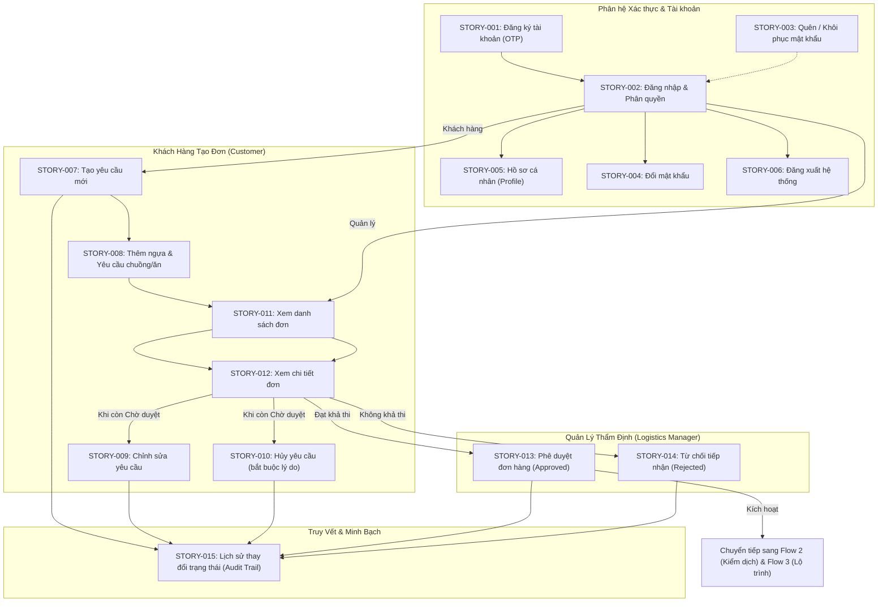

# Danh Mục & Cẩm Nang Tra Cứu User Stories
## Hệ Thống Quản Lý Vận Chuyển Ngựa Đua Xuyên Quốc Gia (`swp391-cross-border-racehorse-transport-system`)

> **Mã đề tài / Phụ trách**: `2 — HoangNT20`  
> **Dự án**: Cross-Border Racehorse Transport System  
> **Tài liệu**: User Stories Explanation & Traceability Guide  
> **Phương pháp tiếp cận**: Document-First, Behavior-Driven Development (BDD Acceptance Criteria)  
> **Phiên bản**: v1.0 — Cập nhật: 2026-09-12  

---

## 📑 1. Tổng Quan Vòng Đời Tác Nghiệp Flow 1

**Flow 1 — Quản lý Tài khoản & Yêu cầu Vận chuyển** là cửa ngõ khởi đầu toàn bộ hệ thống, kết nối Khách hàng (Chủ ngựa, Câu lạc bộ đua) với Ban Quản lý Điều hành Logistics:



---

## 📊 2. Ma Trận Tra Cứu 15 User Stories (Flow 1)

| Mã Story | Tên User Story | Tác nhân chính (Actors) | File đặc tả chi tiết | TDD / Entity liên quan |
|---|---|---|---|---|
| **STORY-001** | Đăng ký tài khoản khách hàng | `Customer` | [`01-RegisterCustomerAccount.md`](file:///d:/VNZ/document-first-brief/swp391-cross-border-racehorse-transport-system/UserStory/01-RegisterCustomerAccount.md) | `User`, `CustomerProfile`, `OtpVerification` |
| **STORY-002** | Đăng nhập và điều hướng phân quyền | `All Actors` | [`02-LoginAndRoleBasedRedirection.md`](file:///d:/VNZ/document-first-brief/swp391-cross-border-racehorse-transport-system/UserStory/02-LoginAndRoleBasedRedirection.md) | `User`, JWT Authentication |
| **STORY-003** | Quên và khôi phục mật khẩu | `All Actors` | [`03-ForgotPasswordAndRecovery.md`](file:///d:/VNZ/document-first-brief/swp391-cross-border-racehorse-transport-system/UserStory/03-ForgotPasswordAndRecovery.md) | `User`, `OtpVerification` |
| **STORY-004** | Thay đổi mật khẩu trong phiên | `All Actors` | [`04-ChangePassword.md`](file:///d:/VNZ/document-first-brief/swp391-cross-border-racehorse-transport-system/UserStory/04-ChangePassword.md) | `User` |
| **STORY-005** | Cập nhật hồ sơ cá nhân (Profile) | `All Actors` | [`05-UpdateUserProfile.md`](file:///d:/VNZ/document-first-brief/swp391-cross-border-racehorse-transport-system/UserStory/05-UpdateUserProfile.md) | `User`, `CustomerProfile` |
| **STORY-006** | Đăng xuất hệ thống | `All Actors` | [`06-Logout.md`](file:///d:/VNZ/document-first-brief/swp391-cross-border-racehorse-transport-system/UserStory/06-Logout.md) | Token Blacklist |
| **STORY-007** | Tạo yêu cầu vận chuyển mới | `Customer` | [`07-CreateTransportRequest.md`](file:///d:/VNZ/document-first-brief/swp391-cross-border-racehorse-transport-system/UserStory/07-CreateTransportRequest.md) | `TransportRequest`, `RequestStatusHistory` |
| **STORY-008** | Quản lý danh sách ngựa & Yêu cầu đặc biệt | `Customer` | [`08-ManageHorsesAndSpecialRequirements.md`](file:///d:/VNZ/document-first-brief/swp391-cross-border-racehorse-transport-system/UserStory/08-ManageHorsesAndSpecialRequirements.md) | `RequestHorseItem`, `TransportRequest` |
| **STORY-009** | Cập nhật thông tin yêu cầu vận chuyển | `Customer` | [`09-UpdateTransportRequest.md`](file:///d:/VNZ/document-first-brief/swp391-cross-border-racehorse-transport-system/UserStory/09-UpdateTransportRequest.md) | `TransportRequest`, `RequestStatusHistory` |
| **STORY-010** | Hủy yêu cầu vận chuyển | `Customer` | [`10-CancelTransportRequest.md`](file:///d:/VNZ/document-first-brief/swp391-cross-border-racehorse-transport-system/UserStory/10-CancelTransportRequest.md) | `TransportRequest`, `RequestStatusHistory` |
| **STORY-011** | Xem danh sách yêu cầu vận chuyển | `Customer`, `Logistics Manager` | [`11-ViewTransportRequestList.md`](file:///d:/VNZ/document-first-brief/swp391-cross-border-racehorse-transport-system/UserStory/11-ViewTransportRequestList.md) | `TransportRequest` (Phân quyền dữ liệu) |
| **STORY-012** | Xem chi tiết yêu cầu vận chuyển | `Customer`, `Logistics Manager` | [`12-ViewTransportRequestDetail.md`](file:///d:/VNZ/document-first-brief/swp391-cross-border-racehorse-transport-system/UserStory/12-ViewTransportRequestDetail.md) | `TransportRequest`, `RequestHorseItem` |
| **STORY-013** | Phê duyệt yêu cầu vận chuyển | `Logistics Manager` | [`13-ApproveTransportRequest.md`](file:///d:/VNZ/document-first-brief/swp391-cross-border-racehorse-transport-system/UserStory/13-ApproveTransportRequest.md) | `TransportRequest`, `RequestStatusHistory` |
| **STORY-014** | Từ chối yêu cầu vận chuyển | `Logistics Manager` | [`14-RejectTransportRequest.md`](file:///d:/VNZ/document-first-brief/swp391-cross-border-racehorse-transport-system/UserStory/14-RejectTransportRequest.md) | `TransportRequest`, `RequestStatusHistory` |
| **STORY-015** | Xem lịch sử thay đổi trạng thái | `Customer`, `Logistics Manager` | [`15-ViewRequestStatusHistory.md`](file:///d:/VNZ/document-first-brief/swp391-cross-border-racehorse-transport-system/UserStory/15-ViewRequestStatusHistory.md) | `RequestStatusHistory` (Audit Trail) |

---

## 📌 3. Quy Ước Ràng Buộc Vòng Đời Trạng Thái (Request Lifecycle State Machine)

Mọi yêu cầu vận chuyển (`TransportRequest`) tuân thủ nghiêm ngặt máy trạng thái sau:

```text
[Bản nháp: DRAFT] ──> [Chờ duyệt: PENDING_APPROVAL] ──┬──> [Đã duyệt: APPROVED] ──> [Đang vận chuyển: IN_TRANSIT] ──> [Đã giao: DELIVERED]
                                                      │
                                                      ├──> [Từ chối: REJECTED] (Có lý do)
                                                      │
                                                      └──> [Đã hủy: CANCELLED] (Có lý do)
```

- **Sửa / Hủy bởi Khách hàng**: Chỉ được phép khi ở trạng thái `DRAFT` hoặc `PENDING_APPROVAL`.
- **Duyệt / Từ chối bởi Manager**: Chỉ được phép khi ở trạng thái `PENDING_APPROVAL`.
- **Lưu vết kiểm toán**: Mọi lần chuyển đổi trạng thái đều tự động sinh bản ghi trong `RequestStatusHistory`.
