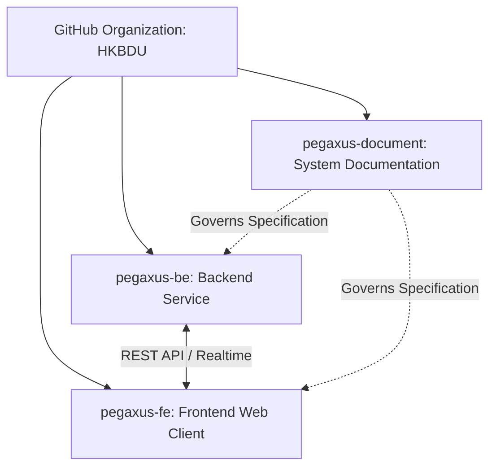
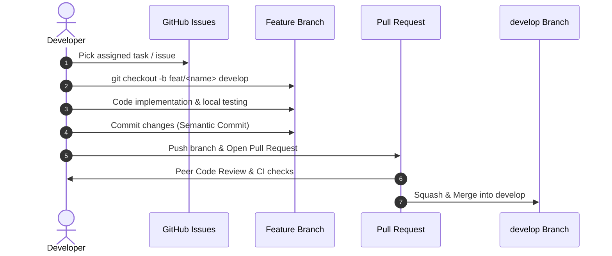

# 6.2 Source Code Management

> **Dự án**: `Pegaxus` (Cross-Border Racehorse Transport Management System)  
> **Tài liệu**: Báo cáo Kiến trúc & Quy trình Quản lý Mã nguồn (Source Code Management)  
> **Căn cứ**: [COMMIT_CONVENTION.md](file:///d:/VNZ/document-first-brief/swp391-pegaxus/COMMIT_CONVENTION.md)  
> **Ngày cập nhật**: 14/09/2026  

---

## 📋 Bản Tóm Tắt (Summary / Slide Format)

GitHub is used for version control, collaborative code management, and GitHub Issues for tracking tasks across the three core repositories of the Pegaxus ecosystem:
* **Backend Repository** (`pegaxus-be`): Core .NET Web API services, database repositories, and business logic.
* **Frontend Repository** (`pegaxus-fe`): Client web application built with React, TypeScript, and Vite.
* **Documentation Repository** (`pegaxus-document`): System specifications, BDD User Stories, Business Rules, and API contracts.

* **Branching Strategy:**
  * `main`: Stable production code.
  * `develop`: Integrates tested features.
  * `feat/*`, `fix/*`, `build/*`: Specific changes.
* **Workflow:**
  * Create issues $\rightarrow$ Work on a branch $\rightarrow$ Submit PR $\rightarrow$ Code review $\rightarrow$ Merge.
  * Use semantic commit messages (e.g., `feat: implement racehorse health tracking`).
  * Squash & merge for clean history.
* **Versioning & Releases:**
  * Use branch for tracking versions and semantic version tags (`v1.0.0`).
* **Security & Backup:**
  * Manage sensitive data with `.gitignore` (`.env`, `appsettings.Development.json`, `node_modules/`, `bin/`, `obj/`).
  * Control access using GitHub permissions and branch protection rules.

*This ensures efficient code management, tracking, and collaboration.*

---

## 📑 Bản Chi Tiết (Detailed Academic / Project Report Format)

### 6.2.1 Multi-Repository Architecture
The Pegaxus system adopts a decoupled multi-repository strategy under the organization workspace to enforce clear separation of concerns, independent deployments, and access governance:

| Repository | Local Path | Tech Stack | Primary Responsibility |
| :--- | :--- | :--- | :--- |
| **`pegaxus-be`** | [C:\Users\acer\pegaxus-be](file:///C:/Users/acer/pegaxus-be) | .NET 8, C#, EF Core, SQL Server | Web API services, domain entities, repositories, transport workflows |
| **`pegaxus-fe`** | [C:\Users\acer\pegaxus-fe](file:///C:/Users/acer/pegaxus-fe) | React 18, TypeScript, Vite, TailwindCSS | User interfaces, customer booking flow, driver tracking dashboards |
| **`pegaxus-document`** | [C:\Users\acer\pegaxus-document](file:///C:/Users/acer/pegaxus-document) | Markdown, Mermaid | System specifications, BDD User Stories, Business Rules, Test suites |

---

### 6.2.2 Branching Strategy & Git Flow
All three repositories enforce a strict Git Feature Branch Workflow:

1. **`main` Branch (Production)**:
   - Contains release-ready, thoroughly verified, and stable production code.
   - Protected branch: direct commits and force-pushes (`push --force`) are completely prohibited.
   - Code enters `main` exclusively through tested Pull Requests merged from `develop` or emergency `hotfix/*` branches.

2. **`develop` Branch (Integration & Staging)**:
   - Serves as the central integration branch for all newly implemented features.
   - Acts as the staging build target where continuous integration (CI) tests are run.

3. **Supporting Branches**:
   - `feat/<feature-name>`: Branched from `develop` to develop new functional user stories (e.g., `feat/horse-quarantine-check`, `feat/route-milestone`).
   - `fix/<bug-name>`: Branched from `develop` to resolve issues identified during testing.
   - `build/*`: Dedicated to dependency updates, CI/CD pipeline adjustments, or Docker build configurations.
   - `hotfix/<issue-name>`: Branched directly from `main` to address critical production blockers, merging back into both `main` and `develop`.

---

### 6.2.3 Collaboration Workflow & Commit Standards

1. **Task Tracking**:
   - Tasks are initiated as GitHub Issues linked directly to requirements in `pegaxus-document`.
2. **Branch Naming**:
   - Standardized format: `<type>/<short-description>` (e.g., `feat/booking-validation`, `fix/login-token-refresh`).
3. **Commit Convention** (Ref: [COMMIT_CONVENTION.md](file:///d:/VNZ/document-first-brief/swp391-pegaxus/COMMIT_CONVENTION.md)):
   - **Commit Header**: Imperative mood, present tense, max 50 characters (e.g., `Add health milestone tracker`, `Fix route milestone timestamp parser`).
   - **Impact Bullets**: 4 to 8 concise lines describing high-impact changes (`behavior`, `logic`, `i18n`, `removals`, `integrations`).
   - Strict avoidance of internal file paths inside commit messages.
4. **Code Review & Quality Gate**:
   - Every Pull Request requires at least one approving peer review before merge authorization.
5. **Merge Strategy**:
   - **Squash and Merge** is strictly configured to compress incremental local commits into a clean, linear, and readable Git history on the target branch.

---

### 6.2.4 Versioning, Releases & Security

1. **Semantic Versioning (SemVer)**:
   - Releases are tagged on the `main` branch following `vMAJOR.MINOR.PATCH` (e.g., `v1.0.0` for MVP milestone, `v1.1.0` for new feature release).
2. **Environment & Secret Protection**:
   - Each repository maintains a comprehensive `.gitignore` preventing accidental commits of secrets:
     - Backend: `appsettings.Development.json`, `appsettings.Production.json`, `/bin`, `/obj`.
     - Frontend: `.env`, `.env.local`, `node_modules/`, `dist/`.
     - System-wide: OS caches (`.DS_Store`, `Thumbs.db`), IDE configs (`.vs/`, `.idea/`, `.vscode/`).
3. **Role-Based Access Control (RBAC)**:
   - Granular permissions managed via GitHub Organization (`HKBDU`), ensuring only authorized Leads can approve PR merges into `main`.
