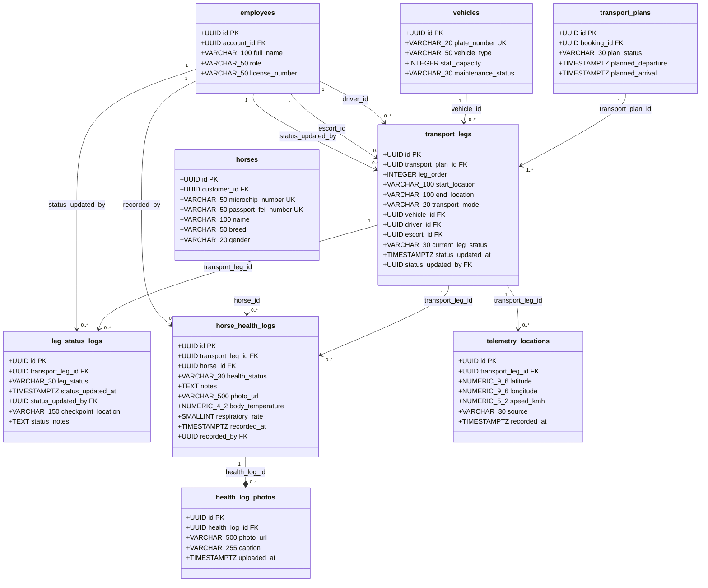

# Physical ERD (PostgreSQL) - Flow 4: Giám Sát Tiến Độ & Nhật Ký Sức Khỏe Ngựa

Tài liệu thiết kế mô hình dữ liệu vật lý (Physical Data Model) cho **Flow 4 (Cập nhật Trạng thái & Nhật ký Lộ trình / Sức khỏe Ngựa)** của hệ thống PEGAXUS, chuẩn hóa theo đúng các yêu cầu đặc tả nghiệp vụ:
- **Chặng di chuyển (từng đoạn trong hành trình)**
- **Trạng thái chặng (khởi hành, đến điểm dừng, đã thông quan, đã giao)**
- **Thời gian cập nhật trạng thái**
- **Người cập nhật trạng thái**
- **Nhật ký sức khỏe ngựa (ổn định, bỏ ăn, căng thẳng, khí hậu thay đổi)**
- **Ghi chú kèm hình ảnh về tình trạng ngựa**
- **Thời điểm ghi nhận nhật ký**
- **Vị trí thực tế (nếu theo dõi realtime)**

---

## 1. Class Diagram (Physical Model)



---

## 2. Bảng Ánh Xạ Chi Tiết Nghiệp Vụ Flow 4 Vào PostgreSQL

| Yêu cầu nghiệp vụ Flow 4 | Tên bảng PostgreSQL | Tên cột / Kiểu dữ liệu | Ràng buộc / Giá trị Enum |
|---|---|---|---|
| **Chặng di chuyển (từng đoạn)** | `transport_legs` | `id UUID PK`<br>`transport_plan_id UUID FK`<br>`leg_order INTEGER`<br>`start_location VARCHAR(100)`<br>`end_location VARCHAR(100)` | Phân đoạn theo từng mốc trong hành trình tổng (`transport_plans`). |
| **Trạng thái chặng** | `transport_legs`<br>`leg_status_logs` | `current_leg_status VARCHAR(30)`<br>`leg_status VARCHAR(30)` | `CHECK (leg_status IN ('DEPARTED', 'ARRIVED_STOP', 'CUSTOMS_CLEARED', 'DELIVERED'))`<br>Khởi hành, Đến điểm dừng, Đã thông quan, Đã giao |
| **Thời gian cập nhật trạng thái** | `transport_legs`<br>`leg_status_logs` | `status_updated_at TIMESTAMPTZ` | `NOT NULL DEFAULT CURRENT_TIMESTAMP` |
| **Người cập nhật trạng thái** | `transport_legs`<br>`leg_status_logs` | `status_updated_by UUID FK` | `REFERENCES employees(id)` (Tài xế / Escort) |
| **Nhật ký sức khỏe ngựa** | `horse_health_logs` | `health_status VARCHAR(30)` | `CHECK (health_status IN ('STABLE', 'LOSS_OF_APPETITE', 'STRESSED', 'CLIMATE_AFFECTED'))`<br>Ổn định, Bỏ ăn, Căng thẳng, Khí hậu thay đổi |
| **Ghi chú tình trạng ngựa** | `horse_health_logs` | `notes TEXT` | `NULL` |
| **Hình ảnh về tình trạng ngựa** | `horse_health_logs`<br>`health_log_photos` | `photo_url VARCHAR(500)` | Hỗ trợ ảnh chính trực tiếp trong log + bảng 1:N lưu nhiều ảnh bằng chứng |
| **Thời điểm ghi nhận nhật ký** | `horse_health_logs` | `recorded_at TIMESTAMPTZ`<br>`recorded_by UUID FK` | `NOT NULL DEFAULT CURRENT_TIMESTAMP`<br>`REFERENCES employees(id)` (Escort / Groom) |
| **Vị trí thực tế (realtime)** | `telemetry_locations` | `latitude NUMERIC(9,6)`<br>`longitude NUMERIC(9,6)`<br>`speed_kmh NUMERIC(5,2)`<br>`source VARCHAR(30)`<br>`recorded_at TIMESTAMPTZ` | Tọa độ GPS từ ứng dụng Web Responsive của Tài xế / thiết bị GPS |

---

## 3. Script DDL PostgreSQL Tham Chiếu (Flow 4)

```sql
-- 1. Bảng chặng di chuyển (từng đoạn trong hành trình)
CREATE TABLE transport_legs (
    id UUID PRIMARY KEY DEFAULT gen_random_uuid(),
    transport_plan_id UUID NOT NULL REFERENCES transport_plans(id) ON DELETE CASCADE,
    leg_order INTEGER NOT NULL,
    start_location VARCHAR(100) NOT NULL,
    end_location VARCHAR(100) NOT NULL,
    transport_mode VARCHAR(20) NOT NULL CHECK (transport_mode IN ('ROAD', 'AIR', 'FERRY')),
    vehicle_id UUID NOT NULL REFERENCES vehicles(id),
    driver_id UUID NOT NULL REFERENCES employees(id),
    escort_id UUID NULL REFERENCES employees(id),
    current_leg_status VARCHAR(30) NOT NULL DEFAULT 'DEPARTED' 
        CHECK (current_leg_status IN ('DEPARTED', 'ARRIVED_STOP', 'CUSTOMS_CLEARED', 'DELIVERED')),
    status_updated_at TIMESTAMPTZ NOT NULL DEFAULT CURRENT_TIMESTAMP,
    status_updated_by UUID NOT NULL REFERENCES employees(id)
);

-- 2. Bảng lịch sử cập nhật trạng thái chặng
CREATE TABLE leg_status_logs (
    id UUID PRIMARY KEY DEFAULT gen_random_uuid(),
    transport_leg_id UUID NOT NULL REFERENCES transport_legs(id) ON DELETE CASCADE,
    leg_status VARCHAR(30) NOT NULL 
        CHECK (leg_status IN ('DEPARTED', 'ARRIVED_STOP', 'CUSTOMS_CLEARED', 'DELIVERED')),
    checkpoint_location VARCHAR(150) NULL,
    status_notes TEXT NULL,
    status_updated_at TIMESTAMPTZ NOT NULL DEFAULT CURRENT_TIMESTAMP,
    status_updated_by UUID NOT NULL REFERENCES employees(id)
);

-- 3. Bảng nhật ký sức khỏe ngựa
CREATE TABLE horse_health_logs (
    id UUID PRIMARY KEY DEFAULT gen_random_uuid(),
    transport_leg_id UUID NOT NULL REFERENCES transport_legs(id) ON DELETE CASCADE,
    horse_id UUID NOT NULL REFERENCES horses(id),
    health_status VARCHAR(30) NOT NULL 
        CHECK (health_status IN ('STABLE', 'LOSS_OF_APPETITE', 'STRESSED', 'CLIMATE_AFFECTED')),
    notes TEXT NULL,
    photo_url VARCHAR(500) NULL,
    body_temperature NUMERIC(4,2) NULL,
    respiratory_rate SMALLINT NULL,
    recorded_at TIMESTAMPTZ NOT NULL DEFAULT CURRENT_TIMESTAMP,
    recorded_by UUID NOT NULL REFERENCES employees(id)
);

-- 4. Bảng hình ảnh chi tiết đính kèm nhật ký (nhiều ảnh)
CREATE TABLE health_log_photos (
    id UUID PRIMARY KEY DEFAULT gen_random_uuid(),
    health_log_id UUID NOT NULL REFERENCES horse_health_logs(id) ON DELETE CASCADE,
    photo_url VARCHAR(500) NOT NULL,
    caption VARCHAR(255) NULL,
    uploaded_at TIMESTAMPTZ NOT NULL DEFAULT CURRENT_TIMESTAMP
);

-- 5. Bảng vị trí thực tế realtime (GPS Telemetry)
CREATE TABLE telemetry_locations (
    id UUID PRIMARY KEY DEFAULT gen_random_uuid(),
    transport_leg_id UUID NOT NULL REFERENCES transport_legs(id) ON DELETE CASCADE,
    latitude NUMERIC(9,6) NOT NULL,
    longitude NUMERIC(9,6) NOT NULL,
    speed_kmh NUMERIC(5,2) NULL,
    source VARCHAR(30) NOT NULL DEFAULT 'DRIVER_MOBILE' 
        CHECK (source IN ('DRIVER_MOBILE', 'GPS_DEVICE')),
    recorded_at TIMESTAMPTZ NOT NULL DEFAULT CURRENT_TIMESTAMP
);

-- Indexes
CREATE INDEX idx_leg_status_lookup ON leg_status_logs(transport_leg_id, status_updated_at DESC);
CREATE INDEX idx_health_logs_lookup ON horse_health_logs(transport_leg_id, horse_id, recorded_at DESC);
CREATE INDEX idx_telemetry_latest ON telemetry_locations(transport_leg_id, recorded_at DESC);
```
