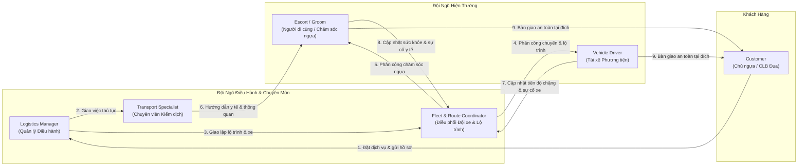
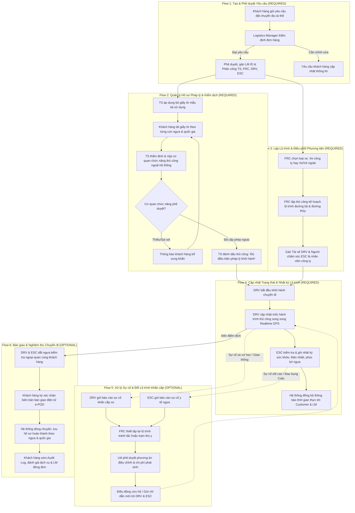
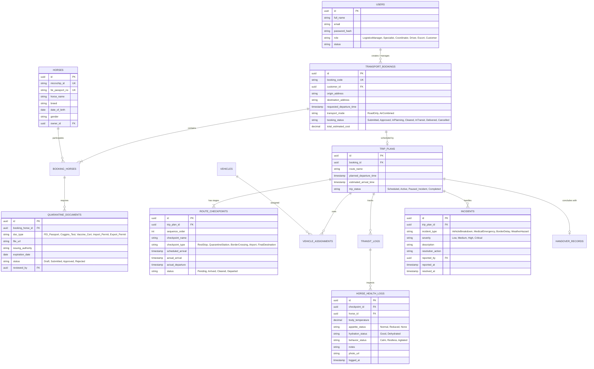

# Ngữ Cảnh Kiến Trúc & Nghiệp Vụ Hệ Thống — Cross-Border Racehorse Transport System

> **Dự án**: Hệ thống Quản lý Vận chuyển Ngựa đua Xuyên Quốc gia Pegaxus (`swp391-pegaxus`)  
> **Tên tiếng Anh**: `Pegaxus — Cross-Border Racehorse Transport System`  
> **Mã đề tài / Phụ trách**: `2 — HoangNT20`  
> **Môn học**: SWP391 (Software Project)  
> **Phương pháp tiếp cận**: Document-First System Specification (BDD Acceptance Criteria)  
> **Trạng thái tài liệu**: Official Context Specification v1.0  
> **Cập nhật gần nhất**: 2026-09-08  

---

## 📖 1. Tổng Quan Bối Cảnh & Mục Tiêu Hệ Thống

### 1.1. Bài toán Thực tế của Logistics Ngựa Đua Xuyên Quốc Gia
Ngựa đua là tài sản sinh học có giá trị kinh tế cực kỳ cao (từ hàng trăm nghìn đến hàng chục triệu USD/cá thể), đòi hỏi các tiêu chuẩn vận chuyển khắt khe nhất trong ngành logistics quốc tế:
- **Tiêu chuẩn phúc lợi động vật & y tế nghiêm ngặt**: Cần theo dõi liên tục tình trạng thể lực, thân nhiệt, nhịp thở, mức độ căng thẳng (stress), nguy cơ mất nước và bệnh đường hô hấp (*Shipping Fever*) trong suốt hành trình đường bộ và đường hàng không.
- **Rào cản pháp lý & kiểm dịch xuyên biên giới**: Mỗi quốc gia và cửa khẩu có danh mục dịch tễ riêng (xét nghiệm bệnh Viêm thiếu máu truyền nhiễm - EIA, Cúm ngựa - Equine Influenza, Viêm động mạch do virus - EVA...), yêu cầu đầy đủ Hộ chiếu FEI (Liên đoàn Thể thao Cưỡi ngựa Quốc tế), Giấy phép CITES (nếu liên quan giống thuần chủng bảo tồn), và giấy phép tạm nhập - tái xuất (ATA Carnet).
- **Điều phối đa phương thức phức tạp**: Kết hợp xe tải chuyên dụng (Horse Trucks/Vans trang bị giảm xóc khí nén), khoang máy bay vận chuyển động vật sống (Jet Stalls) và các trạm trung chuyển cách ly kiểm dịch (*Quarantine Stations*).

### 1.2. Sứ Mệnh của Hệ Thống
Hệ thống số hóa toàn diện vòng đời của một chuyến vận chuyển ngựa đua từ khi khách hàng đặt yêu cầu đến khi bàn giao an toàn tại điểm đích:
1. Số hóa và liên kết hồ sơ kiểm dịch, pháp lý theo thời gian thực.
2. Tối ưu hóa kế hoạch hành trình, lộ trình và phân bổ phương tiện chuyên dụng.
3. Giám sát nhật ký sức khỏe ngựa và mốc tiến độ theo từng chặng di chuyển.
4. Quản trị sự cố khẩn cấp và kích hoạt phương án thay đổi lộ trình tức thời.

---

## 👥 2. Ma Trận Vai Trò Người Dùng (Actors & Responsibilities)

Hệ thống phục vụ **6 nhóm tác nhân (Actors)** với trách nhiệm và quyền hạn phân định độc lập:

### 2.1. Logistics Manager (Quản lý Điều hành Logistics)
- **Tiếp nhận & Phê duyệt đơn hàng**: Thẩm định tính khả thi, thời gian và chi phí của các yêu cầu vận chuyển nội địa và quốc tế từ khách hàng.
- **Lập kế hoạch tổng thể**: Chọn phương thức vận chuyển (đường bộ, đường thủy/phà biển), đối tác vận tải, chuỗi trạm dừng trung chuyển và thời gian biểu sơ bộ.
- **Phân công nhiệm vụ**: Chỉ định Chuyên viên thủ tục (`Transport Specialist`), Điều phối viên (`Fleet & Route Coordinator`), Tài xế (`Vehicle Driver`) và Người đi cùng chăm sóc ngựa (`Escort`).
- **Phê duyệt ngoại lệ & chi phí phát sinh**: Phê duyệt phương án thay đổi lộ trình khẩn cấp, phát sinh phí kiểm dịch đột xuất hoặc dịch vụ thú y dọc đường.
- **Báo cáo & Phân tích hiệu suất**: Theo dõi doanh thu, tỷ lệ đúng hạn (*On-time Delivery - OTD*), chi phí nhiên liệu/phí cầu đường/phí hải quan và chỉ số an toàn sinh học.

### 2.2. Transport Specialist (Chuyên viên Thủ tục & Kiểm dịch)
- **Quản lý danh mục quy định kiểm dịch**: Cập nhật bộ luật y tế thú y, danh sách vaccine bắt buộc và yêu cầu hải quan của từng quốc gia/cửa khẩu quốc tế.
- **Khởi tạo & Lưu trữ Hồ sơ vận chuyển số hóa**: Số hóa Hộ chiếu ngựa (FEI Passport / Weatherbys), Giấy chứng nhận tiêm phòng, Giấy chứng nhận xét nghiệm máu âm tính (*Coggins Test*), Giấy phép xuất nhập cảnh và tờ khai hải quan.
- **Theo dõi tiến độ phê duyệt từ cơ quan công quyền**: Làm việc thủ công với Cục Thú y, Bộ Nông nghiệp, Cơ quan Hải quan cửa khẩu để nộp hồ sơ, tiếp nhận kết quả và đánh dấu trạng thái phê duyệt lên hệ thống.
- **Hướng dẫn & Đôn đốc khách hàng**: Gửi thông báo tự động và trực tiếp hỗ trợ khách hàng bổ sung các giấy tờ pháp lý còn thiếu trước hạn chót (Deadline).

### 2.3. Fleet & Route Coordinator (Điều phối viên Đội xe & Lộ trình)
- **Quản lý tài nguyên phương tiện**: Quản lý 2 loại hình phương tiện: (1) Phương tiện thuộc sở hữu của công ty (dùng vận chuyển trong nước và nơi có chi nhánh) và (2) Phương tiện thuê hoặc mua vé ngoài (vé phà biển/đối tác vận tải thứ ba).
- **Lập lộ trình thủ công**: Thiết kế đường đi tối ưu tránh đoạn đường xóc, đèo dốc; xác định chính xác các điểm dừng nghỉ ngơi cho ngựa ăn uống (*Rest Stops*), trạm kiểm dịch và trạm tiếp nhiên liệu.
- **Theo dõi & Cập nhật tiến độ chặng**: Theo dõi định vị GPS thời gian thực, đối chiếu với các mốc báo cáo thủ công từ tài xế khi xe xuất phát, đến điểm dừng, hoàn tất thủ tục hải quan và bàn giao.
- **Điều chỉnh lộ trình khi có biến động**: Phát hiện sớm nguy cơ kẹt xe cửa khẩu, bão thời tiết hoặc sự cố giao thông để tái lập tuyến đường thay thế và gửi cảnh báo đến tài xế.

### 2.4. Vehicle Driver (Tài xế Phương tiện Chuyên dụng)
- **Tiếp nhận nhiệm vụ & Lộ trình**: Nắm rõ lịch trình di chuyển, phương tiện chuyên dụng phụ trách và danh sách các điểm dừng nghỉ/cửa khẩu bắt buộc.
- **Báo cáo mốc tiến độ thủ công**: Xác nhận trạng thái tại từng điểm mốc (Đã xuất phát, Đã tới điểm dừng nghỉ, Đã vào khu vực kiểm dịch cửa khẩu, Đã thông quan thành công); thông tin này tồn tại song song với dữ liệu định vị Realtime.
- **Báo cáo sự cố khẩn cấp về phương tiện/giao thông**: Gửi tín hiệu SOS khẩn cấp khi hỏng xe cơ học, tai nạn giao thông, kẹt xe kéo dài gây nguy cơ chậm trễ về trung tâm điều hành.
- **Phạm vi áp dụng nhân sự**: Là nhân viên công ty đối với phương tiện thuộc sở hữu của công ty; đối với phương tiện thuê ngoài chỉ theo dõi qua dữ liệu Realtime.

### 2.5. Escort (Người Đi Cùng / Nhân Viên Chăm Sóc & Áp Tải Ngựa — Groom)
- **Tiếp nhận danh sách ngựa phụ trách**: Nắm rõ danh sách cá thể ngựa (tên, tính nết, yêu cầu dinh dưỡng đặc biệt, tiền sử bệnh lý và chỉ dẫn thú y).
- **Ghi nhật ký sức khỏe & phúc lợi ngựa**: Định kỳ ghi nhận thể trạng ngựa tại mỗi trạm dừng (Sức khỏe ổn định, Bỏ ăn/uống nước, Căng thẳng/kích động, Thân nhiệt, Nhịp thở, Tình trạng chuồng đệm) kèm văn bản và hình ảnh chụp thực tế.
- **Báo cáo sự cố y tế khẩn cấp**: Gửi tín hiệu SOS khẩn cấp khi ngựa phát bệnh đột xuất (Sốt cao, Nghi sốc nhiệt, Đau bụng Colic, Chấn thương cào chuồng) về trung tâm điều hành và kết nối Bác sĩ Thú y lưu động.
- **Phạm vi áp dụng nhân sự**: Là nhân viên công ty đối với phương tiện thuộc sở hữu của công ty.

### 2.6. Customer (Khách hàng — Chủ Ngựa / CLB Đua Ngựa / Trang Trại)
- **Đặt dịch vụ vận chuyển**: Tạo yêu cầu vận chuyển trực tuyến cho một hoặc nhiều con ngựa đồng thời, lựa chọn phương thức đường bộ hoặc kết hợp đường thủy (phà biển), cung cấp địa điểm đi/đến, thời gian mong muốn và các yêu cầu chăm sóc chuyên biệt.
- **Xem thông tin người duyệt & Log thao tác**: Xem thông tin định danh của Logistics Manager đã phê duyệt đơn hàng và tra cứu toàn bộ Log lịch sử thao tác của đơn.
- **Tải lên hồ sơ lý lịch & y tế**: Tải lên bản chụp Hộ chiếu ngựa, chứng nhận tiêm phòng, lịch sử y khoa theo danh mục yêu cầu tương ứng với từng con ngựa và quốc gia đến.
- **Theo dõi tiến độ hành trình trực quan**: Giám sát vị trí chuyến đi trên bản đồ và nhận các cập nhật trạng thái chặng, nhật ký sức khỏe ngựa theo thời gian thực.
- **Nhận thông báo & Nghiệm thu**: Nhận thông báo tự động khi ngựa thông quan thành công hoặc đến địa điểm đích; ký biên bản bàn giao điện tử (e-POD) và đánh giá chất lượng dịch vụ.

---

## 🔄 3. Đặc Tả 6 Luồng Nghiệp Vụ Cốt Lõi (Core & Optional Flows)

### 3.1. Flow 1: Luồng Tạo & Phê duyệt Yêu cầu Vận chuyển (`REQUIRED`)
- **Mục tiêu**: Thiết lập hợp đồng vận chuyển khả thi cho một hoặc nhiều cá thể ngựa giữa khách hàng và công ty logistics.
- **Tiền điều kiện**: Khách hàng đã đăng nhập tài khoản hợp lệ.
- **Các bước thực hiện**:
  1. Khách hàng nhập thông tin yêu cầu: Điểm đi, điểm đến, thời gian dự kiến, số lượng ngựa (có thể vận chuyển đồng thời nhiều con ngựa), danh sách tên/giống ngựa, yêu cầu chăm sóc (chế độ ăn, chuồng đơn/đôi).
  2. Hệ thống tính toán báo giá sơ bộ dựa trên khoảng cách, phương thức (đường bộ kết hợp phà biển) và phụ phí kiểm dịch.
  3. Logistics Manager nhận thông báo đơn hàng mới, kiểm tra tính khả thi của đội xe và lịch trình.
  4. Logistics Manager phê duyệt đơn hàng, chỉ định `Transport Specialist` phụ trách pháp lý, `Fleet & Route Coordinator` phụ trách lộ trình, gán mã định danh duy nhất (`Booking ID`) và lưu vết định danh người phê duyệt. Khách hàng có thể xem thông tin người đã phê duyệt Order và xem toàn bộ Log thao tác của đơn hàng.

### 3.2. Flow 2: Luồng Quản lý Hồ sơ Pháp lý & Kiểm dịch Thông quan (`REQUIRED`)
- **Mục tiêu**: Đảm bảo 100% giấy tờ y tế, kiểm dịch và hải quan được cấp phép trước khi phương tiện lăn bánh.
- **Tiền điều kiện**: Đơn vận chuyển đã được phê duyệt ở Flow 1.
- **Các bước thực hiện**:
  1. Transport Specialist khởi tạo `Hồ sơ kiểm dịch số hóa` cho từng cá thể ngựa trong chuyến đi bằng cách áp dụng các bộ giấy tờ mẫu (`DossierTemplate`) sẵn có, được tái sử dụng nhiều lần theo cặp quốc gia.
  2. Hệ thống tạo danh mục giấy tờ bắt buộc dựa theo quy định của quốc gia xuất khẩu, quá cảnh và nhập khẩu; mỗi con ngựa và mỗi quốc gia sẽ áp dụng loại hồ sơ hoàn thành khác nhau.
  3. Khách hàng tải lên ảnh/bản scan: Hộ chiếu FEI, Giấy chứng nhận xét nghiệm máu âm tính (Coggins Test), Sổ tiêm chủng (phải tiêm đủ vaccine cúm trong 6 tháng gần nhất).
  4. Transport Specialist trực tiếp nộp hồ sơ tới cơ quan chức năng bên ngoài (Cục Thú y, Hải quan, Đơn vị cấp chứng thư). Giả định cơ quan chức năng không cung cấp API đồng bộ số tự động.
  5. Khi cơ quan thẩm quyền phê duyệt ngoài đời thực, Transport Specialist tiếp nhận kết quả và đánh dấu thủ công lên hệ thống trạng thái `Đủ điều kiện pháp lý khởi hành` (`Cleared for Departure`).

### 3.3. Flow 3: Luồng Lập Kế hoạch Lộ trình & Điều phối Phương tiện (`REQUIRED`)
- **Mục tiêu**: Tối ưu hóa tuyến đường đa phương thức (đường bộ kết hợp đường thủy), đảm bảo các điểm dừng nghỉ ngơi bắt buộc cho ngựa theo luật bảo vệ động vật.
- **Tiền điều kiện**: Đơn hàng đã duyệt, đã xác định số lượng cá thể ngựa.
- **Các bước thực hiện**:
  1. Fleet & Route Coordinator kiểm tra tính sẵn sàng của 2 loại hình phương tiện: (1) Phương tiện thuộc sở hữu của công ty (dùng vận chuyển trong nước và nơi có chi nhánh) và (2) Phương tiện thuê hoặc mua vé ngoài (phà biển/xe thuê ngoài).
  2. Fleet & Route Coordinator lập thủ công kế hoạch lộ trình: Điểm xuất phát $\to$ Trạm nghỉ 1 $\to$ Trạm kiểm dịch cửa khẩu $\to$ Phà biển/Cảng $\to$ Điểm đích.
  3. Xác định các điểm hỗ trợ thú y dọc tuyến phòng trường hợp khẩn cấp.
  4. Gán Tài xế (`Vehicle Driver`) và Người đi cùng (`Escort`) — đều là nhân viên cơ hữu của công ty khi sử dụng phương tiện công ty (nếu là xe thuê ngoài thì chỉ theo dõi qua Realtime) — và xuất bản kế hoạch hành trình chi tiết.

### 3.4. Flow 4: Luồng Cập nhật Trạng thái & Nhật ký Lộ trình (`REQUIRED`)
- **Mục tiêu**: Cung cấp khả năng hiển thị thời gian thực về tiến độ chuyến đi và thể trạng ngựa cho cả đội điều hành lẫn khách hàng.
- **Tiền điều kiện**: Chuyến đi đã xuất phát.
- **Các bước thực hiện**:
  1. Tài xế (`Vehicle Driver`) nhấn `Bắt đầu xuất phát` trên ứng dụng hiện trường.
  2. Tại mỗi mốc quy định (đến trạm nghỉ, vào khu kiểm dịch, thông quan xong), Tài xế cập nhật tình hình chuyến đi thủ công; thông tin này tồn tại song song với dữ liệu định vị Realtime GPS.
  3. Trong thời gian dừng nghỉ, Người đi cùng (`Escort`) kiểm tra thể trạng từng con ngựa, cập nhật tình hình sức khỏe (Thân nhiệt, mức ăn uống, hành vi kích động) và chụp ảnh thực tế tải lên hệ thống.
  4. Hệ thống tức thời cập nhật trạng thái lên bảng điều khiển của Logistics Manager và gửi thông báo *Push/Email* cho Khách hàng.

### 3.5. Flow 5: Luồng Xử lý Sự cố & Điều chỉnh Lộ trình Khẩn cấp (`OPTIONAL`)
- **Mục tiêu**: Kích hoạt quy trình phản ứng nhanh khi xảy ra biến cố giao thông, thiên tai hoặc vấn đề sức khỏe của ngựa.
- **Tiền điều kiện**: Chuyến đi đang trong hành trình (`In Transit`).
- **Các bước thực hiện**:
  1. Phân loại báo cáo khẩn cấp từ hiện trường:
     - Tài xế (`Vehicle Driver`) báo cáo khẩn cấp sự cố phương tiện/giao thông: Hỏng xe cơ học, Tai nạn giao thông, Kẹt xe kéo dài.
     - Người đi cùng (`Escort`) gửi thông báo khẩn cấp sự cố y tế: Ngựa sốt cao đột ngột, Nghi sốc nhiệt, Đau bụng Colic, Chấn thương cơ học.
  2. Trung tâm điều phối nhận chuông cảnh báo đỏ và vị trí GPS hiện thời của xe.
  3. FRC liên hệ trạm cứu hộ hoặc phòng khám thú y gần nhất; tính toán lộ trình nhánh tránh điểm ùn tắc hoặc hướng tới trạm cấp cứu.
  4. Logistics Manager phê duyệt phương án điều chỉnh lộ trình hoặc phát sinh chi phí y tế/thuê xe cứu hộ.
  5. Lộ trình mới được đẩy thẳng xuống thiết bị của Tài xế và Người đi cùng; đồng thời gửi thông báo giải trình minh bạch tới khách hàng.

### 3.6. Flow 6: Luồng Bàn giao & Nghiệm thu Chuyến đi (`OPTIONAL`)
- **Mục tiêu**: Hoàn tất chuyến đi an toàn, xác nhận trách nhiệm pháp lý và đóng hồ sơ đơn hàng.
- **Tiền điều kiện**: Phương tiện đã tới điểm đích an toàn.
- **Các bước thực hiện**:
  1. Tài xế và Người đi cùng phối hợp cùng đại diện khách hàng tiến hành dắt ngựa xuống chuồng nhận, kiểm tra ngoại quan vết thương hoặc dấu hiệu mệt mỏi.
  2. Bàn giao lại toàn bộ hồ sơ gốc (Hộ chiếu ngựa, giấy kiểm dịch đóng mộc đỏ theo quy định từng quốc gia).
  3. Khách hàng ký chữ ký điện tử xác nhận vào Biên bản bàn giao điện tử (`Digital Delivery Handover / e-POD`).
  4. Hệ thống chuyển trạng thái đơn hàng sang `Hoàn thành` (`Completed`), lưu trữ bộ hồ sơ hoàn thành cho từng con ngựa và quốc gia, mở cổng cho khách hàng đánh giá xếp hạng chất lượng phục vụ, xem Log thao tác và xuất hóa đơn tài chính.

---

## 🗄️ 4. Mô Hình Dữ Liệu Khái Niệm Dự Kiến (Data Architecture Entities)

> **Tài liệu Đánh giá & Chuẩn hóa Chi tiết ERD**: Xem chi tiết phân tích lỗi quan hệ logic, các lỗ hổng cần vá và sơ đồ Mermaid ERD chuẩn hóa 7 phân hệ tại [ERD_Review_And_Fixes.md](file:///d:/VNZ/document-first-brief/swp391-pegaxus/Context/ERD_Review_And_Fixes.md).

---

## 📊 5. Ma Trận Phân Quyền Trách Nhiệm (RACI Matrix)

| Quy trình / Luồng nghiệp vụ | Logistics Manager | Transport Specialist | Fleet & Route Coordinator | Vehicle Driver | Escort | Customer |
| :--- | :---: | :---: | :---: | :---: | :---: | :---: |
| **Flow 1: Tạo & Duyệt yêu cầu đặt chuyến** | **A / R** | C | C | I | I | **R** |
| **Flow 2: Thẩm định hồ sơ y tế & Kiểm dịch** | I | **A / R** | I | I | I | **R (Cung cấp)** |
| **Flow 3: Thiết kế lộ trình & Gán xe/nhân sự** | A | C | **A / R** | C | C | I |
| **Flow 4: Cập nhật tiến độ & Nhật ký ngựa** | I | I | C | **A / R (Mốc xe & GPS)** | **A / R (Sức khỏe & Phúc lợi)** | I (Theo dõi) |
| **Flow 5: Ứng phó sự cố & Đổi tuyến đường** | **A** | C | **R** | **R (Sự cố xe/đường)** | **R (Sự cố thú y)** | I |
| **Flow 6: Bàn giao an toàn & Nghiệm thu** | A | I | I | **R (Bàn giao xe/ngựa)** | **R (Bàn giao hồ sơ/thể trạng)** | **A / R (Ký nhận)** |

> *Ghi chú chữ viết tắt RACI:*
> - **R (Responsible)**: Người trực tiếp thực hiện nhiệm vụ.
> - **A (Accountable)**: Người chịu trách nhiệm cuối cùng phê duyệt.
> - **C (Consulted)**: Người được tham vấn chuyên môn 2 chiều.
> - **I (Informed)**: Người được cập nhật thông tin 1 chiều.

---

## 🎯 6. Kế Hoạch Áp Dụng Document-First Cho Đề Tài SWP391

1. **User Stories (`UserStory/`)**: Sẽ được xây dựng tương ứng theo 4 luồng bắt buộc (Required) và 2 luồng mở rộng (Optional), bao gồm:
   - `US-01`: Đặt yêu cầu dịch vụ vận chuyển ngựa đua (Customer).
   - `US-02`: Thẩm định và phê duyệt yêu cầu vận chuyển (Logistics Manager).
   - `US-03`: Số hóa và quản lý hồ sơ kiểm dịch xuất nhập cảnh (Transport Specialist).
   - `US-04`: Thiết kế lộ trình điểm dừng và gán phương tiện chuyên dụng (Fleet & Route Coordinator).
   - `US-05`: Báo cáo mốc tiến độ chặng và cập nhật thông quan song song Realtime (Vehicle Driver).
   - `US-06`: Ghi nhật ký sức khỏe, thân nhiệt và phúc lợi ngựa tại trạm nghỉ (Escort).
   - `US-07`: Báo cáo và kích hoạt xử lý sự cố khẩn cấp phương tiện / y tế (Vehicle Driver / Escort / Coordinator / Manager).
   - `US-08`: Nghiệm thu và ký biên bản bàn giao điện tử e-POD (Customer / Vehicle Driver / Escort).
2. **Business Rules (`BusinessRules/`)**: Quy định tiêm chủng bắt buộc, thời gian tối đa ngựa di chuyển liên tục trước khi phải dừng nghỉ ($\le 6$ tiếng), thẩm quyền phê duyệt thay đổi lộ trình, bảo mật mật khẩu, rate limiting OTP, v.v.
3. **System Tests (`SystemTest/`)**: Các kịch bản kiểm thử hành vi người dùng theo định dạng chuẩn chia dòng.

---

## 📌 7. Danh Sách Các Giả Định Hệ Thống Đã Thống Nhất (Official Project Assumptions)

Dự án **PasoFino** (Cross-Border Racehorse Transport System) chính thức thông qua danh sách 12 giả định nghiệp vụ và kiến trúc kỹ thuật nền tảng:

1. **Vận chuyển đa cá thể đồng thời**: Một chuyến vận chuyển (`TripPlan`) có thể vận chuyển đồng thời nhiều con ngựa (`Horse`), mỗi con ngựa có thể thuộc cùng một hoặc nhiều chủ sở hữu khác nhau và có yêu cầu chăm sóc cá thể hóa (chế độ dinh dưỡng, chuồng đơn/đôi).
2. **Đa phương thức vận chuyển (Đường bộ & Đường thủy)**: Ngựa có thể được vận chuyển bằng phương thức đường bộ (xe tải chuyên dụng giảm xóc khí nén) kết hợp đường thủy (phà biển chuyên dụng qua eo biển Manche / Biển Bắc / Địa Trung Hải).
3. **Phân hóa hồ sơ hoàn thành theo cá thể & quốc gia**: Mỗi con ngựa và mỗi quốc gia xuất phát/quá cảnh/đích đến sẽ áp dụng loại hồ sơ hoàn thành và danh mục kiểm dịch khác nhau (phụ thuộc vào tình trạng giống, mục đích thi đấu/nhân giống, quy định TRACES-NT, CHED-A, EHC, ATA Carnet).
4. **Minh bạch phê duyệt & Nhật ký thao tác khách hàng**: Khách hàng (`Customer`) có quyền xem thông tin người đã phê duyệt đơn hàng (`Order`) và được quyền tra cứu toàn bộ Log lịch sử thao tác (`Audit Log`) của đơn hàng.
5. **Tái sử dụng bộ giấy tờ mẫu (Dossier Templates)**: Tồn tại các bộ giấy tờ mẫu chuẩn hóa sẵn (`DossierTemplate`) cho từng cặp quốc gia / tuyến đường, cho phép `Transport Specialist` tái sử dụng nhiều lần để tạo nhanh danh mục hồ sơ bắt buộc cho các chuyến đi mới.
6. **Xử lý thủ công với cơ quan chức năng (Manual Authority Marking - Zero-Access for Customs/Gov)**: `Transport Specialist` phụ trách trực tiếp nộp hồ sơ tới cơ quan chức năng bên ngoài, tiếp nhận kết quả phê duyệt và đánh dấu trạng thái thủ công lên hệ thống (giả định cơ quan chức năng không cung cấp dữ liệu hay nền tảng số để đồng bộ tự động). **Cơ quan Hải quan và Chính quyền nhà nước hoàn toàn KHÔNG CÓ TÀI KHOẢN và KHÔNG ĐƯỢC TRUY CẬP VÀO HỆ THỐNG**.
7. **Lập kế hoạch lộ trình thủ công (Manual Route Planning)**: Kế hoạch chuyến đi và tuyến đường chi tiết (chọn đường cao tốc, trạm dừng nghỉ 24h, trạm kiểm dịch, trạm thú y) được lập thủ công bởi Điều phối viên (`Fleet & Route Coordinator`).
8. **Quản lý phân loại 2 hình thức phương tiện**: Quản lý 2 loại hình phương tiện rạch ròi:
   - **Phương tiện thuộc sở hữu của công ty**: Dùng vận chuyển trong nước và tại các quốc gia/khu vực có chi nhánh; do nhân viên công ty vận hành.
   - **Phương tiện thuê hoặc mua vé ngoài**: Thuê đối tác vận tải ngoài hoặc mua vé phà/tàu biển; chỉ theo dõi hành trình qua dữ liệu Realtime.
9. **Cập nhật tiến độ & Báo cáo khẩn cấp tài xế (Dual Progress & Emergency)**: Tài xế (`Vehicle Driver`) cập nhật tình hình chuyến đi và báo cáo sự cố khẩn cấp về phương tiện/giao thông; thông tin này tồn tại song song và đối chiếu với luồng dữ liệu định vị tự động (`Realtime GPS Telemetry`).
10. **Giám sát sức khỏe & Báo cáo y tế của người đi cùng (Escort Health & Medical SOS)**: Người đi cùng (`Escort`) phụ trách cập nhật tình hình sức khỏe, thân nhiệt, thể trạng của ngựa tại mỗi trạm dừng và gửi thông báo/báo cáo y tế khẩn cấp khi ngựa gặp nguy kịch.
11. **Phân định nhân sự theo phương tiện**: Tài xế (`Vehicle Driver`) và Người đi cùng (`Escort`) là nhân viên công ty (áp dụng đối với phương tiện thuộc sở hữu của công ty); đối với phương tiện thuê ngoài chỉ theo dõi qua Realtime.
12. **Chốt tách Driver và Escort thành 2 Actor riêng biệt**: Tách biệt hoàn toàn Tài xế (`Vehicle Driver`) và Người đi cùng chăm sóc ngựa (`Escort`) thành 2 Actor độc lập trong mô hình phân quyền RBAC, phân công nhiệm vụ và trách nhiệm RACI.

---

## 🚫 8. Giới Hạn Phạm Vi Dự Án (Official Out of Scope)

Để đảm bảo dự án SWP391 tập trung vào cốt lõi quản lý logistics và pháp lý vận chuyển ngựa đua, các thành phần kỹ thuật sau **HOÀN TOÀN NẰM NGOÀI PHẠM VI (OUT OF SCOPE)**:

1. **KHÔNG phát triển Native Mobile App**:
   - Hệ thống được triển khai 100% dưới dạng **Web Application (Responsive Web)** chạy trên trình duyệt máy tính và trình duyệt di động (Chrome, Safari).
   - Không phát triển ứng dụng di động bản địa (Native Mobile App bằng iOS/Android/Flutter/React Native). Mọi thao tác của Tài xế (`Vehicle Driver`) và Người đi cùng (`Escort`) thực hiện trực tiếp trên giao diện Web Mobile.
2. **KHÔNG ứng dụng AI (Trí Tuệ Nhân Tạo)**:
   - Không sử dụng các mô hình AI/ML để tự động đề xuất lộ trình hoặc dự báo rủi ro (lộ trình do `Fleet & Route Coordinator` lập thủ công).
   - Không dùng AI phân tích ảnh bệnh lý của ngựa hay Computer Vision nhận diện vết thương.
   - Không dùng AI/OCR tự động bóc tách giấy tờ kiểm dịch (việc kiểm tra hồ sơ do `Transport Specialist` thẩm định thủ công).
3. **KHÔNG kết nối phần cứng IoT (Internet of Things)**:
   - Không tích hợp vòng đeo cổ theo dõi sinh trắc học, cảm biến nhịp tim hay thiết bị vi điều khiển phần cứng (Arduino, Raspberry Pi).
   - Không tích hợp cảm biến vi khí hậu thùng xe IoT. Dữ liệu thân nhiệt, nhịp thở và phúc lợi ngựa do Người đi cùng (`Escort`) tự kiểm tra và nhập liệu thủ công qua Web form tại mỗi trạm dừng.
   - Tọa độ hành trình và mốc tiến độ do Tài xế bấm cập nhật thủ công trên Web.
4. **KHÔNG kết nối trực tiếp cổng Hải quan & Cơ quan Nhà nước (Zero-Access for Customs/Gov)**:
   - Cơ quan kiểm dịch và Hải quan không có tài khoản và không truy cập vào hệ thống.
   - Không tích hợp API tự động với hệ thống nhà nước (TRACES-NT, IPAFFS). Mọi thủ tục do TS nộp ngoài và đánh dấu thủ công lên PasoFino.
5. **KHÔNG sử dụng Số điện thoại & Dịch vụ SMS**:
   - Không hỗ trợ đăng ký, đăng nhập hay khôi phục mật khẩu bằng Số điện thoại.
   - Không tích hợp cổng tin nhắn SMS viễn thông.
   - Xác thực tài khoản (OTP) và thông báo hệ thống được thực hiện 100% qua **Email** và thông báo trực tiếp trên giao diện Web (In-app Notification).

