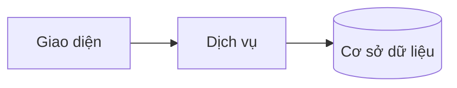
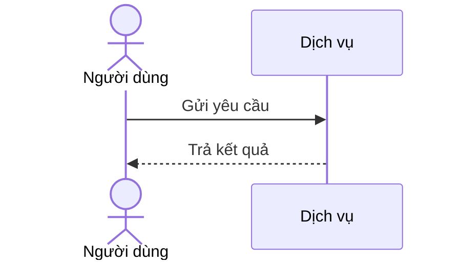
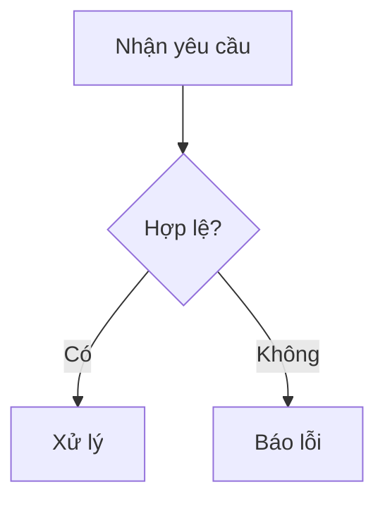
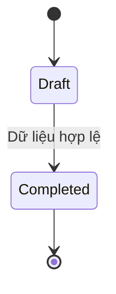
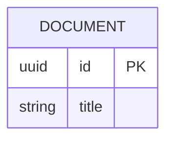

<!-- Thay mã TDD-001 và nội dung ví dụ; giữ nguyên heading và nhãn in đậm.
Sơ đồ dùng mermaid, plantuml hoặc URL. Giữ heading Architecture, Sequence Diagram, Activity Diagram, State Diagram, Data Model.
Ví dụ API phải có heading trùng METHOD /path trong Endpoints. Xoá phần API/sơ đồ không dùng.
Version, Updated At và Change Log do lịch sử phiên bản quản lý, để trống khi nhập mới.
Author/Reviewer là tên hiển thị; gán tài khoản, phê duyệt, giả định và câu hỏi mở trên giao diện sau import.
-->

# TDD-001

## Document Info

- **Feature**: [Tên tính năng]
- **Author**: [Tên tác giả]
- **Reviewer**: [Tên người review]
- **Status**: Draft
- **Version**:
- **Updated At**:

## Context & Goals

### Problem

[Vấn đề kỹ thuật và bối cảnh của Story]

### Goals

- [Mục tiêu kỹ thuật đo được]

### Non-goals

- [Nội dung ngoài phạm vi thiết kế]

## Architecture

[Mô tả thành phần và trách nhiệm]



**Notes**:
- [Quyết định kiến trúc và đánh đổi]

## Sequence Diagram

[Tương tác giữa các thành phần]



## Activity Diagram

[Luồng xử lý và điều kiện rẽ nhánh]



## State Diagram

[Vòng đời thực thể và điều kiện chuyển trạng thái]



## Data Model

[Bảng, kiểu dữ liệu, khoá và ràng buộc]



**Notes**:
- [Ràng buộc, index và chiến lược migration]

## Internal API

### Endpoints

- **POST** `/api/example` — [Mô tả endpoint]

### Examples

#### POST /api/example

```
Request:
{"name": "Ví dụ"}

Response 200:
{"id": "example-id"}

Error Response:
{"code": "INVALID_INPUT"}
```

### Error Codes

- **INVALID_INPUT** (400): [Điều kiện gây lỗi]

## External API

### Endpoints

- **Dịch vụ đối tác** — [Mục đích và hợp đồng tích hợp]

### Fields

- **external_id** — [Ý nghĩa trường và ràng buộc]

### Error Handling

[Timeout, retry, idempotency và ánh xạ lỗi]

### Quirks

- [Đặc điểm cần lưu ý của đối tác]

## References

### User Stories

- STORY-001

### Business Rules

- BR-001

### Use Cases

### Others

- Tài liệu kỹ thuật: [Nguồn tham khảo]

## Change Log
